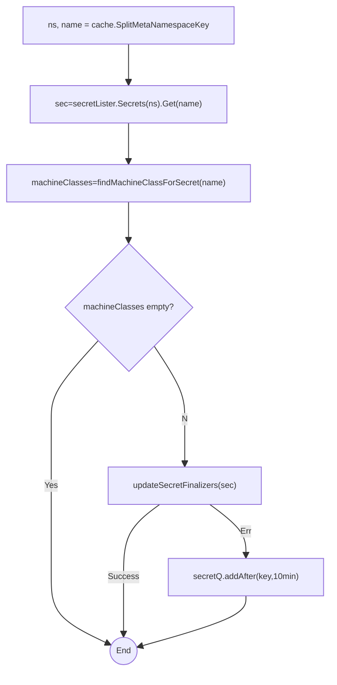
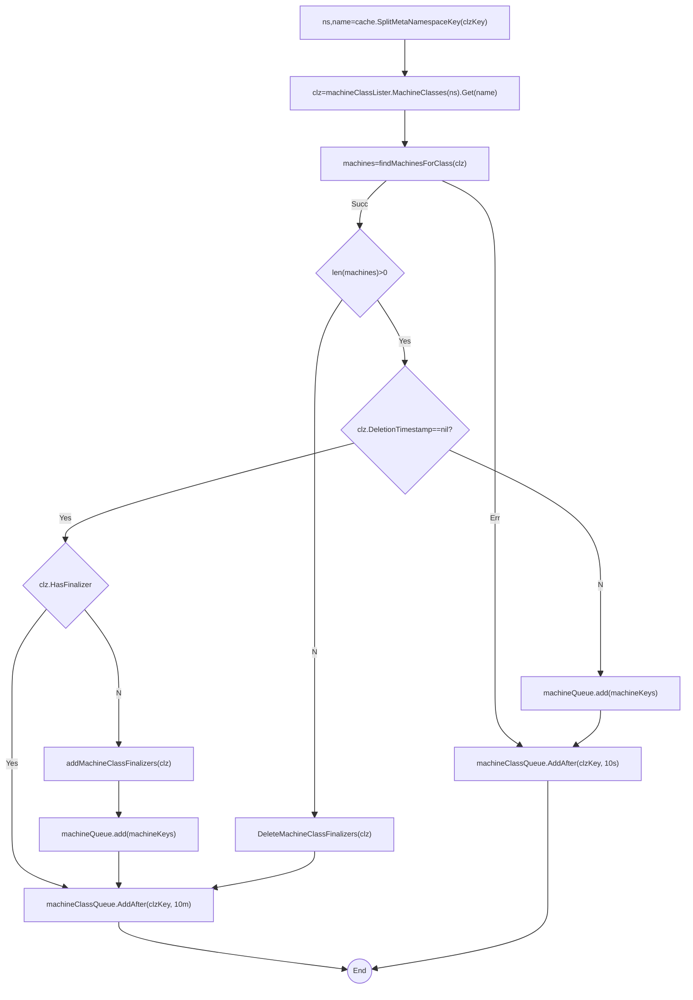
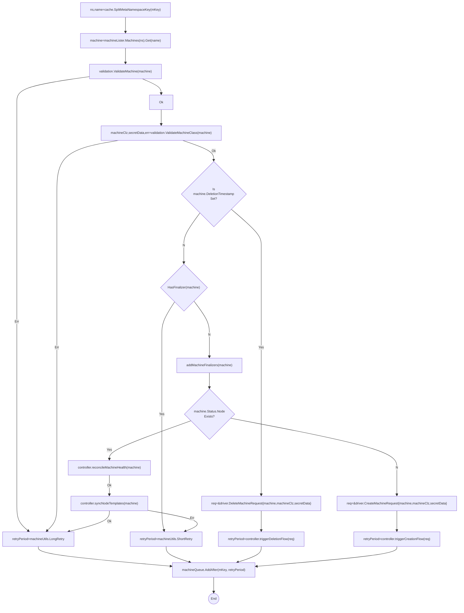

- [Machine Controller Manager](#machine-controller-manager)
	- [K8s Facilities](#k8s-facilities)
		- [k8s apimachinery](#k8s-apimachinery)
			- [Finalizers and Deletion](#finalizers-and-deletion)
			- [wait.Until](#waituntil)
		- [client-go k8s clients.](#client-go-k8s-clients)
		- [client-go Shared Informers.](#client-go-shared-informers)
			- [client-go workqueues](#client-go-workqueues)
		- [Pod Disruptions](#pod-disruptions)
	- [Controller Facilities](#controller-facilities)
		- [Machine Controller Core Types](#machine-controller-core-types)
			- [MachineClass](#machineclass)
			- [Machine](#machine)
				- [MachineSpec](#machinespec)
		- [Controller Client Facades](#controller-client-facades)
		- [Controller Informer Factories.](#controller-informer-factories)
		- [MCServer](#mcserver)
				- [MachineControllerConfiguration struct](#machinecontrollerconfiguration-struct)
				- [SafetyOptions](#safetyoptions)
			- [Controller Core Struct](#controller-core-struct)
		- [Controller Util Types](#controller-util-types)
			- [permits.PermitGiver](#permitspermitgiver)
			- [drain.NewVolumeAttachmentHandler](#drainnewvolumeattachmenthandler)
	- [Machine Phases and Statuses](#machine-phases-and-statuses)
	- [Main Flow](#main-flow)
	- [MCM Provider Local Launch](#mcm-provider-local-launch)
	- [Machine Controller Loop](#machine-controller-loop)
		- [app.Run](#apprun)
		- [app.StartControllers](#appstartcontrollers)
		- [Controller Initialization](#controller-initialization)
			- [1. NewController Factory Func](#1-newcontroller-factory-func)
			- [1.1 Create Controller Struct](#11-create-controller-struct)
			- [1.2 Assign Listers and HasSynced funcs to controller struct](#12-assign-listers-and-hassynced-funcs-to-controller-struct)
			- [1.3 Register Controller Event Handlers on informers.](#13-register-controller-event-handlers-on-informers)
			- [1.4 Event Handler Functions](#14-event-handler-functions)
				- [1.4.1 Adding Secrets Keys to secretsQueue](#141-adding-secrets-keys-to-secretsqueue)
				- [1.4.2 Adding Machine Class Names and Keys to machineClassQueue](#142-adding-machine-class-names-and-keys-to-machineclassqueue)
				- [1.4.3 Adding Machine Keys to machineQueue](#143-adding-machine-keys-to-machinequeue)
		- [machineController.Run](#machinecontrollerrun)
			- [1. Wait for Informer Caches to Sync](#1-wait-for-informer-caches-to-sync)
			- [2. Register Metrics](#2-register-metrics)
				- [2.1 controller.Describe](#21-controllerdescribe)
				- [2.1 controller.Collect](#21-controllercollect)
			- [3. Create Controller Worker Go-Routines applying Reconciliations](#3-create-controller-worker-go-routines-applying-reconciliations)
				- [3.1 createWorker](#31-createworker)
			- [4. Reconciliation Functions Executed by Worker](#4-reconciliation-functions-executed-by-worker)
				- [4.1  reconcileClusterSecretKey](#41--reconcileclustersecretkey)
				- [4.2  reconcileClusterMachineClassKey](#42--reconcileclustermachineclasskey)
				- [4.3  reconcileClusterMachineKey](#43--reconcileclustermachinekey)
					- [4.3.1 controller.triggerCreationFlow](#431-controllertriggercreationflow)
				- [4.4  reconcileClusterMachineSafetyOrphanVMs](#44--reconcileclustermachinesafetyorphanvms)
				- [4.5  reconcileClusterMachineSafetyAPIServer](#45--reconcileclustermachinesafetyapiserver)
	- [MCM Local Provider](#mcm-local-provider)
	- [Doubts.](#doubts)
		- [Dead Code](#dead-code)
			- [Dead? reconcileClusterNodeKey](#dead-reconcileclusternodekey)
			- [Dead? machine.go | triggerUpdationFlow](#dead-machinego--triggerupdationflow)
		- [Duplicate Initialization of EventRecorder in MC](#duplicate-initialization-of-eventrecorder-in-mc)
		- [Q? Internal to External Scheme Conversion](#q-internal-to-external-scheme-conversion)
	- [TODO](#todo)
# Machine Controller Manager


(🚧 WIP: Book at: [MCM Design Book](https://elankath.github.io/mcmdesign/))

Machine Controller Manager is a group of cooperative controllers that manage the lifecycle of the worker machines. 

`MachineControllerManager` controller reconciles a set of Custom Resources namely `MachineDeployment`, `MachineSet`.

The `MachineController` impelements the reconciliation loop for Machine objects but delegates creation/updation/deletion of Machines to the Driver facade. Driver implementations for providers (Local/Azure/AWS) are out of tree in `machine-controller-manager-provider-<providerName>` projects. Each provider starts its machine controller independently.

## K8s Facilities

This section describes the types, utils and functions provided by k8s [client-go](https://github.com/kubernetes/client-go) that are used by MCM and MC.


### k8s apimachinery

Read [k8s API Conventions](https://github.com/kubernetes/community/blob/master/contributors/devel/sig-architecture/api-conventions.md)

#### Finalizers and Deletion

Every k8s object has a `Finalizers []string` field that can be explicitly assigned by a controller. Every k8s object has a `DeletionTimestamp *Time` that is set by API Server when graceful deletion is requested.

These are part of the [k8s.io./apimachinery/pkg/apis/meta/v1.ObjectMeta](https://pkg.go.dev/k8s.io/apimachinery/pkg/apis/meta/v1#ObjectMeta) struct type which is embedded in all k8s objects. 

When you tell Kubernetes to delete an object that has finalizers specified for it, the Kubernetes API marks the object for deletion by populating `.metadata.deletionTimestamp` aka `Deletiontimestamp`, and returns a `202` status code (HTTP `Accepted`). The target object remains in a terminating state while the control plane takes the actions defined by the finalizers. After these actions are complete, the controller should removes the relevant finalizers from the target object. When the `metadata.finalizers` field is empty, Kubernetes considers the deletion complete and deletes the object.

#### wait.Until

[k8s.io/apimachinery/pkg/wait.Until](https://github.com/kubernetes/apimachinery/blob/v0.25.0/pkg/util/wait/wait.go#L91) loops until `stop` channel is closed, running `f` every given `period.` 

`func Until(f func(), period time.Duration, stopCh <-chan struct{})`

### client-go k8s clients.

k8s clients have the type  [k8s.io/client-go/kubernetes.ClientSet](https://pkg.go.dev/k8s.io/client-go/kubernetes#Clientset) and is actually a high-level client set facade encapsulating clients for the  `core`, `appsv1`, `discoveryv1`, `eventsv1`, `networkingv1`, `nodev1`, `policyv1`, `storagev1` api groups

```go
// Clientset contains the clients for groups. Each group has exactly one
// version included in a Clientset.
type Clientset struct {
    appsV1                       *appsv1.AppsV1Client
    coreV1                       *corev1.CoreV1Client
    discoveryV1                  *discoveryv1.DiscoveryV1Client
    eventsV1                     *eventsv1.EventsV1Client
    // ...
}
```

Each of these clients associated with api groups expose an interface named _GroupVersionInterface_ that in-turn provides further access a generic REST Interface and access to a typed interface containing getter/setter methods for objects within that API group.

For example [EventsV1Client](https://pkg.go.dev/k8s.io/client-go@v0.25.0/kubernetes/typed/events/v1#EventsV1Client) which is used to interact with features provided by the `events.k8s.io` group implements [EventsV1Interface](https://pkg.go.dev/k8s.io/client-go@v0.25.0/kubernetes/typed/events/v1#EventsV1Interface)

```go
type EventsV1Interface interface {
	RESTClient() rest.Interface // generic REST API access
	EventsGetter // typed interface access
}
// EventsGetter has a method to return a EventInterface.
type EventsGetter interface {
	Events(namespace string) EventInterface
}
```

k8s client-sets are created in 2 steps:
1.  Use `k8s.io/client-go/tools/
2. TODO: describe client creation.

### client-go Shared Informers.

The vital role of a Kubernetes controller is to watch objects for the desired state and the actual state, then send instructions to make the actual state be more like the desired state. The controller thus first needs to retrieve the object's information. Instead of making direct API calls using k8s listers/watchers, client-go controllers should use `SharedInformer`s.

[cache.SharedInformer](https://pkg.go.dev/k8s.io/client-go/tools/cache#SharedInformer) is a primitive exposed by `client-go` lib that maintains a local cache of k8s objects of a particular API group and kind/resource. (restricable by namespace/label/field selectors) which is linked to the authoritative state of the corresponding objects in the API server. 

Informers are used to reduced the load-pressure on the API Server and etcd.

All that is needed to be known at this point is that Informers internally watch for k8s object changes, update an internal indexed store and invoke registered event handlers. Client code must construct event handlers to inject the logic that one would like to execute when an object is Added/Updated/Deleted. 


```go
type SharedInformer interface {
	// AddEventHandler adds an event handler to the shared informer using the shared informer's resync period.  Events to a single handler are delivered sequentially, but there is no coordination between different handlers.
	AddEventHandler(handler cache.ResourceEventHandler)

	// HasSynced returns true if the shared informer's store has been
	// informed by at least one full LIST of the authoritative state
	// of the informer's object collection.  This is unrelated to "resync".
	HasSynced() bool

	// Run starts and runs the shared informer, returning after it stops.
	// The informer will be stopped when stopCh is closed.
	Run(stopCh <-chan struct{})
	//..
}
```

[cache.ResourceEventHandler](https://pkg.go.dev/k8s.io/client-go/tools/cache#ResourceEventHandler) handle notifications for events that happen to a resource.
```go
type ResourceEventHandler interface {
	OnAdd(obj interface{})
	OnUpdate(oldObj, newObj interface{})
	OnDelete(obj interface{})
}
```

[cache.ResourceEventHandlerFuncs](https://pkg.go.dev/k8s.io/client-go/tools/cache#ResourceEventHandlerFuncs) is an adapter to let you easily specify as many or as few of the notification functions as you want while still implementing `ResourceEventHandler`. Nearly all controllers code use instance of this adapter struct to create event handlers to register on shared informers.

```go
type ResourceEventHandlerFuncs struct {
	AddFunc    func(obj interface{})
	UpdateFunc func(oldObj, newObj interface{})
	DeleteFunc func(obj interface{})
}
```

#### client-go workqueues

The basic [workqueue.Interface](https://pkg.go.dev/k8s.io/client-go/util/workqueue#Interface) has the following methods:
```go
type Interface interface {
	Add(item interface{})
	Len() int
	Get() (item interface{}, shutdown bool)
	Done(item interface{})
	ShutDown()
	ShutDownWithDrain()
	ShuttingDown() bool
}
```
This is extended with ability to Add Item as a later time using the [workqueue.DelayingInterface](https://pkg.go.dev/k8s.io/client-go/util/workqueue#DelayingInterface). 
```go
type DelayingInterface interface {
	Interface
	// AddAfter adds an item to the workqueue after the indicated duration has passed
	// Used to requeue items after failueres to avoid ending in hot-loop
	AddAfter(item interface{}, duration time.Duration)
}
```
This is further extended with rate limiting using [workqueue.RateLimiter](https://pkg.go.dev/k8s.io/client-go/util/workqueue#RateLimiter)

```go
type RateLimiter interface {
 	// When gets an item and gets to decide how long that item should wait
	When(item interface{}) time.Duration
	// Forget indicates that an item is finished being retried.  Doesn't matter whether its for perm failing
	// or for success, we'll stop tracking it
	Forget(item interface{})
	// NumRequeues returns back how many failures the item has had
	NumRequeues(item interface{}) int
}

```


TODO: Move me below

The basic contract for a k8s-client controller is to specifiy callback functions that enqueue items on a rate-limited work queue and register these callback functions using a `SharedInformer`. Then the controller `Run` loop then picks up objects from the work queue using `Get` and reconciles them.

The controller implementation functions for `Add|UpdateFunc` usually enqueue the object on a rate limited work queue created using [workqueue.NewNamedRateLimitingQueue](https://pkg.go.dev/k8s.io/client-go/util/workqueue#NewNamedRateLimitingQueue)


TODO: Implementation details covered in appendix.

### Pod Disruptions

TODO: describe me more.
https://innablr.com.au/blog/what-is-pod-disruption-budget-in-k8s-and-why-to-use-it/
https://kubernetes.io/docs/concepts/workloads/pods/disruptions/

A disruption, for the purpose of this blog post, refers to an event when a pod needs to be killed and respawned.  PodDisruptionBudget (pdb) is a useful layer of defence provided by Kubernetes to deal with this kind of issue.


As an application owner, you can create a PodDisruptionBudget (PDB) for each application. A PDB limits the number of Pods of a replicated application that are down simultaneously from voluntary disruptions. For example, a quorum-based application would like to ensure that the number of replicas running is never brought below the number needed for a quorum. A web front end might want to ensure that the number of replicas serving load never falls below a certain percentage of the total.

A pdb defines the budget of voluntary disruption. In essence, a human operator is letting the cluster aware of a minimum threshold in terms of available pods that the cluster needs to guarantee in order to ensure a baseline availability or performance. The word budget is used as in error budget, in the sense that any voluntary disruption within this budget should be acceptable.

A PDB specifies the number of replicas that an application can tolerate having, relative to how many it is intended to have. For example, a Deployment which has a .spec.replicas: 5 is supposed to have 5 pods at any given time. If its PDB allows for there to be 4 at a time, then the Eviction API will allow voluntary disruption of one (but not two) pods at a time.


A typical pdb looks like

```yaml
apiVersion: policy/v1
kind: PodDisruptionBudget
metadata:
  name: pdb
spec:
  minAvailable: 1
  selector:
    matchLabels:
      app: nginx
```

If we take a closer look at this sample, we will notice

It selects other resources based on labels
It demands that there needs to be at least one pod running.


## Controller Facilities


### Machine Controller Core Types

The MCM and MC API types are present in `pkg/apis/machine(group)/v1alpha1(version)/`.
They include the core k8s object types managed by the controller. (types that embed `pkg/apis/meta/v1.TypeMeta` and `pkg/apis/meta/v1.ObjectMeta`). See [k8s API Go types And Common Machinery](https://iximiuz.com/en/posts/kubernetes-api-go-types-and-common-machinery/) for understanding this.

This includes the top-level structs:
- `MachineClass`
- `Machine` 

#### MachineClass

TODO Describe me with AWS example and local example.

#### Machine

Machine is the representation of a physical or virtual machine that corresponds to a front-end k8s node object. An example YAML looks like the below
```yaml
apiVersion: machine.sapcloud.io/v1alpha1
kind: Machine
metadata:
  name: test-machine
  namespace: default
spec:
  class:
    kind: MachineClass
    name: test-class
```
[pkg/apis/machine/v1alpha1.Machine](https://github.com/gardener/machine-controller-manager/blob/v0.47.0/pkg/apis/machine/v1alpha1/machine_types.go#L39)
```go
type Machine struct {
	// ObjectMeta for machine object
	metav1.ObjectMeta 

	// TypeMeta for machine object
	metav1.TypeMeta 

	// Spec contains the specification of the machine
	Spec MachineSpec 

	// Status contains fields depicting the status
	Status MachineStatus 
}

```
##### MachineSpec
MachineSpec is the specification of a Machine.

[pkg/apis/machine/v1alpha1.MachineSpec](https://github.com/gardener/machine-controller-manager/blob/v0.47.0/pkg/apis/machine/v1alpha1/machine_types.go#L54)
```go
type MachineSpec struct {

	// Class contains the machineclass attributes of a machine. +optional
	Class ClassSpec 

	// ProviderID represents the provider's unique ID given to a machine. +optional
	ProviderID string 

	// NodeTemplateSpec describes the data a node should have when created from a template
	// +optional
	NodeTemplateSpec NodeTemplateSpec 

	// Configuration for the machine-controller.  // +optional
	*MachineConfiguration 
}
```
- `MachineSpec`, 

The package `pkg/apis/machine/v1alpha1` also contains `register.go` which must contain the following for controller client generation to work properly

- A public package const `GroupName` that declades the group name of the types managed in this package managed by the controller. For MCM this is: `const GroupName = "machine.sapcloud.io"`
- A public package variable `SchemaGroupVersion` of type `k8s.io/apimachinery/pkg/runtime/schema.GroupVersion` which will be used to register the above k8s objects. For MCM this is declared as: `var SchemeGroupVersion = schema.GroupVersion{Group: GroupName, Version: "v1alpha1"}`
- A function `func addKnownTypes(scheme *runtime.Scheme) error` that registers all the above objects using `k8s.io/apimachinery/pkg/runtime.scheme.AddKnownTypes(gv schema.GroupVersion, types ...Object`.
   - Ex: `scheme.AddKnownTypes(SchemeGroupVersion, &AWSMachineClass{}, &MachineClass{}, &Machine{}, &MachineList{},...`
   - Additionally uses `k8s.io/apimachinery/pkg/apis/meta/v1.AddToGroupVersion` to regisgter the `SchemeGroupVersion` as follows: `metav1.AddToGroupVersion(scheme, SchemeGroupVersion)`
 - A public package var `SchemeBuilder` that calls `k8s.io/apimachinery/pkg/runtime.NewSchemeBuilder"` passing in the `addKnownTypes` func: `SchemeBuilder = runtime.NewSchemeBuilder(addKnownTypes)`


### Controller Client Facades
`pkg/client/clientset/versioned.Interface` which is a [generated](https://github.com/kubernetes/community/blob/master/contributors/devel/sig-api-machinery/generating-clientset.md) client facade prouced using [client-gen](https://itnext.io/how-to-generate-client-codes-for-kubernetes-custom-resource-definitions-crd-b4b9907769ba)

`pkg/client/clientset/versioned.Interface`
```go
package versioned //usually aliased to simply clientset by callers
type Interface interface {
    // Discover() returns  DiscoveryInterface which holds the methods that discover server-supported API groups, versions and resources.
	Discovery() discovery.DiscoveryInterface 
	MachineV1alpha1() machinev1alpha1.MachineV1alpha1Interface
}
```
`MachineV1alpha1Interface` (GroupVersionInterface) is generated by the client-gen and is effectively a high-level facade that is a collection of individual getter interfaces corresponding to each of the k8s types declared in `pkg/apis/machine/v1alpha1(version)/`.

`pkg/client/clientset/versioned/typed/machine/v1alpha1/machine_client.go`
```go
package v1alpha1
type MachineV1alpha1Interface interface {
	RESTClient() rest.Interface
	AWSMachineClassesGetter
	AlicloudMachineClassesGetter
	AzureMachineClassesGetter
	GCPMachineClassesGetter
	MachinesGetter
	MachineClassesGetter
	MachineDeploymentsGetter
	MachineSetsGetter
	OpenStackMachineClassesGetter
	PacketMachineClassesGetter
}

```

`pkg/client/clientset/versioned/typed/machine/v1alpha1/machine.go`
```go
// MachinesGetter has a method to return a MachineInterface.
// A group's client should implement this interface.
type MachinesGetter interface {
	Machines(namespace string) MachineInterface
}
```

The `controller.ClientBuilder` is a client builder that produces these generated controller client facades.

`util/clientbuilder/machine/controller.ClientBuilder`
```go
type ClientBuilder interface {
	// Config returns a new restclient.Config with the given user agent name.
	Config(name string) (*restclient.Config, error)
	// ConfigOrDie return a new restclient.Config with the given user agent
	// name, or logs a fatal error.
	ConfigOrDie(name string) *restclient.Config
	// Client returns a new clientset.Interface with the given user agent
	// name.
	Client(name string) (versioned.Interface, error)
	// ClientOrDie returns a new clientset.Interface with the given user agent
	// name or logs a fatal error, destroying the computer and killing the
	// operator and programmer.
	ClientOrDie(name string) versioned.Interface

```

### Controller Informer Factories.

The client generation also creates informers and informer factories.

`pkg/client/informers/externalversions/v1apha1.Interface`
```go
// Interface provides access to all the informers in this group version.
type Interface interface {
	// AWSMachineClasses returns a AWSMachineClassInformer.
	AWSMachineClasses() AWSMachineClassInformer
	// AlicloudMachineClasses returns a AlicloudMachineClassInformer.
	AlicloudMachineClasses() AlicloudMachineClassInformer
	// AzureMachineClasses returns a AzureMachineClassInformer.
	AzureMachineClasses() AzureMachineClassInformer
	// GCPMachineClasses returns a GCPMachineClassInformer.
	GCPMachineClasses() GCPMachineClassInformer
	// Machines returns a MachineInformer.
	Machines() MachineInformer
	// MachineClasses returns a MachineClassInformer.
	MachineClasses() MachineClassInformer
	// MachineDeployments returns a MachineDeploymentInformer.
	MachineDeployments() MachineDeploymentInformer
	// MachineSets returns a MachineSetInformer.
	MachineSets() MachineSetInformer
	// OpenStackMachineClasses returns a OpenStackMachineClassInformer.
	OpenStackMachineClasses() OpenStackMachineClassInformer
	// PacketMachineClasses returns a PacketMachineClassInformer.
	PacketMachineClasses() PacketMachineClassInformer
}
```

Each Informer returned by this high-level facade provides access to a  `Lister` that allow listing k8s objects of that type using internal shared cache maintained by the informer.

`pkg/client/informers/externalversions/machine/v1alpha1.MachineInformer`
```go
// MachineInformer provides access to a shared informer and lister for
// Machines.
type MachineInformer interface {
	Informer() cache.SharedIndexInformer
	Lister() v1alpha1.MachineLister
}

```

`pkg/client/listers/machine/v1alpha.MachineLister`
```go
// MachineLister helps list Machines.
// All objects returned here must be treated as read-only.
type MachineLister interface {
	// List lists all Machines in the indexer.
	// Objects returned here must be treated as read-only.
	List(selector labels.Selector) (ret []*v1alpha1.Machine, err error)
	// Machines returns an object that can list and get Machines.
	Machines(namespace string) MachineNamespaceLister
}

```

### MCServer

`machine-controller-manager/pkg/util/provider/app/options.MCServer`
is the main context object for the machine controller. It embeds `options.MachineControllerConfiguration` and has a `ControlKubeConfig` and `TargetKubeConfig` fields.

```go
type MCServer struct {
	options.MachineControllerConfiguration

	ControlKubeconfig string
	TargetKubeconfig  string
}
```

The `MCServer` is initialized using the  `pkg/util/provider/app/options.NewMCServer`  which sets most of the default values for fields for the embedded struct.

##### MachineControllerConfiguration struct
An imnportant struct that represents machine configuration that supports deep-coopying and is embedded within the `MCServer`

`machine-controller-manager/pkg/util/provider/options.MachineControllerConfiguration`
```go
type MachineControllerConfiguration struct {
	metav1.TypeMeta

	// namespace in seed cluster in which controller would look for the resources.
	Namespace string

	// port is the port that the controller-manager's http service runs on.
	Port int32
	// address is the IP address to serve on (set to 0.0.0.0 for all interfaces).
	Address string
	// CloudProvider is the provider for cloud services.
	CloudProvider string
	// ConcurrentNodeSyncs is the number of node objects that are
	// allowed to sync concurrently. Larger number = more responsive nodes,
	// but more CPU (and network) load.
	ConcurrentNodeSyncs int32

	// enableProfiling enables profiling via web interface host:port/debug/pprof/
	EnableProfiling bool
	// enableContentionProfiling enables lock contention profiling, if enableProfiling is true.
	EnableContentionProfiling bool
	// contentType is contentType of requests sent to apiserver.
	ContentType string
	// kubeAPIQPS is the QPS to use while talking with kubernetes apiserver.
	KubeAPIQPS float32
	// kubeAPIBurst is the burst to use while talking with kubernetes apiserver.
	KubeAPIBurst int32
	// leaderElection defines the configuration of leader election client.
	LeaderElection mcmoptions.LeaderElectionConfiguration
	// How long to wait between starting controller managers
	ControllerStartInterval metav1.Duration
	// minResyncPeriod is the resync period in reflectors; will be random between
	// minResyncPeriod and 2*minResyncPeriod.
	MinResyncPeriod metav1.Duration

	// SafetyOptions is the set of options to set to ensure safety of controller
	SafetyOptions SafetyOptions

	//NodeCondition is the string of known NodeConditions. If any of these NodeCondition is set for a timeout period, the machine  will be declared failed and will replaced. Default is "KernelDeadlock,ReadonlyFilesystem,DiskPressure,NetworkUnavailable"
	NodeConditions string

	//BootstrapTokenAuthExtraGroups is a comma-separated string of groups to set bootstrap token's "auth-extra-groups" field to.
	BootstrapTokenAuthExtraGroups string
}

```
##### SafetyOptions

An important struct availablea as the `SafetyOptions` field in `MachineControllerConfiguration` containing several timeouts, retry-limits, etc. Most of these fields are set via [pkg/util/provider/app/options.NewMCServer](https://github.com/gardener/machine-controller-manager/blob/master/pkg/util/provider/app/options/options.go#L48) function

`pkg/util/provider/option.SafetyOptions`
```go
// SafetyOptions are used to configure the upper-limit and lower-limit
// while configuring freezing of machineSet objects
type SafetyOptions struct {
	// Timeout (in durartion) used while creation of
	// a machine before it is declared as failed
	MachineCreationTimeout metav1.Duration
	// Timeout (in durartion) used while health-check of
	// a machine before it is declared as failed
	MachineHealthTimeout metav1.Duration
	// Deprecated. No effect. Timeout (in durartion) used while draining of machine before deletion,
	// beyond which it forcefully deletes machine
	MachineDrainTimeout metav1.Duration
	// Maximum number of times evicts would be attempted on a pod for it is forcibly deleted
	// during draining of a machine.
	MaxEvictRetries int32
	// Timeout (in duration) used while waiting for PV to detach
	PvDetachTimeout metav1.Duration
	// Timeout (in duration) used while waiting for PV to reattach on new node
	PvReattachTimeout metav1.Duration

	// Timeout (in duration) for which the APIServer can be down before
	// declare the machine controller frozen by safety controller
	MachineSafetyAPIServerStatusCheckTimeout metav1.Duration
	// Period (in durartion) used to poll for orphan VMs
	// by safety controller
	MachineSafetyOrphanVMsPeriod metav1.Duration
	// Period (in duration) used to poll for APIServer's health
	// by safety controller
	MachineSafetyAPIServerStatusCheckPeriod metav1.Duration

	// APIserverInactiveStartTime to keep track of the
	// start time of when the APIServers were not reachable
	APIserverInactiveStartTime time.Time
	// MachineControllerFrozen indicates if the machine controller
	// is frozen due to Unreachable APIServers
	MachineControllerFrozen bool
}
```

#### Controller Core Struct

`controller` struct in package `controller` inside go file: `machine-controller-manager/pkg/util/provider/machinecontroller.go` (Bad convention) is the concrete Machine Controller struct that holds state data for the MC and implements the classifical controller `Run(workers int, stopCh <-chan struct{})` method.

```go
package controller
type controller struct {
	namespace                     string // control clustern namespace
	nodeConditions                string // Default: "KernelDeadlock,ReadonlyFilesystem,DiskPressure,NetworkUnavailable"

	controlMachineClient    machineapi.MachineV1alpha1Interface
	controlCoreClient       kubernetes.Interface
	targetCoreClient        kubernetes.Interface
	targetKubernetesVersion *semver.Version

	recorder                record.EventRecorder
	safetyOptions           options.SafetyOptions
	internalExternalScheme  *runtime.Scheme
	driver                  driver.Driver
	volumeAttachmentHandler *drain.VolumeAttachmentHandler
	// permitGiver store two things:
	// - mutex per machinedeployment
	// - lastAcquire time
	// it is used to limit removal of `health timed out` machines
	permitGiver permits.PermitGiver

	// listers
	pvcLister               corelisters.PersistentVolumeClaimLister
	pvLister                corelisters.PersistentVolumeLister
	secretLister            corelisters.SecretLister
	nodeLister              corelisters.NodeLister
	pdbV1beta1Lister        policyv1beta1listers.PodDisruptionBudgetLister
	pdbV1Lister             policyv1listers.PodDisruptionBudgetLister
	volumeAttachementLister storagelisters.VolumeAttachmentLister
	machineClassLister      machinelisters.MachineClassLister
	machineLister           machinelisters.MachineLister
	// queues
    // secretQueue = workqueue.NewNamedRateLimitingQueue(workqueue.DefaultControllerRateLimiter(), "secret"),
	secretQueue                 workqueue.RateLimitingInterface
	nodeQueue                   workqueue.RateLimitingInterface
	machineClassQueue           workqueue.RateLimitingInterface
	machineQueue                workqueue.RateLimitingInterface
	machineSafetyOrphanVMsQueue workqueue.RateLimitingInterface
	machineSafetyAPIServerQueue workqueue.RateLimitingInterface
	// syncs
	pvcSynced               cache.InformerSynced
	pvSynced                cache.InformerSynced
	secretSynced            cache.InformerSynced
	pdbV1Synced             cache.InformerSynced
	volumeAttachementSynced cache.InformerSynced
	nodeSynced              cache.InformerSynced
	machineClassSynced      cache.InformerSynced
	machineSynced           cache.InformerSynced
}

```


### Controller Util Types

#### permits.PermitGiver
TODO: explain me

`machine-controller-manager/pkg/util/permits.PermitGiver`
```go 
// PermitGiver provides different operations regarding permit for a given key
type PermitGiver interface {
	RegisterPermits(key string, numPermits int)
	TryPermit(key string, timeout time.Duration) bool
	ReleasePermit(key string)
	DeletePermits(key string)
	Close()
}
type permit struct {
	lastAcquiredPermitTime time.Time
	c                      chan struct{}
}
```

#### drain.NewVolumeAttachmentHandler

TODO: explain me

VolumeAttachmentHandler is an handler used to distribute incoming VolumeAttachment requests to all listening workers
`machine-controller-manager/pkg/util/provider/drain.VolumeAttachmentHandler`
```go
type VolumeAttachmentHandler struct {
	sync.Mutex
	workers []chan *storagev1.VolumeAttachment
}
```

## Machine Phases and Statuses


A `Machine`
```go
const (
	// MachinePending means that the machine is being created
	MachinePending MachinePhase = "Pending"

	// MachineAvailable means that machine is present on provider but hasn't joined cluster yet
	MachineAvailable MachinePhase = "Available"

	// MachineRunning means node is ready and running successfully
	MachineRunning MachinePhase = "Running"

	// MachineRunning means node is terminating
	MachineTerminating MachinePhase = "Terminating"

	// MachineUnknown indicates that the node is not ready at the movement
	MachineUnknown MachinePhase = "Unknown"

	// MachineFailed means operation failed leading to machine status failure
	MachineFailed MachinePhase = "Failed"

	// MachineCrashLoopBackOff means creation or deletion of the machine is failing.
	MachineCrashLoopBackOff MachinePhase = "CrashLoopBackOff"
)

```

## Main Flow
MacineDeployment provides a declarative update for MachineSet and Machines. Controllers work in a cooperative manner.

Entrypoint:
[machine-controller-manager/controller_manager.go](https://github.com/gardener/machine-controller-manager/blob/master/cmd/machine-controller-manager/controller_manager.go)

Uses [options.NewMCMServer](https://github.com/gardener/machine-controller-manager/blob/master/cmd/machine-controller-manager/app/options/options.go#L48) to create a `MCMServer` which is the main context object for the  controller manager.

`MCMServer` consists of a [machineconfig.MachineControllerManagerConfiguration](https://github.com/gardener/machine-controller-manager/blob/master/pkg/options/types.go#L44) a `ControlKubeconfig` and a `TargetKubeconfig`.


## MCM Provider Local Launch

Most of these timeout flags are redundant since exact same values are 
given in `machine-controller-manager/pkg/util/provider/app/options.NewMCServer`
```
go run -mod=vendor cmd/machine-controller/main.go \
			--control-kubeconfig=$(CONTROL_KUBECONFIG) \
			--target-kubeconfig=$(TARGET_KUBECONFIG) \
			--namespace=$(CONTROL_NAMESPACE) \
			--machine-creation-timeout=20m \
			--machine-drain-timeout=5m \
			--machine-health-timeout=10m \
			--machine-pv-detach-timeout=2m \
			--machine-safety-apiserver-statuscheck-timeout=30s \
			--machine-safety-apiserver-statuscheck-period=1m \
			--machine-safety-orphan-vms-period=30m \
			--leader-elect=$(LEADER_ELECT) \
			--v=3

```
Entrypoint: 
`cmd/machine-controller/main.go`

- Creates `machine-controller-manager/pkg/util/provider/app/options.MCServer` using `options.NewMCServer` which is the main context object for the machinecontroller that embeds a
`machineconfig.MachineControllerConfiguration`,   The `options.NewMCServer` initializes `options.MCServer` with default values for `Port: 10258`, `Namespace: default`, `ConcurrentNodeSyncs: 50`, `NodeConditions: "KernelDeadlock,ReadonlyFilesystem,DiskPressure,NetworkUnavailable"`, `MinResyncPeriod: 12 hours`, `KubeAPIQPS: 20`, `KubeAPIBurst:30` 

- Calls `MCServer.AddFlags` which defines all parsing flags for the machine controller into fields of `MCServer` instance created in the last step.

- Calls `k8s.io/component-base/logs.NewOptions` and then `options.AddFlags` for logging options. Probably get rid of this when moving to `logr`. See [Logging In Gardener Components](https://github.com/gardener/gardener/blob/master/docs/development/logging.md). Then use the [logcheck](https://github.com/gardener/gardener/tree/master/hack/tools/logcheck)tool.
- Calls `newDriver` with control kube config that creates a controller runtime client (`sigs.k8s.io/controller-runtime/pkg/client`) which then calls `pkg/local/driver.NewDriver` passing the controlloer-runtime client which constructs a `localDriver` encapsulating the passed in client.
  - The `localDriver` implements [Driver](https://github.com/gardener/machine-controller-manager/blob/master/pkg/util/provider/driver/driver.go#L28) is the facade for creation/deletion of VM's
- Calls [app.Run](https://github.com/gardener/machine-controller-manager/blob/master/pkg/util/provider/app/app.go#L77) passing in the previously created `MCServer` and `Driver` instances.
- 

## Machine Controller Loop

### app.Run

`app.Run` is the function that setups the main control loop of the Machine Controller Server. 

- [app.Run(s *options.MCServer, driver driver.Driger)](https://github.com/gardener/machine-controller-manager/blob/master/pkg/util/provider/app/app.go#L77) is the common run loop for all machine controllers
- Creates `targetkubeconfig` and `controlkubeconfig` of type `k8s.io/client-go/rest.Config` from the target kube config path using `clientcmd.BuildConfigFromFlags`
- Set fields such as `Config.QPS` and `Config.Burst`  in both `targetkubeconfig` and `controlkubeconfig` from the `options.NewMCServer`
- Create `kubeClientControl` from the `controlkubeconfig` using the standard client-go client factory metohd: `kubernetes.NewForConfig` that returns a `client-go/kubernetes.ClientSet`
- Similarly create another `ClientSet` named `leaderElectionClient` using `controlkubeconfig`
- Start a go routine using the function `startHTTP` that registers a bunch of http handlers for the GO profiler, prometheus metrics and the health check.
- Call `createRecorder` passing the `kubeClientControl` client set instance that returns a [client-go/tools/record.EventRecorder](https://github.com/kubernetes/client-go/blob/master/tools/record/event.go#L91)
  - Creates a new `eventBroadcaster` of type [event.EventBroadcaster](https://github.com/kubernetes/client-go/blob/master/tools/record/event.go#L113)
  - Set the logging function of the broadcaster to `klog.Infof`.
  - Sets the event slink using `StartRecordingToSlink` passing the event interface as `kubeClient.CoreV1().RESTClient()).Events("")`. Effectively events will be published remotely.
  - Returns the `record.EventRecorder` associated with the `eventBroadcaster` using `eventBroadcaster.NewRecorder`
  - Constructs the `Run` anonmous function assigned to `run` variable which does the following:
    - Initializes a `stop` receive channel.
    - Creates a `controlMachineClientBuilder` using `machineclientbuilder.SimpleClientBuilder` using the `controlkubeconfig`.
    - Creates a `controlCoreClientBuidler` using `coreclientbuilder.SimpleControllerClientBuilder` wrapping `controlkubeconfig`.
    - Creates `targetCoreClientBuilder` using `coreclientbuilder.SimpleControllerClientBuilder` wrapping `controlkubeconfig`.
    - // IMHO Far too many clients created
    - Call the `StartControllers` function passing the `MCServer`, `Driver`, `controlkubeconfig`, `targetkubeconfig`, `controlMachineClientBuilder`, `controlCoreClientBuilder`, `targetCoreClientBuilder`, `recorder` and `stop` channel.
      - // ?: If you are going to pass the controlkubeconfig and targetkubeconfig - Why not create the client builders inside the StartControllers ?
      - If `StartControllers` return an error panic and exit `Run`.
  - Use [leaderelection.RunOrDie](https://github.com/kubernetes/client-go/blob/master/tools/leaderelection/leaderelection.go#L218) to start a leader election and pass the previously created `run` function to the leader callbacks for `OnStartedLeading`. `OnStartedLeading` is called when a LeaderElector client starts leading.

### app.StartControllers
[app.StartControllers](https://github.com/gardener/machine-controller-manager/blob/master/pkg/util/provider/app/app.go#L202) starts all controllers which are part fo machine controller. Currently there is only one controller: the machine controller started.
- Calls `getAvailableResources` using the `controlCoreClientBuilder` that returns a `map[schema.GroupVersionResource]bool]` assigned to `availableResources`
  - `getAvailableResources` waits till the api server is running by checking its `/healthz` using `wait.PollImmediate`. Keeps re-creating the client using `clientbuilder.Client` method. 
  - Then uses `clientset.Interface.Discovery.ServerResources` to get a `[]*metav1.APIResourceList` (which encapsulates a `[]APIResources`) and then converts that to a `map[schema.GroupVersionResource]bool]` `
- Creates a `controlMachineClient` which is a client for the controller CRD types (type: `versioned.Interface`) using `controlMachineClientBuilder.ClientOrDie` using `machine-controller` as client name. This client targets the control cluster - ie the cluster holding the machine CR's.
- Creates a `controlCoreClient` (of type: `kubernetes.clientSet`) which is the standard k8s client-go client for accessing the k8s control cluster.
- Creates a `targetCoreClient` (of type: `kubernetes.clientSet`) which is the standard k8s client-go client for accessing the k8s target cluster. 
- Obtain the target cluster k8s version using the discovery interface and preserve it in `targetKubernetesVersion`
- If the `availableResources` does not contain the `machineGVR` exit this loop with error.
- Creates the following informer factories:
  -  `controlMachineInformerFactory` using the generated `client/informers/externalversions.NewFilteredSharedInformerFactory` passing the conrol machine client, the configured min resync period and control namespace obtained from MCServer.
  -  `controlCoreInformerFactory` using the standard k8s client-go `k8s.io/client-go/informers.NewFilteredSharedInformerFactory` method passing in the k8s client for the , the control cluster, configured min resync period and control namespace obtained from MCServer.
  -  `targetCoreInformerFactory` using the standard k8s client-go `k8s.io/client-go/informers.NewFilteredSharedInformerFactory` method passing in the k8s core client for the target cluster, the configured min resync period and control namespace obtained from MCServer.
  -   Get the controller's informer access facade `v1alpha1.Interface` using `controlMachineInformerFactory.Machine().V1alpha1()` and assign to `machineSharedInformers`
  -  Now create the `machineController` using `pkg/util/provider/machinecontroller/controller.NewController` factory function, passing the below:
     -  control namespace from `MCServer.Namespace`
     -  `SafetyOptions` from `MCServer.SafetyOptions`
     -  `NodeConditions` from `MCServer.NodeConditions`. (by default these would be : "KernelDeadlock,ReadonlyFilesystem,DiskPressure,NetworkUnavailable")
     -  clients: `controlMachineClient`, `controlCoreClient`, `targetCoreClient`
     -  the `driver` 
     -  target cluster informers: `NodeInformer`, `PersistentVolumeClaimsInformer`, `PersistentVolumeInformer`, `VolumeAttachmentInformer` and `PodDisruptionBudgetInformer` obtained from `targetCoreInformerFactory`
     -  control cluster informers: 
        - `SecretInformer` from `controlCoreInformerFactory`
        - `MachineClassInformer`, `MachineInformer` from `machineSharedInformers`
     -  event recorder
     -  `targetKubernetesVersion`
  -  Start all informers by calling `SharedInformerFactory.Start(stopCh <-chan struct{})` for `controlMachineInformerFactory`, `controlCoreInformerFactory` and `targetCoreInformerFactory` passing teh `stop` channel
  -  Launches the `machineController` in new go-routine by invoking: `go machineController.Run(MCServer.ConcurrentNodeSyncs, stop)`
  
### Controller Initialization
 The Machine Controller is constructed using
`machine-controller-manager/pkg/util/provider/machinecontroller/controller.NewController` factory function which initializes the `controller` struct.


#### 1. NewController Factory Func

MC is constructed using the factory function below:
```go
func NewController(
	namespace string,
	controlMachineClient machineapi.MachineV1alpha1Interface,
	controlCoreClient kubernetes.Interface,
	targetCoreClient kubernetes.Interface,
	driver driver.Driver,
	pvcInformer coreinformers.PersistentVolumeClaimInformer,
	pvInformer coreinformers.PersistentVolumeInformer,
	secretInformer coreinformers.SecretInformer,
	nodeInformer coreinformers.NodeInformer,
	pdbInformer policyinformers.PodDisruptionBudgetInformer,
	volumeAttachmentInformer storageinformers.VolumeAttachmentInformer,
	machineClassInformer machineinformers.MachineClassInformer,
	machineInformer machineinformers.MachineInformer,
	recorder record.EventRecorder,
	safetyOptions options.SafetyOptions,
	nodeConditions string,
	bootstrapTokenAuthExtraGroups string,
) (Controller, error) {
	// etc

}
```

#### 1.1 Create Controller Struct

Create the controller struct initializing rate-limiting work queues for all relevant resources

```go
	controller := &controller{
		namespace:                     namespace,
		controlMachineClient:          controlMachineClient,
		controlCoreClient:             controlCoreClient,
		targetCoreClient:              targetCoreClient,
		recorder:                      recorder,
		secretQueue:                   workqueue.NewNamedRateLimitingQueue(workqueue.DefaultControllerRateLimiter(), "secret"),
		nodeQueue:                     workqueue.NewNamedRateLimitingQueue(workqueue.DefaultControllerRateLimiter(), "node"),
		machineClassQueue:             workqueue.NewNamedRateLimitingQueue(workqueue.DefaultControllerRateLimiter(), "machineclass"),
		machineQueue:                  workqueue.NewNamedRateLimitingQueue(workqueue.DefaultControllerRateLimiter(), "machine"),
		machineSafetyOrphanVMsQueue:   workqueue.NewNamedRateLimitingQueue(workqueue.DefaultControllerRateLimiter(), "machinesafetyorphanvms"),
		machineSafetyAPIServerQueue:   workqueue.NewNamedRateLimitingQueue(workqueue.DefaultControllerRateLimiter(), "machinesafetyapiserver"),
		safetyOptions:                 safetyOptions,
		nodeConditions:                nodeConditions,
		driver:                        driver,
		bootstrapTokenAuthExtraGroups: bootstrapTokenAuthExtraGroups,
		volumeAttachmentHandler:       nil,
		permitGiver:                   permits.NewPermitGiver(permitGiverStaleEntryTimeout, janitorFreq),
	}


```
#### 1.2 Assign Listers and HasSynced funcs to controller struct

```go
	// Initialize controller Listers from the passed-in shared informers (8 Listers)
	controller.pvcLister = pvcInformer
	controller.pvLister = pvInformer.Lister()
    controller.machineLister = machineInformer.Lister()
	// etc
	// Assign the HasSynced function from the passed-in shared informers
	controller.pvcSynced = pvcInformer.Informer().HasSynced
	controller.pvSynced = pvInformer.Informer().HasSynced
    controller.machineSynced = machineInformer.Informer().HasSynced
```

#### 1.3 Register Controller Event Handlers on informers.

An informer invokes registered event handler when a k8s object changes. Event Handlers are registered using `<Type>Informer().AddEventHandler(ResourceEventHandler)` function. The controller initialization registers event handlers: on control-cluster `secretInformer`, control-cluster `machineClassInformer`, control-cluster `machineInformer` and target-cluster `nodeInformer`.

```go
   // Event handlers added for control-cluster secret add/delete
	secretInformer.Informer().AddEventHandler(cache.ResourceEventHandlerFuncs{
		AddFunc:    controller.secretAdd,
		DeleteFunc: controller.secretDelete,
	})

   // 2 Event handlers added for ControlCluster MachineClass Add/Update/Delete
	machineClassInformer.Informer().AddEventHandler(cache.ResourceEventHandlerFuncs{
		AddFunc:    controller.machineClassToSecretAdd,
		UpdateFunc: controller.machineClassToSecretUpdate,
		DeleteFunc: controller.machineClassToSecretDelete,
	})

	machineClassInformer.Informer().AddEventHandler(cache.ResourceEventHandlerFuncs{
		AddFunc:    controller.machineClassAdd,
		UpdateFunc: controller.machineClassUpdate,
		DeleteFunc: controller.machineClassDelete,
	})

   // 3 Event handlers added for Control-Cluster Machine Add/Update/Delete
	machineInformer.Informer().AddEventHandler(cache.ResourceEventHandlerFuncs{
		AddFunc:    controller.machineToMachineClassAdd,
		UpdateFunc: controller.machineToMachineClassUpdate,
		DeleteFunc: controller.machineToMachineClassDelete,
	})
	machineInformer.Informer().AddEventHandler(cache.ResourceEventHandlerFuncs{
		AddFunc:    controller.addMachine,
		UpdateFunc: controller.updateMachine,
		DeleteFunc: controller.deleteMachine,
	})

	machineInformer.Informer().AddEventHandler(cache.ResourceEventHandlerFuncs{
		// updateMachineToSafety makes sure that orphan VM handler is invoked on some specific machine obj updates
		UpdateFunc: controller.updateMachineToSafety,
		// deleteMachineToSafety makes sure that orphan VM handler is invoked on any machine deletion
		DeleteFunc: controller.deleteMachineToSafety,
	})

    // Event Handler registered for Target-Cluster Node Add/Update/Delete
	nodeInformer.Informer().AddEventHandler(cache.ResourceEventHandlerFuncs{
		AddFunc:    controller.addNodeToMachine,
		UpdateFunc: controller.updateNodeToMachine,
		DeleteFunc: controller.deleteNodeToMachine,
	}		

	// Event Handler added for target-cluster Volume Attachments is handled by
	// utility VolumeAttachmentHandler that can distribute incoming VolueAttachment 
	// add/updates to a bunch of workers.
	controller.volumeAttachmentHandler = drain.NewVolumeAttachmentHandler()
	volumeAttachmentInformer.Informer().AddEventHandler(cache.ResourceEventHandlerFuncs{
		AddFunc:    controller.volumeAttachmentHandler.AddVolumeAttachment,
		UpdateFunc: controller.volumeAttachmentHandler.UpdateVolumeAttachment,
	})
```

#### 1.4 Event Handler Functions

Controller Informer Event Handlers generally add the object keys to the appropriate work queues which are later picked up and reconciled in processing in `controller.Run`.

The work queue is used to separate the delivery of the object from its processing. Resource event handler functions extract the key of the delivered object and add it to the relevant work queue for future processing. (In `controller.Run`) 

##### 1.4.1 Adding Secrets Keys to secretsQueue 

`controller.secretAdd(obj interfade{})` which is the `AddFunc` callback registered for the `secretInformer` extracts the secret `key` using `cache.DeletionHandlingMetaNamespaceKeyFunc(obj)` and then adds this `key` to the `secretQueue`.

```go
func (c *controller) secretAdd(obj interface{}) {
// Confusing. Should just use MetaNamespaceKeyFunc(obj)
	key, err := cache.DeletionHandlingMetaNamespaceKeyFunc(obj) 
	if err != nil {
		c.secretQueue.Add(key)
	}
}
func (c *controller) secretDelete(obj interface{}) {
	c.secretAdd(obj) // Dont like this delegation
}
```
In the case of `controller.secretDelete`, we must check for the [DeletedFinalStateUnknown](https://pkg.go.dev/k8s.io/client-go/tools/cache#DeletedFinalStateUnknown) state of that secret in the cache before enqueuing its key. The `DeletedFinalStateUnknown` state means that the object has been deleted but that the watch deletion event was missed while disconnected from apiserver and the controller didn't react accordingly, hence we need to add to the secretqueue for processing.

`controller.machineClassToSecretAdd`  is the `AddFunc` callback registered for the `machineClassInformer` adds the key (namespace/name) of the secret obtained from the newly added `MachineClass` object.

```go
func (c *controller) machineClassToSecretAdd(obj interface{}) {
	machineClass, ok := obj.(*v1alpha1.MachineClass)
	// if error or nil ref return
	secretRefs := []*corev1.SecretReference{machineClass.SecretRef, machineClass.CredentialsSecretRef}
	for _, secretRef := range secretRefs {
		if secretRef != nil {
			queue.Add(secretRef.Namespace + "/" + secretRef.Name)
		}
	}
}
```

`controller.machineClassToSecretUpdate` is the `UpdateFunc` callback registered for the `machine classInformer` which adds the key (namespace/name) of the secret obtained from the old/new machine class if its `SecretRef` is not nil.

```go
func (c *controller) machineClassToSecretUpdate(oldObj interface{}, newObj interface{}) {
	oldMachineClass, ok := oldObj.(*v1alpha1.MachineClass)
	newMachineClass, ok := newObj.(*v1alpha1.MachineClass)
	// if error or nil refs return
	secretQueue.Add(oldMachineClass.SecretRef.Namespace + "/" + oldMachineClass.SecretRef.Name)
	secretQueue.Add(newMachineClass.SecretRef.Namespace + "/" + newMachineClass.SecretRef.Name)
}
```

##### 1.4.2 Adding Machine Class Names and Keys to machineClassQueue

`controller.machineClassAdd`is specified as both the `AddFunc` and `DeleteFunc` callback registered on the `machineClassInformer`. It gets the object key `namespace/name` for the machine class `obj` and adds the key to the `machineClassQueue`

`controller.machineClassUpdate` just delegates to `controller.machineClassAdd(newObj)`.

```go
func (c *controller) machineClassAdd(obj interface{}) {
	key, err := cache.DeletionHandlingMetaNamespaceKeyFunc(obj)
	// log & return on err != nil
	c.machineClassQueue.Add(key)
}
func (c *controller) machineClassUpdate(oldObj, newObj interface{}) {
	old, ok := oldObj.(*v1alpha1.MachineClass)
	if old == nil || !ok {
		return
	}
	new, ok := newObj.(*v1alpha1.MachineClass)
	if new == nil || !ok {
		return
	}

	c.machineClassAdd(newObj)
}
```

`controller.machineToMachineClassAdd` is both an `AddFunc` and `DeleteFunc` callback registered on the `machineInfomer` . This simply adds the machine spec class name to the `machineClassQueue`. 
```go

func (c *controller) machineToMachineClassAdd(obj interface{}) {
	c.machineClassQueue.Add(machine.Spec.Class.Name)
}
```
`controller.machineToMachineClassUpdate` is the `UpdateFunc` callback registered on the `machineInformer`.  It enqueues the `newMacine` spec class name if there are no changes in the machine class name, otherwise it adds both the old and new machine classnames to the `machineClassQueue'.

```go
func (c *controller) machineToMachineClassUpdate(oldObj, newObj interface{}) {
	oldMachine, ok := oldObj.(*v1alpha1.Machine)
	newMachine, ok := newObj.(*v1alpha1.Machine)
	// return if nil or not ok
	if oldMachine.Spec.Class.Kind == newMachine.Spec.Class.Kind {
		c.machineClassQueue.Add(newMachine.Spec.Class.Name)
	} else {
		c.machineClassQueue.Add(oldMachine.Spec.Class.Name)
		c.machineClassQueue.Add(newMachine.Spec.Class.Name)
	}
}
```

So, the `machineClassQueue` effectively holds machine-class keys (ns/name) and plain class names (name)
for added/updated/delete machine classes.

##### 1.4.3 Adding Machine Keys to machineQueue

`controller.addMachine`, `controller.updateMachine` and `controller.deleteMachine` all just deletgate the newly added/newly updated and newly delete machine obj to `controller.enqueueMachine` which simpy gets the object key for the machine and adds it to the `machineQueue`.

```go
func (c *controller) enqueueMachine(obj interface{}) {
	key, err := cache.MetaNamespaceKeyFunc(obj)
	// return if err
	c.machineQueue.Add(key)
}
```

`controller.addNodeToMachine` is specified as the `AddFunc` registered for the `nodeInformer`.  Basically, when a new node is created, the corresponding `machine` obj is obtained for the `node` and if the `machine.Status.Conditions`  does not match the `nodeStatusConditions` then the machine `key` is added to the `machineQueue` for reconciliation.

Snippet Shown be below with error handling+logging omitted.
```go
func (c *controller) addNodeToMachine(obj interface{}) {
	// if err != nil log err and return
	node := obj.(*corev1.Node)
	key, err := cache.DeletionHandlingMetaNamespaceKeyFunc(obj)
	machine, err := c.getMachineFromNode(key) // leverages machineLister and gets Machine whose 'node' label matches key
	if machine.Status.CurrentStatus.Phase != v1alpha1.MachineCrashLoopBackOff && nodeConditionsHaveChanged(machine.Status.Conditions, node.Status.Conditions) {
		macineKey, err = cache.MetaNamespaceKeyFunc(obj)
		c.machineQueue.Add(key)
	}
}

```

`controller.updateNodeToMachine` is specified as `UpdateFunc` registered for the `nodeInformer`. In a nutshell, it simply delegates to `addNodeToMachine(newObj)` EXCEPT if the node has the annotation `machineutils.TriggerDeletionByMCM` (Value: `node.machine.sapcloud.io/trigger-deletion-by-mcm`), in which case get the `machine` obj corresponding to the node and then leverages the `controlMachineClient` to delete the machine object.

TODO: Who sets this annotation ?? Can't find the guy.

Snippet Shown be below without error handling+logging omitted.
```go
func (c *controller) updateNodeToMachine(oldObj, newObj interface{}) {
	node := newObj.(*corev1.Node)
	// check for the TriggerDeletionByMCM annotation on the node object
	// if it is present then mark the machine object for deletion
	if value, ok := node.Annotations[machineutils.TriggerDeletionByMCM]; ok && value == "true" {
		machine, err := c.getMachineFromNode(node.Name)
		if machine.DeletionTimestamp == nil {
			c.controlMachineClient
			.Machines(c.namespace)
			.Delete(context.Background(), machine.Name, metav1.DeleteOptions{});		
		} 
	}  else {
		c.addNodeToMachine(newObj)
	}
}
```
`controller.deleteNodeToMachine` is specified as `DeleteFunc` registered for the `nodeInformer` and is quite simple. It just finds the corresponding machine object and adds its key to the `machineQueue`

Snippet Shown be below without error handling+logging omitted.
```go
func (c *controller) deleteNodeToMachine(obj interface{}) {
	// if err != nil log error and return for statements below
	key, err := cache.DeletionHandlingMetaNamespaceKeyFunc(obj)
	machine, err := c.getMachineFromNode(key) // leverages machineLister and gets Machine whose 'node' label matches key
	macineKey, err = cache.MetaNamespaceKeyFunc(obj)
	c.machineQueue.Add(key)
}

```
### machineController.Run

```go
func (c *controller) Run(workers int, stopCh <-chan struct{}) {
	// ...
}

```
#### 1. Wait for Informer Caches to Sync

```go
if !cache.WaitForCacheSync(stopCh, c.secretSynced, c.pvcSynced, c.pvSynced, c.pdbSynced, c.volumeAttachementSynced, c.nodeSynced, c.machineClassSynced, c.machineSynced) {
		runtimeutil.HandleError(fmt.Errorf("Timed out waiting for caches to sync"))
		return
}
```
#### 2. Register Metrics

The controller struct implements the [prometheus.Collector](https://pkg.go.dev/github.com/prometheus/client_golang@v1.13.0/prometheus#Collector) interface and can therefore
 be registered on prometheus metrics registry. 
 
Collectors which are added to the registry will collect metrics to expose them via the metrics endpoint of the mcm every time when the endpoint is called.
```go
prometheus.MustRegister(c)
```

##### 2.1 controller.Describe

All [promethueus.Metric](https://pkg.go.dev/github.com/prometheus/client_golang@v1.13.0/prometheus#Metric) that are collected must first be described using a [prometheus.Desc](https://pkg.go.dev/github.com/prometheus/client_golang@v1.13.0/prometheus#Desc) which is the _meta-data_ about a metric.  

As can be seen below the Machine Controller sends a description of `metrics.MachineCountDesc` to prometheus. This is `mcm_machine_items_total` which is the count of machines managed by controller. Doubt: We currently appear to have  only have one metric for the MC ?
```go
var MachineCountDesc = prometheus.NewDesc("mcm_machine_items_total", "Count of machines currently managed by the mcm.", nil, nil)

func (c *controller) Describe(ch chan<- *prometheus.Desc) {
	ch <- metrics.MachineCountDesc
}
```
##### 2.1 controller.Collect

`Collect` is called by the Prometheus registry when collecting
 metrics. The implementation sends each collected metric via the
 provided channel and returns once the last metric has been sent. The
descriptor of each sent metric is one of those returned by `Describe`

TODO: Describe each of the collect methods.
```go
// Collect is method required to implement the prometheus.Collect interface.
func (c *controller) Collect(ch chan<- prometheus.Metric) {
	c.CollectMachineMetrics(ch)
	//c.CollectMachineSetMetrics(ch)
	//c.CollectMachineDeploymentMetrics(ch)
	c.CollectMachineControllerFrozenStatus(ch)
}
```
#### 3. Create Controller Worker Go-Routines applying Reconciliations

```go
func (c *controller) Run(workers int, stopCh <-chan struct{}) {
	//.. 3
	waitGroup sync.WaitGroup
	for i := 0; i < workers; i++ {
		createWorker(c.secretQueue, "ClusterSecret", maxRetries, true, c.reconcileClusterSecretKey, stopCh, &waitGroup)
		createWorker(c.machineClassQueue, "ClusterMachineClass", maxRetries, true, c.reconcileClusterMachineClassKey, stopCh, &waitGroup)
		createWorker(c.nodeQueue, "ClusterNode", maxRetries, true, c.reconcileClusterNodeKey, stopCh, &waitGroup)
		createWorker(c.machineQueue, "ClusterMachine", maxRetries, true, c.reconcileClusterMachineKey, stopCh, &waitGroup
		createWorker(c.machineSafetyOrphanVMsQueue, "ClusterMachineSafetyOrphanVMs", maxRetries, true, c.reconcileClusterMachineSafetyOrphanVMs, stopCh, &waitGroup)
		createWorker(c.machineSafetyAPIServerQueue, "ClusterMachineAPIServer", maxRetries, true, c.reconcileClusterMachineSafetyAPIServer, stopCh, &waitGroup)
	}
	<-stopCh
	waitGroup.Wait()
}

```
##### 3.1 createWorker

`createWorker` creates and runs a go-routine that just processes items in the
specified `queue`. The worker will run until `stopCh` is closed. The worker will be
 added to the wait group when started and marked done when finished.

```go
func createWorker(queue workqueue.RateLimitingInterface, resourceType string, maxRetries int, forgetAfterSuccess bool, reconciler func(key string) error, stopCh <-chan struct{}, waitGroup *sync.WaitGroup) {
	waitGroup.Add(1)
	go func() {
		wait.Until(worker(queue, resourceType, maxRetries, forgetAfterSuccess, reconciler), time.Second, stopCh)
		waitGroup.Done()
	}()
}
```

[worker](https://github.com/gardener/machine-controller-manager/blob/v0.47.0/pkg/util/provider/machinecontroller/controller.go#L369) returns a function that 
1. de-queues items (keys) from the work `queue`. The `key`s that are obtained using work `queue.Get` to be strings of the form `namespace/name` of the resource. 
2. processes them by invoking the `reconciler(key)` function 
   1. The purpose of the `reconciler` is to compares the actual state with the desired state, and attempts to converge the two. It should then update the `Status` block of the resource.
   2. If `reconciler` returns an error, requeue the item up to `maxRetries` before giving up.
3. marks items as done.  

Then we execute the `reconciler`. 


```go
func worker(queue workqueue.RateLimitingInterface, resourceType string, maxRetries int, forgetAfterSuccess bool, reconciler func(key string) error) func() {
	return func() {
		exit := false
		for !exit {
			exit = func() bool {
				key, quit := queue.Get()
				if quit {
					return true
				}
				defer queue.Done(key)

				err := reconciler(key.(string))
				if err == nil {
					if forgetAfterSuccess { // always true for MC
						queue.Forget(key)
					}
					return false
				}

				if queue.NumRequeues(key) < maxRetries {
					queue.AddRateLimited(key)
					return false
				}

				queue.Forget(key)
				return false
			}()
		}
	}
}
```
#### 4. Reconciliation Functions Executed by Worker

The controller starts worker go-routines that pop out keys from the relevant workQueue and execute the reconcile function.

##### 4.1  reconcileClusterSecretKey

`reconcileClusterSecretKey` basically adds the `MCFinalizer` (Value: `machine.sapcloud.io/machine-controller`) to the list of `secret.Finalizers` for all secrets that are referenced by machine classes within the same namespace.



##### 4.2  reconcileClusterMachineClassKey 

`reconcileClusterMachineClassKey` re-queues after 10seconds on failure and 10mins on success. ie the machine class key is regularly re-queued.  BAD: We are not using the `machineutils.LongRetry|ShortRetry` constants here.


##### 4.3  reconcileClusterMachineKey 




###### 4.3.1 controller.triggerCreationFlow

The creation flow adds policy and delegates to the `driver.CreateMachine`.


##### 4.4  reconcileClusterMachineSafetyOrphanVMs
TBD

##### 4.5  reconcileClusterMachineSafetyAPIServer 
TBD

## MCM Local Provider 

`cmd/machine-controller/main.go`
Creates `pkg/util/provider/app/options.MCServer`

TODO: Driver CM/DM Diagrams

## Doubts.

### Dead Code

#### Dead? reconcileClusterNodeKey 

This just delegates to `reconcileClusterNode` which does nothing..
```go
func (c *controller) reconcileClusterNode(node *v1.Node) error {
	return nil
}

```

#### Dead? machine.go | triggerUpdationFlow
Can't find usages

### Duplicate Initialization of EventRecorder in MC

`pkg/util/provider/app.createRecorder` already dones this below.
```go
func createRecorder(kubeClient *kubernetes.Clientset) record.EventRecorder {
eventBroadcaster := record.NewBroadcaster()
	eventBroadcaster.StartLogging(klog.Infof)
	eventBroadcaster.StartRecordingToSink(&v1core.EventSinkImpl{Interface: v1core.New(kubeClient.CoreV1().RESTClient()).Events("")})
	return eventBroadcaster.NewRecorder(kubescheme.Scheme, v1.EventSource{Component: controllerManagerAgentName})
}
```


We get the recorder from this eventBroadcaster and then pass it to the `pkg/util/provider/machinecontroller/controller.NewController` method which again does:
```go
	eventBroadcaster := record.NewBroadcaster()
	eventBroadcaster.StartLogging(klog.Infof)
	eventBroadcaster.StartRecordingToSink(&typedcorev1.EventSinkImpl{Interface: typedcorev1.New(controlCoreClient.CoreV1().RESTClient()).Events(namespace)})
```
The above is useless.

### Q? Internal to External Scheme Conversion

Why do we do this ?
```go
internalClass := &machine.MachineClass{}
	err := c.internalExternalScheme.Convert(class, internalClass, nil)
	if err != nil {
		return err
	}
```


## TODO

- [ ] Migrate to mdbook chapters.
- [ ] Incorporate description of requests from: https://github.com/gardener/machine-controller-manager/blob/master/docs/development/machine_error_codes.md
- [ ] Clearly explain difference between control cluster and targer cluster.
- [ ] describe informers: https://www.cncf.io/blog/2019/10/15/extend-kubernetes-via-a-shared-informer/
  - [ ] https://medium.com/codex/explore-client-go-informer-patterns-4415bb5f1fbd
  - [ ] Execute the pdb-demo
- [ ] Add collapsible sections for large code
- [ ] Understand safety options: safety up and safety down and describe them.
- [ ] Figure out how to get full list of unused code using go staticcheck and cross-modules
- [ ] TODO: Incorporate knowledge of https://cloud.redhat.com/blog/kubernetes-deep-dive-code-generation-customresources into the above including how the informer types are created.
