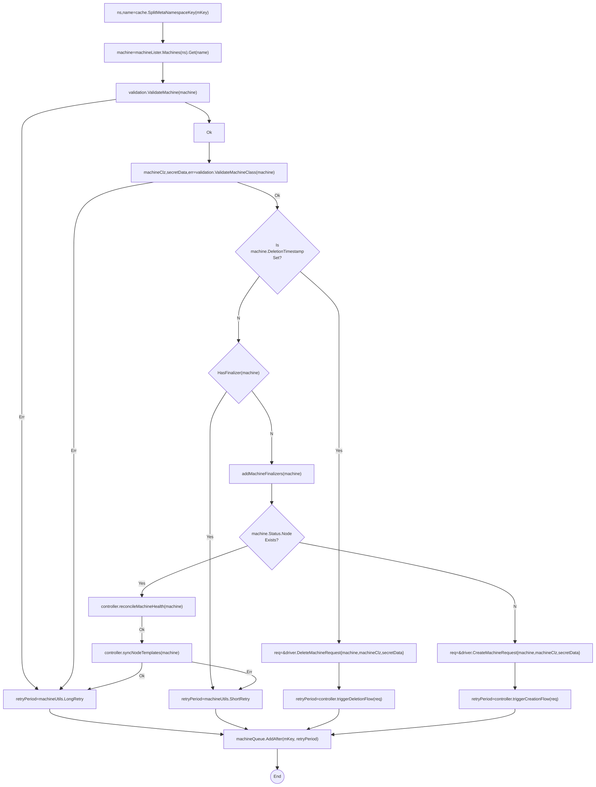
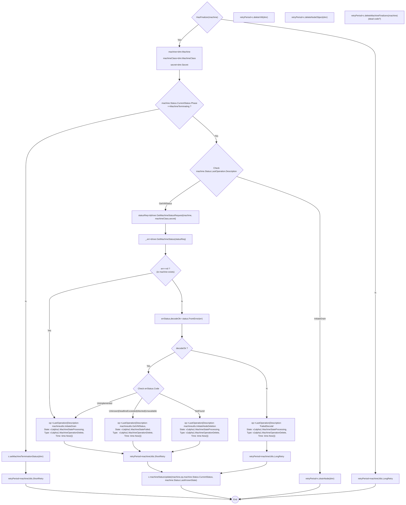

- [Cluster Machine Reconciliation](#cluster-machine-reconciliation)
  - [controller.reconcileClusterMachineKey](#controllerreconcileclustermachinekey)
    - [triggerDeletionFlow](#triggerdeletionflow)
  - [controller.reconcileMachineHealth](#controllerreconcilemachinehealth)
  - [controller.syncMachineNodeTemplates](#controllersyncmachinenodetemplates)

# Cluster Machine Reconciliation

##  controller.reconcileClusterMachineKey

The primary reconcile function for the machine that analyzes machine status and triggers lifecalls calls to the driver. TODO: Provide descriptive summary

```go
func (c *controller) reconcileClusterMachineKey(key string) error
```


### triggerDeletionFlow

```go
func (c *controller) triggerDeletionFlow(ctx context.Context, dmr *driver.DeleteMachineRequest) (machineutils.RetryPeriod, error) 

```
Please note that there is sad use of `machine.Status.LastOperation`  as semantically the _next_ requested operation. This is confusing. TODO: DIscuss This.



## controller.reconcileMachineHealth

```go
func (c *controller) reconcileMachineHealth(ctx context.Context, machine *v1alpha1.Machine) (machineutils.RetryPeriod, error)
```
TODO: illustrate me

## controller.syncMachineNodeTemplates

```go
func (c *controller) syncMachineNodeTemplates(ctx context.Context, machine *v1alpha1.Machine) (machineutils.RetryPeriod, error) 
```
TODO: illustrate me