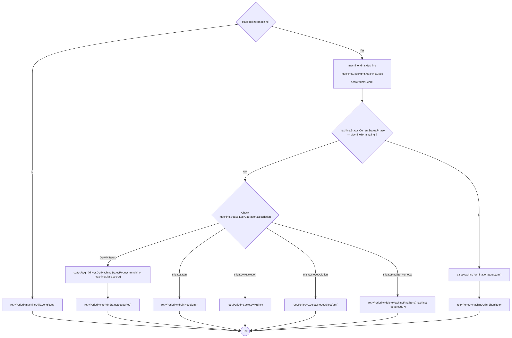
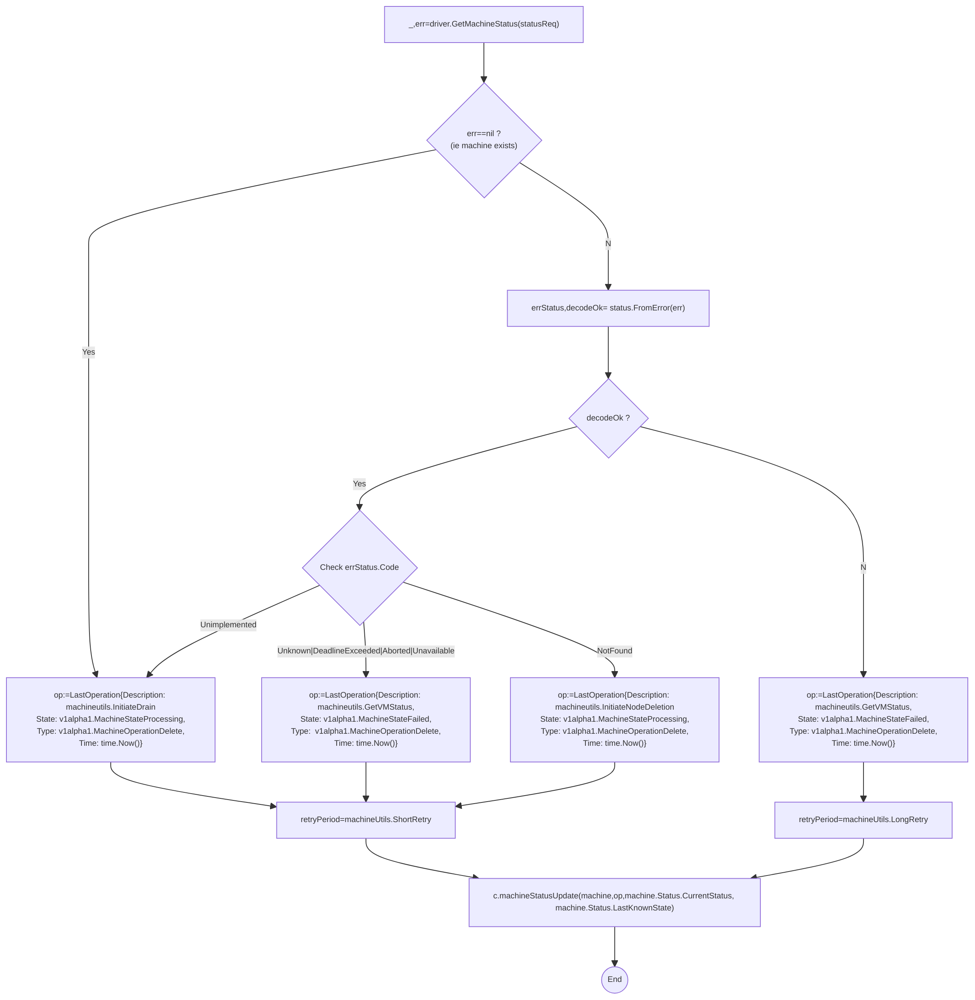
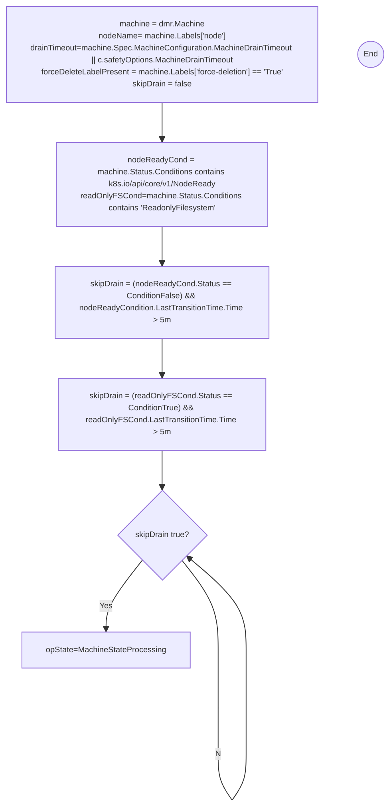

- [Cluster Machine Reconcile](#cluster-machine-reconcile)
  - [triggerDeletionFlow](#triggerdeletionflow)
    - [controller.getVMStatus](#controllergetvmstatus)
    - [controller.drainNode](#controllerdrainnode)
  - [controller.reconcileMachineHealth](#controllerreconcilemachinehealth)
  - [controller.syncMachineNodeTemplates](#controllersyncmachinenodetemplates)

While perusing the below, you might need to reference [Machine Controller Helper Functions](./mc_helper_funcs.md)  as several reconcile functions delegate to helper methods defined on the machine controller struct.

# Cluster Machine Reconcile 

```go
func (c *controller) reconcileClusterMachineKey(key string) error
```
The top-level reconcile function for the machine that analyzes machine status and delegates to the reconcile functions for creation and deletion flows. TODO: Provide descriptive summary


## triggerDeletionFlow

```go
func (c *controller) triggerDeletionFlow(ctx context.Context, dmr *driver.DeleteMachineRequest) (machineutils.RetryPeriod, error) 

```
Please note that there is sad use of `machine.Status.LastOperation`  as semantically the _next_ requested operation. This is confusing. TODO: DIscuss This.



### controller.getVMStatus
(BAD NAME FOR METHOD: should be called `checkMachineExistenceAndEnqueNextOperation`)

```go
func (c *controller) getVMStatus(ctx context.Context, 
    statusReq *driver.GetMachineStatusRequest) (machineutils.RetryPeriod, error)
```

This method is only called for the delete flow. 
1. It attempts to get the machine status
1. If the machine exists, it updates the machine status operation to `InitiateDrain` and returns a `ShortRetry` for the machine work queue. 
1. If attempt to get machine status failed, it will obtain the error code from the error.
   1. If decoding the error code failed, it will update the  machine status operation to `machineutils.GetVMStatus`returns a `LongRetry` for the machine work queue. 
      1. Unsure how we get out of this Loop. TODO: Discuss this. Is this dead code?
   2. For `Unknown|DeadlineExceeded|Aborted|Unavailable` it updates the machine status operation to `machineutils.GetVMStatus` status and returns a `ShortRetry` for the machine work queue.  (So that reconcile will run this method again in future)
   3. For `NotFound` code (ie machine is not found), it will enqueue node deletion by updating the machine stauts operation to `machineutils.InitiateNodeDeletion` and returning a `ShortRetry` for the machine work queue.




### controller.drainNode

Inside `pkg/util/provider/machinecontroller/machine_util.go`
```go
func (c *controller) drainNode(ctx context.Context, dmr *driver.DeleteMachineRequest) (machineutils.RetryPeriod, error)
```




Note on above
1. We skip the drain if node is set to ReadonlyFilesystem for over 5 minutes
   1. Check TODO:  `ReadonlyFilesystem` is a MCM condition and not a k8s core node condition. Not sure if we are mis-using this field. TODO: Check this.
2. Check TODO: Why do we check that node is not ready for 5m in order to skip the drain ? Shouldn't we skip the drain if node is simply not ready ? Why wait for 5m here ?

btmp
```
```
etmp

## controller.reconcileMachineHealth

```go
func (c *controller) reconcileMachineHealth(ctx context.Context, machine *v1alpha1.Machine) (machineutils.RetryPeriod, error)
```
TODO: illustrate me

## controller.syncMachineNodeTemplates

```go
func (c *controller) syncMachineNodeTemplates(ctx context.Context, machine *v1alpha1.Machine) (machineutils.RetryPeriod, error) 
```
TODO: illustrate me