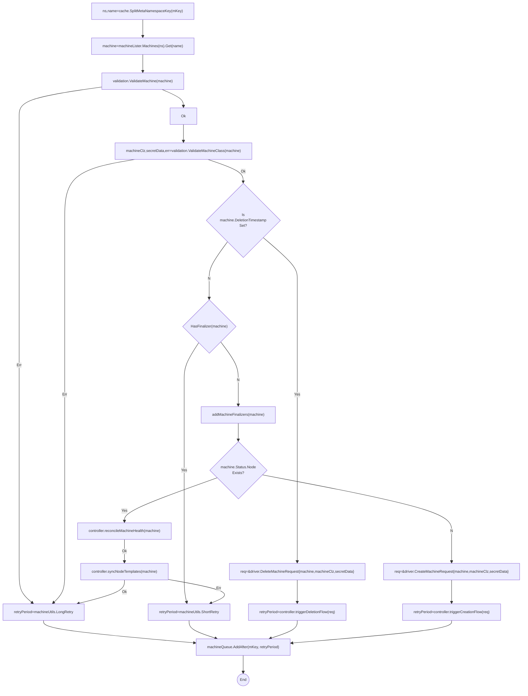

# Cluster Machine Reconciliation

```mermaid
%%{init: {'themeVariables': { 'fontSize': '10px'}}}%%
flowchart TD

A["ns,name=cache.SplitMetaNamespaceKey(mKey)"]
GetM["machine=machineLister.Machines(ns).Get(name)"]
ValM["validation.ValidateMachine(machine)"]
ValMC["machineClz,secretData,err=validation.ValidateMachineClass(machine)"]
LongR["retryPeriod=machineUtils.LongRetry"]
ShortR["retryPeriod=machineUtils.ShortRetry"]
EnqM["machineQueue.AddAfter(mKey, retryPeriod)"]
CheckMDel{"Is\nmachine.DeletionTimestamp\nSet?"}
NewDelReq["req=&driver.DeleteMachineRequest{machine,machineClz,secretData}"]
DelFlow["retryPeriod=controller.triggerDeletionFlow(req)"]
CreateFlow["retryPeriod=controller.triggerCreationFlow(req)"]
HasFin{"HasFinalizer(machine)"}
AddFin["addMachineFinalizers(machine)"]
CheckMachineNodeExists{"machine.Status.Node\nExists?"}
ReconcileMachineHealth["controller.reconcileMachineHealth(machine)"]
SyncNodeTemplates["controller.syncNodeTemplates(machine)"]
NewCreateReq["req=&driver.CreateMachineRequest{machine,machineClz,secretData}"]
Z(("End"))

A-->GetM
EnqM-->Z
LongR-->EnqM
ShortR-->EnqM
GetM-->ValM
ValM-->Ok-->ValMC
ValM--Err-->LongR
ValMC--Err-->LongR
ValMC--Ok-->CheckMDel
CheckMDel--Yes-->NewDelReq
CheckMDel--No-->HasFin
NewDelReq-->DelFlow
HasFin--No-->AddFin
HasFin--Yes-->ShortR
AddFin-->CheckMachineNodeExists
CheckMachineNodeExists--Yes-->ReconcileMachineHealth
CheckMachineNodeExists--No-->NewCreateReq
ReconcileMachineHealth--Ok-->SyncNodeTemplates
SyncNodeTemplates--Ok-->LongR
SyncNodeTemplates--Err-->ShortR
DelFlow-->EnqM
NewCreateReq-->CreateFlow
CreateFlow-->EnqM

```