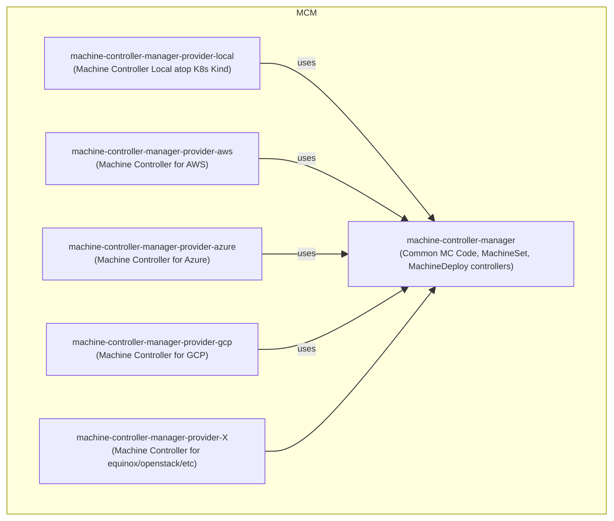

- [Introduction](#introduction)
  - [Project Structure](#project-structure)
- [Change Log](#change-log)

 Current location: [MCM Design Book](https://elankath.github.io/mcmdesign/). 

(🚧 Please see [Change Log](#change-log) for new additions/corrections.Please Check on Oct 21th for v1.1 release!🏗)

# Introduction

A Kubernetes Controller is a program that watches for lifecycle events on specific resources and triggers one or more _reconcile_ functions in response. A _reconcile function_ is called with the _Namespace_ and _Name_ of an object corresponding to the resource and its job is to make the object _Status_ match the declared state in the object _Spec_. 

Machine Controller Manager aka MCM is a group of cooperative controllers that manage the lifecycle of the worker machines, machine-classes machine-sets and machine deployments. 
   - A worker [Machine](./mcm_facilities.md#machine) is a provider specific VM/instance that corresponds to a k8s [Node](https://kubernetes.io/docs/concepts/architecture/nodes/). (k8s doesn't bring up nodes by its own, the MCM does so by using cloud provider API's abstracted by the [Driver](./mcm_facilities.md#driver) facade to bring up machines and map them to nodes)
   - A [MachineClass](./mcm_facilities.md#machineclass) represents a template that contains cloud provider specific details used to create machines.
   - A [MachineSet](./mcm_facilities.md#machineset) ensures that the specified number of `Machine` replicas are running at a given point of time. Analogoues to k8s [ReplicaSets](https://kubernetes.io/docs/concepts/workloads/controllers/replicaset/).
   - A [MachineDeployment](./mcm_facilities.md#machinedeployment) provides a declarative update for `MachineSet` and `Machines`. Analogous to k8s [Deployments](https://kubernetes.io/docs/concepts/workloads/controllers/deployment/). 

## Project Structure

The MCM project is divided into:

1. The [MCM Module](https://github.com/gardener/machine-controller-manager). This contains 
   1. The [MCM Controller Type](https://github.com/gardener/machine-controller-manager/blob/51cea3373d8be7c78aee3f7a4664ccd31f439269/pkg/controller/controller.go#L421) and [MCM Controller Factory Method](https://github.com/gardener/machine-controller-manager/blob/v0.47.0/pkg/controller/controller.go#L62). The `MCM Controller` is responsible for reconciling the `MachineDeployment` and `MachineSet` custom resources. 
   2. [MCM Main](https://github.com/gardener/machine-controller-manager/blob/v0.47.0/cmd/machine-controller-manager/controller_manager.go#L40) which creates and starts the MCM Controller.
   3. The [MC Controller Type](https://github.com/gardener/machine-controller-manager/blob/v0.47.0/pkg/util/provider/machinecontroller/controller.go#L252) and [MC Controller Factory Method](https://github.com/gardener/machine-controller-manager/blob/v0.47.0/pkg/util/provider/machinecontroller/controller.go#L77).
      1. The `MC Controller` implements the reconciliation loop for `MachineClass` and `Machine` objects but delegates creation/updation/deletion/status-retrieval of Machines to the `Driver` facade. 
   4. The [Driver](https://github.com/gardener/machine-controller-manager/blob/v0.47.0/pkg/util/provider/driver/driver.go#L28) facade that abstracts away the lifecycle operations on Machines and obtaining Machine status.
   5. Utility Code leveraged by provider modules. 
2. The provider specific modules named as `machine-controller-manager-provider-<providerName>`. 
   1. Contains a _main_ file located at `cmd/machine-controller/main.go` that instantiate a `Driver` implementation (Ex: [AWSDriver](https://github.com/gardener/machine-controller-manager-provider-aws/blob/v0.13.0/pkg/aws/core.go#L56)) and then create and start a `MC Controller` using the [MC Controller Factory Method](https://github.com/gardener/machine-controller-manager/blob/v0.47.0/pkg/util/provider/machinecontroller/controller.go#L77), passing the `Driver` impl.  In other worlds, each provider module starts its independent machine controller.
   2. See [MCM README](https://github.com/gardener/machine-controller-manager/README.md) for list of provider modules

The MCM leverages the _old-school_ technique of writing controllers directly using [client-go](https://github.com/kubernetes/sample-controller/blob/master/docs/controller-client-go.md). Skeleton code for client types is generated using [client-gen](https://github.com/kubernetes/community/blob/master/contributors/devel/sig-api-machinery/generating-clientset.md). A barebones example is illustrated in the [sample controller](https://github.com/kubernetes/sample-controller). 

The Modern Way of writing controllers is by leveraging the [Controller Runtime](https://github.com/kubernetes-sigs/controller-runtime) and generating skeletal code fur custom controllers using the [Kubebuilder Tool](https://book.kubebuilder.io/quick-start.html).

The MCM has a planned backlog to port the project to the controller runtime. The details of this will be documented in a separate proposal. (TODO: link me in future). 

This book describes the current design of the MCM in order to aid code comprehension for development, enhancement and migratiion/port activities.

# Change Log

- [x] 14th Oct 2022. Machine Health Reconciliation.
- [ ] TODO - PLANNED 21th: Reconcile Machine Safety Orphan VM's.
- [ ] TODO - PLANNED 21th: reconcileClusterMachineSafetyAPIServer 
- [ ] TODO - PLANNED 21th: Machine Status Diagram with actions/transitions (complicated due to concurrency)
- [ ] TODO - PLANNED 31th: Machine Deployment Controller
- [ ] TODO - PLANNED 31th: AWS, Azure Drivers
- [ ] TODO - evictPodsWithPVInternal (complicated due to concurrent flow)