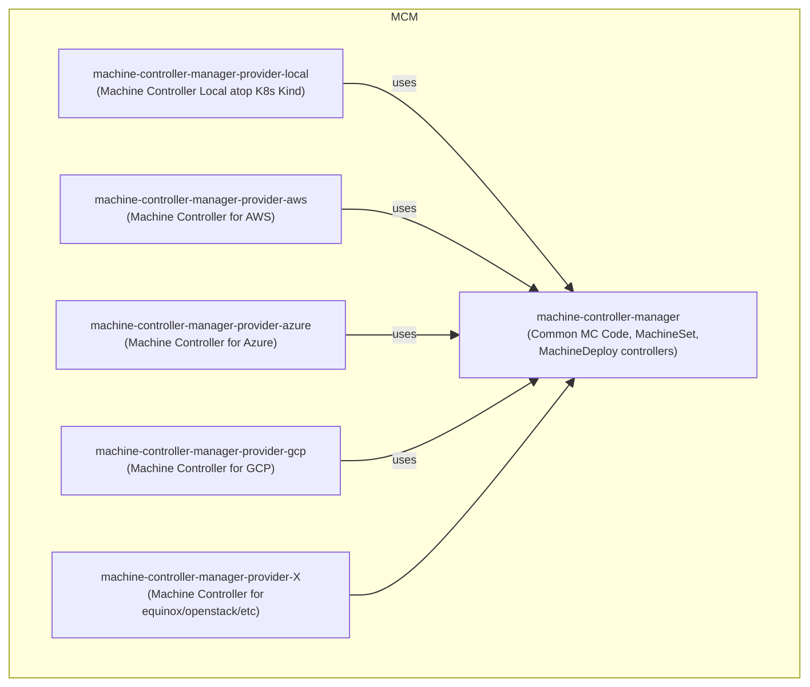

- [Introduction](#introduction)
  - [Project Structure](#project-structure)
  - [Deployment Structure](#deployment-structure)
- [Change Log](#change-log)

 Current location: [MCM Design Book](https://elankath.github.io/mcmdesign/). 

(🚧 Please see [Change Log](#change-log) for new additions/corrections.Please Check on Oct 21th for v1.1 release!🏗)

# Introduction

A Kubernetes Controller is a program that watches for lifecycle events on specific resources and triggers one or more _reconcile_ functions in response. A _reconcile function_ is called with the _Namespace_ and _Name_ of an object corresponding to the resource and its job is to make the object _Status_ match the declared state in the object _Spec_. 

Machine Controller Manager aka MCM is a group of cooperative controllers that manage the lifecycle of the worker machines, machine-classes machine-sets and machine deployments. All these objects are custom resources.
   - A worker [Machine](./mcm_facilities.md#machine) is a provider specific VM/instance that corresponds to a k8s [Node](https://kubernetes.io/docs/concepts/architecture/nodes/). (k8s doesn't bring up nodes by its own, the MCM does so by using cloud provider API's abstracted by the [Driver](./mcm_facilities.md#driver) facade to bring up machines and map them to nodes)
   - A [MachineClass](./mcm_facilities.md#machineclass) represents a template that contains cloud provider specific details used to create machines.
   - A [MachineSet](./mcm_facilities.md#machineset) ensures that the specified number of `Machine` replicas are running at a given point of time. Analogoues to k8s [ReplicaSets](https://kubernetes.io/docs/concepts/workloads/controllers/replicaset/).
   - A [MachineDeployment](./mcm_facilities.md#machinedeployment) provides a declarative update for `MachineSet` and `Machines`. Analogous to k8s [Deployments](https://kubernetes.io/docs/concepts/workloads/controllers/deployment/). 

All the custom resources (`Machine-*` objects) mentioned above are stored in the K8s _control cluster_. The nodes corresponding to the machines are created and registered in the _target cluster_. 

For productive Gardener deployments, the _control cluster_ is the control plane of the shoot cluster and since the MCM is running in the shoot's control plane, the kubeconfig for the control cluster is generally specified as the [In-Cluster Config](https://github.com/kubernetes/client-go/tree/master/examples/in-cluster-client-configuration). The target cluster is the shoot cluster and hence the target cluster config is the shoot kube config.

## Project Structure



The MCM project is divided into:

1. The [MCM Module](https://github.com/gardener/machine-controller-manager). This contains 
   1. The [MCM Controller Type](https://github.com/gardener/machine-controller-manager/blob/51cea3373d8be7c78aee3f7a4664ccd31f439269/pkg/controller/controller.go#L421) and [MCM Controller Factory Method](https://github.com/gardener/machine-controller-manager/blob/v0.47.0/pkg/controller/controller.go#L62). The `MCM Controller` is responsible for reconciling the `MachineDeployment` and `MachineSet` custom resources. 
   2. [MCM Main](https://github.com/gardener/machine-controller-manager/blob/v0.47.0/cmd/machine-controller-manager/controller_manager.go#L40) which creates and starts the MCM Controller.
   3. The [MC Controller Type](https://github.com/gardener/machine-controller-manager/blob/v0.47.0/pkg/util/provider/machinecontroller/controller.go#L252) and [MC Controller Factory Method](https://github.com/gardener/machine-controller-manager/blob/v0.47.0/pkg/util/provider/machinecontroller/controller.go#L77).
      1. The `MC Controller` implements the reconciliation loop for `MachineClass` and `Machine` objects but delegates creation/updation/deletion/status-retrieval of Machines to the `Driver` facade. 
   4. The [Driver](https://github.com/gardener/machine-controller-manager/blob/v0.47.0/pkg/util/provider/driver/driver.go#L28) facade that abstracts away the lifecycle operations on Machines and obtaining Machine status.
   5. Utility Code leveraged by provider modules. 
2. The provider specific modules named as `machine-controller-manager-provider-<providerName>`. 
   1. Contains a _main_ file located at `cmd/machine-controller/main.go` that instantiate a `Driver` implementation (Ex: [AWSDriver](https://github.com/gardener/machine-controller-manager-provider-aws/blob/v0.13.0/pkg/aws/core.go#L56)) and then create and start a `MC Controller` using the [MC Controller Factory Method](https://github.com/gardener/machine-controller-manager/blob/v0.47.0/pkg/util/provider/machinecontroller/controller.go#L77), passing the `Driver` impl.  In other worlds, each provider module starts its independent machine controller.
   2. See [MCM README](https://github.com/gardener/machine-controller-manager/README.md) for list of provider modules

The MCM leverages the _old-school_ technique of writing controllers directly using [client-go](https://github.com/kubernetes/sample-controller/blob/master/docs/controller-client-go.md). Skeleton code for client types is generated using [client-gen](https://github.com/kubernetes/community/blob/master/contributors/devel/sig-api-machinery/generating-clientset.md). A barebones example is illustrated in the [sample controller](https://github.com/kubernetes/sample-controller). 

The Modern Way of writing controllers is by leveraging the [Controller Runtime](https://github.com/kubernetes-sigs/controller-runtime) and generating skeletal code fur custom controllers using the [Kubebuilder Tool](https://book.kubebuilder.io/quick-start.html).

The MCM has a planned backlog to port the project to the controller runtime. The details of this will be documented in a separate proposal. (TODO: link me in future). 

This book describes the current design of the MCM in order to aid code comprehension for development, enhancement and migratiion/port activities.


## Deployment Structure

The MCM Pod's are part of the `Deployment` named `machine-controller-manager` that resides in the shoot control plane. After logging into the shoot control plane (use `gardenctl`), you can the deployment details using `k get deploy machine-controller-manager -o yaml `. The MCM deployment has two containers:

1. `machine-controller-manager-provider-<provider>`. Ex: `machine-controller-manager-provider-aws`.  This container name is a bit misleading as it starts the provider specific machine controller main program responsible for reconciling machine-classes and machines. See [Machine Controller](./machine-controller/README.md). (Ideally the `-manager` should have been removed)

Container command configured on AWS:
```
./machine-controller
         --control-kubeconfig=inClusterConfig
         --machine-creation-timeout=20m
         --machine-drain-timeout=2h
         --machine-health-timeout=10m
         --namespace=shoot--i034796--tre
         --port=10259
         --target-kubeconfig=/var/run/secrets/gardener.cloud/shoot/generic-kubeconfig/kubeconfig`
```
2. `<provider>-machine-controller-manager`. Ex: `aws-machine-controller-manager`. This container name is a bit misleading as it starts the machine deployment controller main program responsible for reconciling machine-deployments and machine-sets. (See: TODO: link me). Ideally it should have been called simply `machine-deployment-controller` as it is provider independent.

Container command configured on AWS
```
./machine-controller-manager
         --control-kubeconfig=inClusterConfig
         --delete-migrated-machine-class=true
         --machine-safety-apiserver-statuscheck-timeout=30s
         --machine-safety-apiserver-statuscheck-period=1m
         --machine-safety-orphan-vms-period=30m
         --machine-safety-overshooting-period=1m
         --namespace=shoot--i034796--tre
         --port=10258
         --safety-up=2
         --safety-down=1
         --target-kubeconfig=/var/run/secrets/gardener.cloud/shoot/generic-kubeconfig/kubeconfig
```


# Change Log

- [x] 14th Oct 2022. Machine Health Reconciliation.
- [ ] TODO - PLANNED 23th: Reconcile Machine Safety Orphan VM's.
- [ ] TODO - PLANNED 23th: reconcileClusterMachineSafetyAPIServer 
- [ ] TODO - PLANNED 23th: Machine Status Diagram with actions/transitions (complicated due to concurrency)
- [ ] TODO - PLANNED 31th: Machine Deployment Controller
- [ ] TODO - PLANNED 31th: AWS, Azure Drivers
- [ ] TODO - evictPodsWithPVInternal (complicated due to concurrent flow)