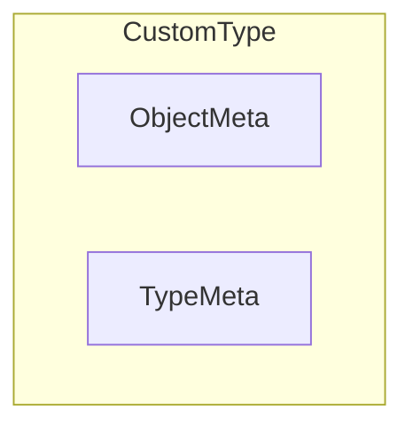
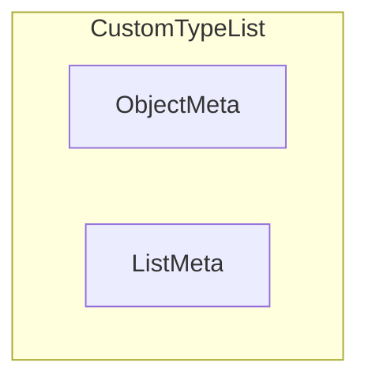
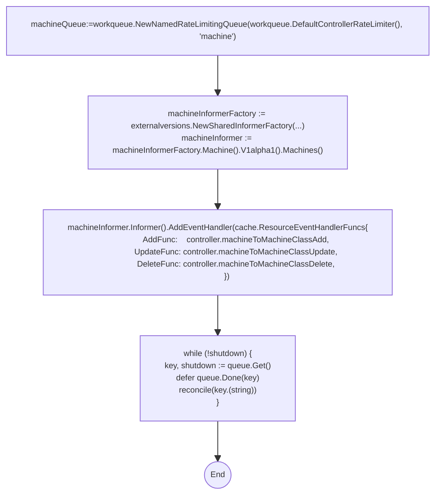

- [Kubernetes Client Facilities](#kubernetes-client-facilities)
	- [K8s apimachinery](#k8s-apimachinery)
		- [K8s objects](#k8s-objects)
			- [TypeMeta](#typemeta)
			- [ObjectMeta](#objectmeta)
				- [OwnerReferences](#ownerreferences)
				- [Finalizers and Deletion](#finalizers-and-deletion)
				- [Diff between Labels and Annotations](#diff-between-labels-and-annotations)
				- [RawExtension](#rawextension)
			- [API Errors](#api-errors)
				- [errors.IsNotFound](#errorsisnotfound)
				- [errors.IsNotFound](#errorsisnotfound-1)
		- [API Machinery Utilities](#api-machinery-utilities)
			- [wait.Until](#waituntil)
			- [wait.PollImmediate](#waitpollimmediate)
			- [wait.Backoff](#waitbackoff)
			- [Errors](#errors)
	- [K8s API Core](#k8s-api-core)
		- [Node](#node)
			- [NodeSpec](#nodespec)
				- [Node Taints](#node-taints)
			- [NodeStatus](#nodestatus)
				- [Capacity](#capacity)
				- [Conditions](#conditions)
					- [NodeConditionType](#nodeconditiontype)
					- [ConditionStatus](#conditionstatus)
				- [NodeSystemInfo](#nodesysteminfo)
				- [Images](#images)
				- [Attached Volumes](#attached-volumes)
		- [Pod](#pod)
			- [Pod Eviction](#pod-eviction)
			- [Pod Disruption Budget](#pod-disruption-budget)
				- [PodDisruptionBudgetSpec](#poddisruptionbudgetspec)
				- [PodDisruptionBudgetStatus](#poddisruptionbudgetstatus)
			- [Pod Volumes](#pod-volumes)
		- [PersistentVolume](#persistentvolume)
			- [PersistentVolumeClaim](#persistentvolumeclaim)
		- [Secret](#secret)
	- [client-go](#client-go)
		- [client-go Shared Informers.](#client-go-shared-informers)
		- [client-go workqueues](#client-go-workqueues)
		- [client-go controller steps](#client-go-controller-steps)
		- [client-go utilities](#client-go-utilities)
			- [k8s.io/client-go/util/retry.RetryOnConflict](#k8sioclient-goutilretryretryonconflict)
	- [References](#references)

# Kubernetes Client Facilities

This chapter describes the types and functions provided by k8s core and client modules that are leveraged by the MCM - it only covers what is required to understand MCM code and is simply meant to be a helpful review. References are provided for further reading.

## K8s apimachinery


### K8s objects

A K8s object represents a persistent entity. When using the K8s client-go framework to define such an object, one should follow the rules:

1. A Go type representing a object must embed the [k8s.io/apimachinery/pkg/apis/meta/v1.ObjectMeta](https://pkg.go.dev/k8s.io/apimachinery/pkg/apis/meta/v1#ObjectMeta) struct. `ObjectMeta` is metadata that all persisted resources must have, which includes all objects users must create.
2. A Go type representing a _singluar_ object must embed [k8s.io/apimachinery/pkg/apis/meta/v1.TypeMeta](https://pkg.go.dev/k8s.io/apimachinery/pkg/apis/meta/v1#TypeMeta) which describes an _individual_ object in an API response or request with strings representing the _Kind_ of the object and its API schema version called _APIVersion_. 

3. A Go type representing a _list_ of a custom type must embed [k8s.io/apimachinery/pkg/apis/meta/v1.ListMeta](https://pkg.go.dev/k8s.io/apimachinery/pkg/apis/meta/v1#ListMeta)


#### TypeMeta

```go
type TypeMeta struct {
	// Kind is a string value representing the REST resource this object represents.
	Kind string 

	// APIVersion defines the versioned schema of this representation of an object.
	APIVersion string
}
```

#### ObjectMeta

A snippet of `ObjectMeta` struct fields shown below for convenience with the MCM relevant fields that are used by controller code.
```go
type ObjectMeta struct { //snippet 
    // Name must be unique within a namespace. Is required when creating resources,
    Name string 

    // Namespace defines the space within which each name must be unique. An empty namespace is  equivalent to the "default" namespace,
    Namespace string

    // An opaque value that represents the internal version of this object that can be used by clients to determine when objects have changed.
    ResourceVersion string

	// A sequence number representing a specific generation of the desired state.
	Generation int64 

    // UID is the unique in time and space value for this object. It is typically generated by the API server on successful creation of a resource and is not allowed to change on PUT operations.
    UID types.UID 

    // CreationTimestamp is a timestamp representing the server time when this object was  created.
    CreationTimestamp Time 

    // DeletionTimestamp is RFC 3339 date and time at which this resource will be deleted. This field is set by the server when a graceful deletion is requested by the user.  The resource is expected to be deleted (no longer reachable via APIs) after the time in this field, once the finalizers list is empty.
    DeletionTimestamp *Time


    // Must be empty before the object is deleted from the registry by the API server. Each entry is an identifier for the responsible controller that will remove the entry from the list.
    Finalizers []string 

    // Map of string keys and values that can be used to organize and categorize (scope and select) objects. Valid label keys have two segments: an optional prefix and name, separated by a slash (/).  Meant to be meaningful and relevant to USERS.
    Labels map[string]string

    // Annotations is an unstructured key value map stored with a resource that may be  set by controllers/tools to store and retrieve arbitrary metadata. Meant for TOOLS.
    Annotations map[string]string 

    // References to owner objects. Ex: Pod belongs to its owning ReplicaSet. A Machine belongs to its owning MachineSet.
    OwnerReferences []OwnerReference

    // The name of the cluster which the object belongs to. This is used to distinguish resources with same name and namespace in different clusters.
    ClusterName string

    //... other fields omitted.
}
```

##### OwnerReferences
[k8s.io/apimachinery/pkg/apis/meta/v1.OwnerReference](https://pkg.go.dev/k8s.io/apimachinery/pkg/apis/meta/v1#OwnerReference) is a struct that contains `TypeMeta` fields and a small sub-set of the `ObjectMetadata` - enough to let you identify an owning object. An owning object must be in the same namespace as the dependent, or be cluster-scoped, so there is no namespace field.
```go
type OwnerReference struct {
   APIVersion string
   Kind string 
   Name string 
   UID types.UID 
   //... other fields omitted. TODO: check for usages.
}
```

##### Finalizers and Deletion

Every k8s object has a `Finalizers []string` field that can be explicitly assigned by a controller. Every k8s object has a `DeletionTimestamp *Time` that is set by API Server when graceful deletion is requested.

These are part of the [k8s.io./apimachinery/pkg/apis/meta/v1.ObjectMeta](https://pkg.go.dev/k8s.io/apimachinery/pkg/apis/meta/v1#ObjectMeta) struct type which is embedded in all k8s objects. 

When you tell Kubernetes to delete an object that has finalizers specified for it, the Kubernetes API marks the object for deletion by populating `.metadata.deletionTimestamp` aka `Deletiontimestamp`, and returns a `202` status code (HTTP `Accepted`). The target object remains in a terminating state while the control plane takes the actions defined by the finalizers. After these actions are complete, the controller should removes the relevant finalizers from the target object. When the `metadata.finalizers` field is empty, Kubernetes considers the deletion complete and deletes the object.

##### Diff between Labels and Annotations

_Labels_ are used in conjunction with selectors to identify groups of related resources and meant to be meaningful to users. Because selectors are used to query labels, this operation needs to be efficient. To ensure efficient queries, labels are constrained by RFC 1123. RFC 1123, among other constraints, restricts labels to a maximum 63 character length. Thus, labels should be used when you want Kubernetes to group a set of related resources. See https://kubernetes.io/docs/concepts/overview/working-with-objects/labels/ on label key and value restrictions

_Annotations_ are used for “non-identifying information” i.e., metadata that Kubernetes does not care about. As such, annotation keys and values have no constraints. Can include characters not 

##### RawExtension

[k8s.io/apimachinery/pkg/runtime.RawExtension](https://pkg.go.dev/k8s.io/apimachinery/pkg/runtime#RawExtension) is used to hold extension objects whose structures can be arbitrary. An example of MCM type that leverages this is the [MachineClass](https://pkg.go.dev/github.com/gardener/machine-controller-manager@v0.47.0/pkg/apis/machine/v1alpha1#MachineClass) type whose `ProviderSpec` field is of type `runtime.RawExtension` and whose structure can vary according to the provider.

One can use a different custom structure type for each extension variant and then decode the field into an instance of that extension structure type using the standard Go json decoder.

Example:
```go
var providerSpec *api.AWSProviderSpec
json.Unmarshal(machineClass.ProviderSpec.Raw, &providerSpec)
```

One can

#### API Errors

[k8s.io/apimachinery/pkg/api/errors](https://pkg.go.dev/k8s.io/apimachinery@v0.25.2/pkg/api/errors) provides detailed error types  ans `IsXXX` methods for k8s api errors.

##### errors.IsNotFound

[k8s.io/apimachinery/pkg/api/errors.IsNotFound](https://pkg.go.dev/k8s.io/apimachinery@v0.25.2/pkg/api/errors#IsNotFound) returns true if the specified error was due to a k8s object not found. (error or wrapped error created by [errors.NewNotFound](https://pkg.go.dev/k8s.io/apimachinery@v0.25.2/pkg/api/errors#NewNotFound))

##### errors.IsNotFound
[k8s.io/apimachinery/pkg/api/errors.IsTooManyRequests](https://pkg.go.dev/k8s.io/apimachinery@v0.25.2/pkg/api/errors#IsTooManyRequests)  determines if err (or any wrapped error) is an error which indicates that there are too many requests that the server cannot handle.

### API Machinery Utilities

#### wait.Until

[k8s.io/apimachinery/pkg/wait.Until](https://github.com/kubernetes/apimachinery/blob/v0.25.0/pkg/util/wait/wait.go#L91) loops until `stop` channel is closed, running `f` every given `period.` 

```go
func Until(f func(), period time.Duration, stopCh <-chan struct{})
```

#### wait.PollImmediate

[k8s.io/apimachinery/pkg/util/wait.PollImmediate](https://pkg.go.dev/k8s.io/apimachinery@v0.25.2/pkg/util/wait#PollImmediate)  tries a condition func until it returns true, an error, or the timeout is reached.

```go
func PollImmediate(interval, timeout time.Duration, condition ConditionFunc) error
```

#### wait.Backoff

[k8s.io/apimachinery/pkg/util/wait.Backoff](https://pkg.go.dev/k8s.io/apimachinery/pkg/util/wait#Backoff) holds parameters applied to a Backoff function. There are many `retry` functions in `client-go` and MCM that take an instance of this struct as parameter.

```go
type Backoff struct {
	Duration time.Duration
	Factor float64
	Jitter float64
	Steps int
	Cap time.Duration
}
```
- `Duration` is the initial backoff duration.
- `Duration` is multiplied by `Factor` for the next iteration. 
- `Jitter` is the random amount of each duration added (between `Duration` and `Duration*(1+jitter)`
- `Steps` is the remaining number of iterations in which the duration may increase.
- `Cap` is the cap on the duration and may not exceed this value.

#### Errors

[k8s.io/apimachinery/pkg/util/errors.Aggregate](https://pkg.go.dev/k8s.io/apimachinery@v0.25.2/pkg/util/errors#Aggregate) represents an object that contains multiple errors

Use [k8s.io/apimachinery/pkg/util/errors.NewAggregate](https://pkg.go.dev/k8s.io/apimachinery@v0.25.2/pkg/util/errors#NewAggregate) to construct the aggregate error from a slice of errors.
```go
type Aggregate interface {
	error
	Errors() []error
	Is(error) bool
}
func NewAggregate(errlist []error) Aggregate {//...}
```

## K8s API Core
The MCM leverages several types from https://pkg.go.dev/k8s.io/api/core/v1 

### Node
[k8s.io/api/core/v1.Node](https://pkg.go.dev/k8s.io/api/core/v1#Node) represents a worker node in Kubernetes. 

```go
type Node struct {
    metav1.TypeMeta
    metav1.ObjectMeta 
    Spec NodeSpec
    // Most recently observed status of the node.
    Status NodeStatus
}
```
#### NodeSpec

[k8s.io/api/core/v1.NodeSpec](https://pkg.go.dev/k8s.io/api/core/v1#NodeSpec)describes the attributes that a node is created with.  Both [Node](#node) and [MachineSpec](./mcm_facilities.md#machinespec) use this. A snippet of MCM-relevant `NodeSpec` struct fields shown below for convenience.

```go 
type NodeSpec struct {
    // ID of the node assigned by the cloud provider in the format: <ProviderName>://<ProviderSpecificNodeID>
    ProviderID string 
    // podCIDRs represents the IP ranges assigned to the node for usage by Pods on that node.
    PodCIDRs []string 

    // Unschedulable controls node schedulability of new pods. By default, node is schedulable.
    Unschedulable bool

    // Taints represents the Node's Taints. (taint is opposite of affinity. allow a Node to repel pods as opposed to attracting them)
    Taints []Taint
}
```

##### Node Taints
See [Taints and Tolerations](https://kubernetes.io/docs/concepts/scheduling-eviction/taint-and-toleration/)

[k8s.io/api/core/v1.Taint](https://pkg.go.dev/k8s.io/api/core/v1#Taint) is a Kubernetes `Node` property that enable specific nodes to repel pods. _Tolerations_ are a Kubernetes `Pod` property that overcome this and allow a pod to be scheduled on a node with a _matching_ taint.

Instead of applying the label to a node, we apply a taint that tells a scheduler to repel Pods from this node if it does not match the taint. Only those Pods that have a _toleration_ for the taint can be let into the node with that taint.


`kubectl taint nodes <node name> <taint key>=<taint value>:<taint effect>
`

Example:

`kubectl taint nodes node1 gpu=nvidia:NoSchedule`

Users can specify any arbitrary string for the taint key and value. The taint effect defines how a tainted node reacts to a pod without appropriate toleration. It must be one of the following effects;

- `NoSchedule`: The pod will not get scheduled to the node without a matching toleration.

- `NoExecute`:This will immediately evict all the pods without the matching toleration from the node.

- `PerferNoSchedule`:This is a softer version of NoSchedule where the controller will not try to schedule a pod with the tainted node. However, it is not a strict requirement.

```go
type Taint struct {
	// Key of taint to be applied to a node.
	Key string
	// Value of taint corresponding to the taint key.
	Value string 
	// Effect represents the effect of the taint on pods
	// that do not tolerate the taint.
	// Valid effects are NoSchedule, PreferNoSchedule and NoExecute.
	Effect TaintEffect 
	// TimeAdded represents the time at which the taint was added.
	// It is only written for NoExecute taints.
	// +optional
	TimeAdded *metav1.Time 
}
```

Example of a PodSpec with toleration below:
```yaml
apiVersion: v1
kind: Pod
metadata:
  name: pod-1
  labels:
    security: s1
spec:
  containers:
  - name: bear
    image: supergiantkir/animals:bear
  tolerations:
  - key: "gpu"
    operator: "Equal"
    value: "nvidia"
    effect: "NoSchedule"
 ```

Example use case for a taint/tolerance: If you have nodes with special hardware (e.g GPUs) you want to repel Pods that do not need this hardware and attract Pods that do need it. This can be done by tainting the nodes that have the specialized hardware (e.g. kubectl taint nodes nodename gpu=nvidia:NoSchedule ) and adding corresponding toleration to Pods that must use this special hardware.

#### NodeStatus

See [Node status](https://kubernetes.io/docs/concepts/architecture/nodes/#node-status)

[k8s.io/api/core/v1.NodeStatus](https://pkg.go.dev/k8s.io/api/core/v1#NodeStatus) represents the current status of a node and is an encapsulation illustrated below:

```go
type NodeStatus struct {
	Capacity ResourceList 
	// Allocatable represents the resources of a node that are available for scheduling. Defaults to Capacity.
	Allocatable ResourceList
	// Conditions is an array of current observed node conditions.
	Conditions []NodeCondition 
	// List of addresses reachable to the node.Queried from cloud provider, if available.
	Addresses []NodeAddress 
	// Set of ids/uuids to uniquely identify the node.
	NodeInfo NodeSystemInfo 
	// List of container images on this node
	Images []ContainerImage 
	// List of attachable volumes that are in use (mounted) by the node.
  //UniqueVolumeName is just typedef for string
	VolumesInUse []UniqueVolumeName 
	// List of volumes that are attached to the node.
	VolumesAttached []AttachedVolume 
}
```

##### Capacity 
 [Capacity](https://kubernetes.io/docs/concepts/storage/persistent-volumes#capacity). The fields in the capacity block indicate the total amount of resources that a Node has. 
  - Allocatable indicates the amount of resources on a Node that is available to be consumed by normal Pods. Defaults to Capacity.

A Node `Capacity` is of type [k8s.io/api/core/v1.ResourceList](https://pkg.go.dev/k8s.io/api/core/v1#ResourceList) which is effectively a set of set of (resource name, quantity) pairs. 

```go
type ResourceList map[ResourceName]resource.Quantity
```

`ResourceName`s can be cpu/memory/storage

```go
const (
	// CPU, in cores. (500m = .5 cores)
	ResourceCPU ResourceName = "cpu"
	// Memory, in bytes. (500Gi = 500GiB = 500 * 1024 * 1024 * 1024)
	ResourceMemory ResourceName = "memory"
	// Volume size, in bytes (e,g. 5Gi = 5GiB = 5 * 1024 * 1024 * 1024)
	ResourceStorage ResourceName = "storage"
	// Local ephemeral storage, in bytes. (500Gi = 500GiB = 500 * 1024 * 1024 * 1024)
	// The resource name for ResourceEphemeralStorage is alpha and it can change across releases.
	ResourceEphemeralStorage ResourceName = "ephemeral-storage"
)
```
A [k8s.io/apimachinery/pkg/api/resource.Quantity](https://pkg.go.dev/k8s.io/apimachinery@v0.25.2/pkg/api/resource#Quantity) is a serializable/de-serializable number with a SI unit

##### Conditions
[Conditions](https://kubernetes.io/docs/concepts/nodes/node/#condition) are valid conditions of nodes.

[https://pkg.go.dev/k8s.io/api/core/v1.NodeCondition](https://pkg.go.dev/k8s.io/api/core/v1#NodeCondition) contains condition information for a node.

```go
type NodeCondition struct {
	// Type of node condition.
	Type NodeConditionType 
	// Status of the condition, one of True, False, Unknown.
	Status ConditionStatus 
	// Last time we got an update on a given condition.
	LastHeartbeatTime metav1.Time 
	// Last time the condition transitioned from one status to another.
	LastTransitionTime metav1.Time 
	// (brief) reason for the condition's last transition.
	Reason string 
	// Human readable message indicating details about last transition.
	Message string 
}
```

###### NodeConditionType
`NodeConditionType` is one of the following:
```go
const (
	// NodeReady means kubelet is healthy and ready to accept pods.
	NodeReady NodeConditionType = "Ready"
	// NodeMemoryPressure means the kubelet is under pressure due to insufficient available memory.
	NodeMemoryPressure NodeConditionType = "MemoryPressure"
	// NodeDiskPressure means the kubelet is under pressure due to insufficient available disk.
	NodeDiskPressure NodeConditionType = "DiskPressure"
	// NodePIDPressure means the kubelet is under pressure due to insufficient available PID.
	NodePIDPressure NodeConditionType = "PIDPressure"
	// NodeNetworkUnavailable means that network for the node is not correctly configured.
	NodeNetworkUnavailable NodeConditionType = "NetworkUnavailable"
)
```
Note: The MCM extends the above with further custom node condition types of its own. Not sure if this is correct - could break later if k8s enforces some validation ?

###### ConditionStatus

These are valid condition statuses. `ConditionTrue` means a resource is in the condition. `ConditionFalse` means a resource is not in the condition. `ConditionUnknown` means kubernetes can't decide if a resource is in the condition or not. 
```go
type ConditionStatus string

const (
	ConditionTrue    ConditionStatus = "True"
	ConditionFalse   ConditionStatus = "False"
	ConditionUnknown ConditionStatus = "Unknown"
)
````

##### Addresses
See [Node Addresses](https://kubernetes.io/docs/concepts/architecture/nodes/#addresses)
	
[k8s.io/api/core/v1.NodeAddress](https://pkg.go.dev/k8s.io/api/core/v1#NodeAddress) contains information for the node's address.

```go
type NodeAddress struct {
	// Node address type, one of Hostname, ExternalIP or InternalIP.
	Type NodeAddressType 
	// The node address string.
	Address string 
}
```

##### NodeSystemInfo

Describes general information about the node, such as machine id, kernel version, Kubernetes version (kubelet and kube-proxy version), container runtime details, and which operating system the node uses. The kubelet gathers this information from the node and publishes it into the Kubernetes API.

```go
type NodeSystemInfo struct {
	// MachineID reported by the node. For unique machine identification
	// in the cluster this field is preferred. 
	MachineID string 
	// Kernel Version reported by the node from 'uname -r' (e.g. 3.16.0-0.bpo.4-amd64).
	KernelVersion string 
	// OS Image reported by the node from /etc/os-release (e.g. Debian GNU/Linux 7 (wheezy)).
	OSImage string 
	// ContainerRuntime Version reported by the node through runtime remote API (e.g. docker://1.5.0).
	ContainerRuntimeVersion string 
	// Kubelet Version reported by the node.
	KubeletVersion string 
	// KubeProxy Version reported by the node.
	KubeProxyVersion string 
	// The Operating System reported by the node
	OperatingSystem string 
	// The Architecture reported by the node
	Architecture string 
}
```
- The [MachineID](http://man7.org/linux/man-pages/man5/machine-id.5.html) is a single newline-terminated, hexadecimal, 32-character, lowercase ID. from `/etc/machine-id`


##### Images
A slice of [k8s.io/api/core/v1.ContainerImage](https://pkg.go.dev/k8s.io/api/core/v1#ContainerImage) which describes a contianer image.

```go
type ContainerImage struct {
	Names []string 
	SizeBytes int64 
}
```
- Names is the names by which this image is known.
	 e.g. `["kubernetes.example/hyperkube:v1.0.7", "cloud-vendor.registry.example/cloud-vendor/hyperkube:v1.0.7"]`
- `SizeBytes` is the size of the image in bytes.

##### Attached Volumes

[k8s.io/api/core/v1.AttachedVolume](https://pkg.go.dev/k8s.io/api/core/v1#AttachedVolume) describes a volume attached to a node.

```go
type UniqueVolumeName string
type AttachedVolume struct {
	Name UniqueVolumeName 
	DevicePath string 
}
```
- `Name` is the Name of the attached volume. `UniqueVolumeName` is just a typedef for a Go string.
- `DevicePath` represents the device path where the volume should be available


### Pod 

[k8s.io/api/core/v1.Pod](k8s.io/api/core/v1#Pod) struct represents a k8s [Pod](https://kubernetes.io/docs/concepts/workloads/pods/) which a collection of containers that can run on a host. This resource is created by clients and scheduled onto hosts.

```go
type Pod struct {
	metav1.TypeMeta
	metav1.ObjectMeta

	// Specification of the desired behavior of the pod.
	Spec PodSpec 

	// Most recently observed status of the pod.
	Status PodStatus
}
```

See [k8s.io/api/core/v1.PodSpec](https://pkg.go.dev/k8s.io/api/core/v1#PodSpec). Each `PodSpec` has a priority value where the higher the value, the higher the priority of the Pod.

`PodSpec.Volumes` slice is List of volumes that can be mounted by containers belonging to the pod and is relevant to MC code that attaches/detaches volumes .
```go
type PodSpec struct {
	 Volumes []Volume 
	 //TODO: describe other PodSpec fields used by MC
}
```

#### Pod Eviction
A [k8s.io/api/policy/v1.Eviction](k8s.io/api@v0.25.2/policy/v1#Eviction) can be used to evict a [Pod](#pod) from its [Node](#node) - eviction is the _graceful_ terimation of Pods on nodes.See [API Eviction](https://kubernetes.io/docs/concepts/scheduling-eviction/api-eviction/)

```go
type Eviction struct {
	metav1.TypeMeta 

	// ObjectMeta describes the pod that is being evicted.
	metav1.ObjectMeta 

	// DeleteOptions may be provided
	DeleteOptions *metav1.DeleteOptions 
}

```

Construct the `ObjectMeta` using the Pod and namespace and then use instance of typed [Kubernetes Client Interface](https://pkg.go.dev/k8s.io/client-go/kubernetes#Interface), and get the [PolicyV1Interface](https://pkg.go.dev/k8s.io/client-go@v0.25.2/kubernetes/typed/policy/v1#PolicyV1Interface), get the [EvictionInterface](https://pkg.go.dev/k8s.io/client-go@v0.25.2/kubernetes/typed/policy/v1#EvictionInterface) and invoke the invoke the [Evict](https://pkg.go.dev/k8s.io/client-go@v0.25.2/kubernetes/typed/policy/v1#EvictionExpansion) method

Example
```go
client.PolicyV1().Evictions(eviction.Namespace).Evict(ctx, eviction)
```
#### Pod Disruption Budget

A [k8s.io/api/policy/v1.PodDisruptionBudget](https://pkg.go.dev/k8s.io/api@v0.25.2/policy/v1#PodDisruptionBudget)is a struct type that represents a [Pod Disruption Budget](https://kubernetes.io/docs/tasks/run-application/configure-pdb/#specifying-a-poddisruptionbudget) which is the max disruption that can be caused to a collection of pods.

```go
type PodDisruptionBudget struct {
	metav1.TypeMeta 
	metav1.ObjectMeta

	// Specification of the desired behavior of the PodDisruptionBudget.
	Spec PodDisruptionBudgetSpec 
	// Most recently observed status of the PodDisruptionBudget.
	Status PodDisruptionBudgetStatus 
}
```
##### PodDisruptionBudgetSpec

```go
type PodDisruptionBudgetSpec struct {
	MinAvailable *intstr.IntOrString 
	Selector *metav1.LabelSelector 
	MaxUnavailable *intstr.IntOrString 
}
```
- `Selector` specifies  Label query over pods whose evictions are managed by the disruption budget. A null selector will match no pods, while an empty ({}) selector will select all pods within the namespace.
- An eviction is allowed if at least `MinAvailable` pods selected by `Selector` will still be available after the eviction, i.e. even in the absence of the evicted pod.  So for example you can prevent all voluntary evictions by specifying "100%".
-  An eviction is allowed if at most `MaxUnavailable` pods selected by `Selector` are unavailable after the eviction, i.e. even in absence of  the evicted pod. For example, one can prevent all voluntary evictions  by specifying 0. 
-  `MinAvailable` is a mutually exclusive setting with `MaxUnavailable`

##### PodDisruptionBudgetStatus
See godoc for [k8s.io/api/policy/v1.PodDisruptionBudgetStatus](https://pkg.go.dev/k8s.io/api@v0.25.2/policy/v1#PodDisruptionBudgetStatus)


#### Pod Volumes

A [k8s.io/api/core/v1.Volume](https://pkg.go.dev/k8s.io/api/core/v1#Volume) represents a named volume in a pod - which is a directory that may be accessed by any container in the pod. See [Pod Volumes](https://kubernetes.io/docs/concepts/storage/volumes/)

A `Volume` has a `Name` and embeds a `VolumeSource` as shown below. A `VolumeSource` represents the location and type of the mounted volume.

```go
type Volume struct {
	Name string 
	VolumeSource
}
```
`VolumeSource` which represents the source of a volume to mount should only have ONE of its fields popularted. The MC uses `PersistentVolumeClaim` field which is pointer to a `PersistentVolumeClaimVolumeSource` which represents a reference to a [PersistentVolumeClaim](https://pkg.go.dev/k8s.io/api/core/v1#PersistentVolumeClaim) in the same namespace.
```go
type VolumeSource struct {
	PersistentVolumeClaim *PersistentVolumeClaimVolumeSource
}
type PersistentVolumeClaimVolumeSource struct  {
	ClaimName string
	ReadOnly bool
}
```

### PersistentVolume

A [k8s.io/api/core/v1.PersistentVolume](https://pkg.go.dev/k8s.io/api/core/v1#PersistentVolume) (PV) represents a piece of storage in the cluster.
See [K8s Persistent Volumes](https://kubernetes.io/docs/concepts/storage/persistent-volumes/)

#### PersistentVolumeClaim

A [k8s.io/api/core/v1.PersistentVolumeClaim](https://pkg.go.dev/k8s.io/api/core/v1#PersistentVolumeClaim) represents a user's request for and claim to a persistent volume. 

```go
type PersistentVolumeClaim struct {
	metav1.TypeMeta 
	metav1.ObjectMeta
	Spec PersistentVolumeClaimSpec
	Status PersistentVolumeClaimStatus
}
type PersistentVolumeClaimSpec struct {
	StorageClassName *string 
	//...
	VolumeName string
	//...
}
```
Note that `PersistentVolumeClaimSpec.VolumeName` is of interest to the MC which represents the binding reference to the `PersistentVolume` backing this claim. Please note that this is different from `Pod.Spec.Volumes[*].Name` which is more like a label for the volume directory.

### Secret

A [k8s.io/api/core/v1.Secret](https://pkg.go.dev/k8s.io/api/core/v1#Secret) holds secret data of a secret type whose size < 1MB.  See [K8s Secrets](https://kubernetes.io/docs/concepts/configuration/secret/)

- Secret Data is in `Secret.Data` which is a `map[string][]byte` where the bytes is the secret value and key is simple ASCII alphanumeric.
```go
type Secret struct {
	metav1.TypeMeta 
	metav1.ObjectMeta 
	Data map[string][]byte 
	Type SecretType 
	//... omitted for brevity
}
```
`SecretType` can be of many types: `SecretTypeOpaque` which represents user-defined secreets, `SecretTypeServiceAccountToken` whichcontains a token that identifies a service account to the API, etc.


## client-go

k8s clients have the type  [k8s.io/client-go/kubernetes.ClientSet](https://pkg.go.dev/k8s.io/client-go/kubernetes#Clientset) which is actually a high-level client set facade encapsulating clients for the  `core`, `appsv1`, `discoveryv1`, `eventsv1`, `networkingv1`, `nodev1`, `policyv1`, `storagev1` api groups. These individual clients are available via accessor methods. ie use [clientset.AppsV1()](https://pkg.go.dev/k8s.io/client-go/kubernetes#Clientset.AppsV1) to get the the [AppsV1](https://pkg.go.dev/k8s.io/client-go@v0.25.2/kubernetes/typed/apps/v1#AppsV1Interface) client.

```go
// Clientset contains the clients for groups. Each group has exactly one
// version included in a Clientset.
type Clientset struct {
    appsV1                       *appsv1.AppsV1Client
    coreV1                       *corev1.CoreV1Client
    discoveryV1                  *discoveryv1.DiscoveryV1Client
    eventsV1                     *eventsv1.EventsV1Client
    // ...

  // AppsV1 retrieves the AppsV1Client
  func (c *Clientset) AppsV1() appsv1.AppsV1Interface {
    return c.appsV1
  }
    // ...
}
```

As can be noticed from the above snippet, each of these clients associated with api groups expose an interface named _GroupVersionInterface_ that in-turn provides further access to a _generic_ REST Interface as well as access to a _typed_ interface containing getter/setter methods for objects within that API group.

For example [EventsV1Client](https://pkg.go.dev/k8s.io/client-go@v0.25.0/kubernetes/typed/events/v1#EventsV1Client) which is used to interact with features provided by the `events.k8s.io` group implements [EventsV1Interface](https://pkg.go.dev/k8s.io/client-go@v0.25.0/kubernetes/typed/events/v1#EventsV1Interface)

```go
type EventsV1Interface interface {
	RESTClient() rest.Interface // generic REST API access
	EventsGetter // typed interface access
}
// EventsGetter has a method to return a EventInterface.
type EventsGetter interface {
	Events(namespace string) EventInterface
}
```

The `ClientSet` struct implements the [kubernetes.Interface](https://pkg.go.dev/k8s.io/client-go@v0.25.2/kubernetes#Interface) facade which is a high-level facade containing all the methods to access the individual _GroupVersionInterface_ facade clients.

```go
type Interface interface {
	Discovery() discovery.DiscoveryInterface
	AppsV1() appsv1.AppsV1Interface
	CoreV1() corev1.CoreV1Interface
	EventsV1() eventsv1.EventsV1Interface
	NodeV1() nodev1.NodeV1Interface
 // ... other facade accessor
}
```

One can _generate_ k8s clients for custom k8s objects that follow the same pattern for core k8s objects. The details are not covered here. Please refer to [How to generate client codes for Kubernetes Custom Resource Definitions](https://itnext.io/how-to-generate-client-codes-for-kubernetes-custom-resource-definitions-crd-b4b9907769ba)
 , [gengo](https://github.com/kubernetes/gengo), [k8s.io codegenrator](https://github.com/kubernetes/code-generator) and the slightly-old article:  [Kubernetes Deep Dive: Code Generation for CustomResources](https://cloud.redhat.com/blog/kubernetes-deep-dive-code-generation-customresources)

### client-go Shared Informers.

The vital role of a Kubernetes controller is to watch objects for the desired state and the actual state, then send instructions to make the actual state be more like the desired state. The controller thus first needs to retrieve the object's information. Instead of making direct API calls using k8s listers/watchers, client-go controllers should use `SharedInformer`s.

[cache.SharedInformer](https://pkg.go.dev/k8s.io/client-go/tools/cache#SharedInformer) is a primitive exposed by `client-go` lib that maintains a local cache of k8s objects of a particular API group and kind/resource. (restricable by namespace/label/field selectors) which is linked to the authoritative state of the corresponding objects in the API server. 

Informers are used to reduced the load-pressure on the API Server and etcd.

All that is needed to be known at this point is that Informers internally watch for k8s object changes, update an internal indexed store and invoke registered event handlers. Client code must construct event handlers to inject the logic that one would like to execute when an object is Added/Updated/Deleted. 


```go
type SharedInformer interface {
	// AddEventHandler adds an event handler to the shared informer using the shared informer's resync period.  Events to a single handler are delivered sequentially, but there is no coordination between different handlers.
	AddEventHandler(handler cache.ResourceEventHandler)

	// HasSynced returns true if the shared informer's store has been
	// informed by at least one full LIST of the authoritative state
	// of the informer's object collection.  This is unrelated to "resync".
	HasSynced() bool

	// Run starts and runs the shared informer, returning after it stops.
	// The informer will be stopped when stopCh is closed.
	Run(stopCh <-chan struct{})
	//..
}
```
Note: resync period tells the informer to rebuild its cache every every time the period expires.

[cache.ResourceEventHandler](https://pkg.go.dev/k8s.io/client-go/tools/cache#ResourceEventHandler) handle notifications for events that happen to a resource.
```go
type ResourceEventHandler interface {
	OnAdd(obj interface{})
	OnUpdate(oldObj, newObj interface{})
	OnDelete(obj interface{})
}
```

[cache.ResourceEventHandlerFuncs](https://pkg.go.dev/k8s.io/client-go/tools/cache#ResourceEventHandlerFuncs) is an adapter to let you easily specify as many or as few of the notification functions as you want while still implementing `ResourceEventHandler`. Nearly all controllers code use instance of this adapter struct to create event handlers to register on shared informers.

```go
type ResourceEventHandlerFuncs struct {
	AddFunc    func(obj interface{})
	UpdateFunc func(oldObj, newObj interface{})
	DeleteFunc func(obj interface{})
}
```

Shared informers for standard k8s objects can be obtained using the [k8s.io/client-go/informers.NewSharedInformerFactory](https://pkg.go.dev/k8s.io/client-go/informers#NewSharedInformerFactory) or one of the variant factory methods in the same package.

Informers and their factory functions for custom k8s objects are usually found in the generated factory code usually in a `factory.go` file. 

See [github.com/machine-controller-manager/pkg/client/informers/externalversions/externalversions.NewSharedInformerFactory](https://github.com/gardener/machine-controller-manager/blob/v0.47.0/pkg/client/informers/externalversions/factory.go#L79)


### client-go workqueues

The basic [workqueue.Interface](https://pkg.go.dev/k8s.io/client-go/util/workqueue#Interface) has the following methods:
```go
type Interface interface {
	Add(item interface{})
	Len() int
	Get() (item interface{}, shutdown bool)
	Done(item interface{})
	ShutDown()
	ShutDownWithDrain()
	ShuttingDown() bool
}
```
This is extended with ability to Add Item as a later time using the [workqueue.DelayingInterface](https://pkg.go.dev/k8s.io/client-go/util/workqueue#DelayingInterface). 
```go
type DelayingInterface interface {
	Interface
	// AddAfter adds an item to the workqueue after the indicated duration has passed
	// Used to requeue items after failueres to avoid ending in hot-loop
	AddAfter(item interface{}, duration time.Duration)
}
```
This is further extended with rate limiting using [workqueue.RateLimiter](https://pkg.go.dev/k8s.io/client-go/util/workqueue#RateLimiter)

```go
type RateLimiter interface {
 	// When gets an item and gets to decide how long that item should wait
	When(item interface{}) time.Duration
	// Forget indicates that an item is finished being retried.  Doesn't matter whether its for perm failing
	// or for success, we'll stop tracking it
	Forget(item interface{})
	// NumRequeues returns back how many failures the item has had
	NumRequeues(item interface{}) int
}

```

### client-go controller steps
The basic high-level contract for a k8s-client controller leveraging work-queues goes like the below:
1. Create rate-limited work queue(s) created using [workqueue.NewNamedRateLimitingQueue](https://pkg.go.dev/k8s.io/client-go/util/workqueue#NewNamedRateLimitingQueue)
1. Define lifecycle callback functions (Add/Update/Delete) which accept k8s objects and enqueue k8s object keys (namespace/name) on these rate-limited work queue(s).
2. Create informers using the shared informer factory functions.
2. Add event handlers to the informers specifying these callback functions.
   1. When informers are started, they will invoke the appropriate registered callbacks when k8s objects are added/updated/deleted.
3. The controller `Run` loop then picks up objects from the work queue using `Get` and reconciles them by invoking the appropriate reconcile function, ensuring that `Done` is called after reconcile to mark it as done processing.

Example:


A more elaborate example of basic client-go controller flow is demonstrated in the [clien-go workqueue example](https://github.com/kubernetes/client-go/blob/master/examples/workqueue/main.go)

### client-go utilities

#### k8s.io/client-go/util/retry.RetryOnConflict

```go
func RetryOnConflict(backoff wait.Backoff, fn func() error) error
```
- [retry.RetryOnConflict](https://pkg.go.dev/k8s.io/client-go@v0.25.2/util/retry#RetryOnConflict) is used to make an update to a resource when you have to worry about conflicts caused by other code making unrelated updates to the resource at the same time. 
-  `fn` should fetch the resource to be modified, make appropriate changes to it, try to update it, and return (unmodified) the error from the update function.  
-  On a successful update, `RetryOnConflict` will return `nil`. If the update `fn` returns a _Conflict_ error, `RetryOnConflict` will wait some amount of time as described by `backoff`, and then try again. 
-  On a _non-Conflict_ error, or if it retries too many times (`backoff.Steps` has reached zero) and gives up, `RetryOnConflict` will return an error to the caller.

## References

- [K8s API Conventions](https://github.com/kubernetes/community/blob/master/contributors/devel/sig-architecture/api-conventions.md)
- [How To Call Kubernetes API using Go - Types and Common Machinery](https://iximiuz.com/en/posts/kubernetes-api-go-types-and-common-machinery/)
- [Node Taints and Tolerances](https://kubernetes.io/docs/concepts/scheduling-eviction/taint-and-toleration/)
- [Node status](https://kubernetes.io/docs/concepts/architecture/nodes/#node-status)
- [Making Sense of Taints and Tolerations](https://medium.com/kubernetes-tutorials/making-sense-of-taints-and-tolerations-in-kubernetes-446e75010f4e)
- [CIDR](https://www.ionos.com/digitalguide/server/know-how/cidr-classless-inter-domain-routing/)
- [CIDR Calculator](https://mxtoolbox.com/subnetcalculator.aspx)
- [k8s.io codegenrator](https://github.com/kubernetes/code-generator)
- [How to generate client codes for Kubernetes Custom Resource Definitions](https://itnext.io/how-to-generate-client-codes-for-kubernetes-custom-resource-definitions-crd-b4b9907769ba)
- [Kubernetes Deep Dive: Code Generation for CustomResources](https://cloud.redhat.com/blog/kubernetes-deep-dive-code-generation-customresources)