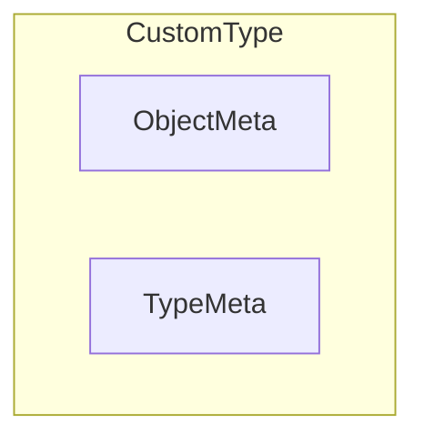
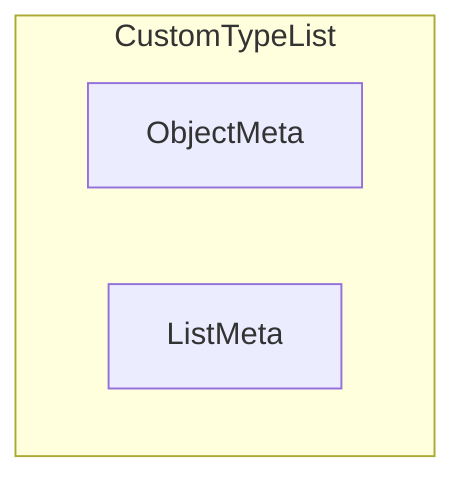

- [Kubernetes Client Facilities](#kubernetes-client-facilities)
  - [K8s apimachinery](#k8s-apimachinery)
    - [K8s objects](#k8s-objects)
      - [TypeMeta](#typemeta)
      - [ObjectMeta](#objectmeta)
        - [OwnerReferences](#ownerreferences)
        - [Finalizers and Deletion](#finalizers-and-deletion)
        - [Diff between Labels and Annotations](#diff-between-labels-and-annotations)
  - [K8s API Core](#k8s-api-core)
    - [Node](#node)
      - [NodeSpec](#nodespec)
        - [Node Taints](#node-taints)
      - [NodeStatus](#nodestatus)
        - [Capacity](#capacity)
        - [Conditions](#conditions)
        - [Addresses](#addresses)
        - [NodeSystemInfo](#nodesysteminfo)
        - [Images](#images)
        - [Attached Volumes](#attached-volumes)
  - [References](#references)

# Kubernetes Client Facilities

This chapter describes the types and functions provided by k8s core and client modules that are leveraged by the MCM - it only covers what is required to understand MCM code and is simply meant to be a helpful review. References are provided for further reading.
## K8s apimachinery


### K8s objects

A K8s object represents a persistent entity. When using the K8s client-go framework to define such an object, one should follow the rules:

1. A Go type representing a object must embed the [k8s.io/apimachinery/pkg/apis/meta/v1.ObjectMeta](https://pkg.go.dev/k8s.io/apimachinery/pkg/apis/meta/v1#ObjectMeta) struct. `ObjectMeta` is metadata that all persisted resources must have, which includes all objects users must create.
2. A Go type representing a _singluar_ object must embed [k8s.io/apimachinery/pkg/apis/meta/v1.TypeMeta](https://pkg.go.dev/k8s.io/apimachinery/pkg/apis/meta/v1#TypeMeta) which describes an _individual_ object in an API response or request with strings representing the _Kind_ of the object and its API schema version called _APIVersion_. 

3. A Go type representing a _list_ of a custom type must embed [k8s.io/apimachinery/pkg/apis/meta/v1.ListMeta](https://pkg.go.dev/k8s.io/apimachinery/pkg/apis/meta/v1#ListMeta)


#### TypeMeta

```go
type TypeMeta struct {
	// Kind is a string value representing the REST resource this object represents.
	Kind string 

	// APIVersion defines the versioned schema of this representation of an object.
	APIVersion string
}
```

#### ObjectMeta

A snippet of `ObjectMeta` struct fields shown below for convenience with the MCM relevant fields that are used by controller code.
```go
type ObjectMeta struct { //snippet 
    // Name must be unique within a namespace. Is required when creating resources,
    Name string 

    // Namespace defines the space within which each name must be unique. An empty namespace is  equivalent to the "default" namespace,
    Namespace string

    // An opaque value that represents the internal version of this object that can be used by clients to determine when objects have changed.
    ResourceVersion string
    // UID is the unique in time and space value for this object. It is typically generated by the API server on successful creation of a resource and is not allowed to change on PUT operations.
    UID types.UID 

    // CreationTimestamp is a timestamp representing the server time when this object was  created.
    CreationTimestamp Time 

    // DeletionTimestamp is RFC 3339 date and time at which this resource will be deleted. This field is set by the server when a graceful deletion is requested by the user.  The resource is expected to be deleted (no longer reachable via APIs) after the time in this field, once the finalizers list is empty.
    DeletionTimestamp *Time


    // Must be empty before the object is deleted from the registry by the API server. Each entry is an identifier for the responsible controller that will remove the entry from the list.
    Finalizers []string 

    // Map of string keys and values that can be used to organize and categorize (scope and select) objects. Valid label keys have two segments: an optional prefix and name, separated by a slash (/).  Meant to be meaningful and relevant to USERS.
    Labels map[string]string

    // Annotations is an unstructured key value map stored with a resource that may be  set by controllers/tools to store and retrieve arbitrary metadata. Meant for TOOLS.
    Annotations map[string]string 

    // References to owner objects. Ex: Pod belongs to its owning ReplicaSet. A Machine belongs to its owning MachineSet.
    OwnerReferences []OwnerReference

    // The name of the cluster which the object belongs to. This is used to distinguish resources with same name and namespace in different clusters.
    ClusterName string

    //... other fields omitted.
}
```

##### OwnerReferences
[k8s.io/apimachinery/pkg/apis/meta/v1.OwnerReference](https://pkg.go.dev/k8s.io/apimachinery/pkg/apis/meta/v1#OwnerReference) is a struct that contains `TypeMeta` fields and a small sub-set of the `ObjectMetadata` - enough to let you identify an owning object. An owning object must be in the same namespace as the dependent, or be cluster-scoped, so there is no namespace field.
```go
type OwnerReference struct {
   APIVersion string
   Kind string 
   Name string 
   UID types.UID 
   //... other fields omitted. TODO: check for usages.
}
```

##### Finalizers and Deletion

Every k8s object has a `Finalizers []string` field that can be explicitly assigned by a controller. Every k8s object has a `DeletionTimestamp *Time` that is set by API Server when graceful deletion is requested.

These are part of the [k8s.io./apimachinery/pkg/apis/meta/v1.ObjectMeta](https://pkg.go.dev/k8s.io/apimachinery/pkg/apis/meta/v1#ObjectMeta) struct type which is embedded in all k8s objects. 

When you tell Kubernetes to delete an object that has finalizers specified for it, the Kubernetes API marks the object for deletion by populating `.metadata.deletionTimestamp` aka `Deletiontimestamp`, and returns a `202` status code (HTTP `Accepted`). The target object remains in a terminating state while the control plane takes the actions defined by the finalizers. After these actions are complete, the controller should removes the relevant finalizers from the target object. When the `metadata.finalizers` field is empty, Kubernetes considers the deletion complete and deletes the object.

##### Diff between Labels and Annotations

_Labels_ are used in conjunction with selectors to identify groups of related resources and meant to be meaningful to users. Because selectors are used to query labels, this operation needs to be efficient. To ensure efficient queries, labels are constrained by RFC 1123. RFC 1123, among other constraints, restricts labels to a maximum 63 character length. Thus, labels should be used when you want Kubernetes to group a set of related resources. See https://kubernetes.io/docs/concepts/overview/working-with-objects/labels/ on label key and value restrictions

_Annotations_ are used for “non-identifying information” i.e., metadata that Kubernetes does not care about. As such, annotation keys and values have no constraints. Can include characters not 


## K8s API Core
The MCM leverages several types from https://pkg.go.dev/k8s.io/api/core/v1 

### Node
[k8s.io/api/core/v1.Node](https://pkg.go.dev/k8s.io/api/core/v1#Node) represents a worker node in Kubernetes. 

```go
type Node struct {
    metav1.TypeMeta
    metav1.ObjectMeta 
    Spec NodeSpec
    // Most recently observed status of the node.
    Status NodeStatus
}
```
#### NodeSpec

[k8s.io/api/core/v1.NodeSpec](https://pkg.go.dev/k8s.io/api/core/v1#NodeSpec)describes the attributes that a node is created with.  Both [Node](#node) and [MachineSpec](./mcm_facilities.md#machinespec) use this. A snippet of MCM-relevant `NodeSpec` struct fields shown below for convenience.

```go 
type NodeSpec struct {
    // ID of the node assigned by the cloud provider in the format: <ProviderName>://<ProviderSpecificNodeID>
    ProviderID string 
    // podCIDRs represents the IP ranges assigned to the node for usage by Pods on that node.
    PodCIDRs []string 

    // Unschedulable controls node schedulability of new pods. By default, node is schedulable.
    Unschedulable bool

    // Taints represents the Node's Taints. (taint is opposite of affinity. allow a Node to repel pods as opposed to attracting them)
    Taints []Taint
}
```

##### Node Taints
See [Taints and Tolerations](https://kubernetes.io/docs/concepts/scheduling-eviction/taint-and-toleration/)

[k8s.io/api/core/v1.Taint](https://pkg.go.dev/k8s.io/api/core/v1#Taint) is a Kubernetes `Node` property that enable specific nodes to repel pods. _Tolerations_ are a Kubernetes `Pod` property that overcome this and allow a pod to be scheduled on a node with a _matching_ taint.

Instead of applying the label to a node, we apply a taint that tells a scheduler to repel Pods from this node if it does not match the taint. Only those Pods that have a _toleration_ for the taint can be let into the node with that taint.


`kubectl taint nodes <node name> <taint key>=<taint value>:<taint effect>
`

Example:

`kubectl taint nodes node1 gpu=nvidia:NoSchedule`

Users can specify any arbitrary string for the taint key and value. The taint effect defines how a tainted node reacts to a pod without appropriate toleration. It must be one of the following effects;

- `NoSchedule`: The pod will not get scheduled to the node without a matching toleration.

- `NoExecute`:This will immediately evict all the pods without the matching toleration from the node.

- `PerferNoSchedule`:This is a softer version of NoSchedule where the controller will not try to schedule a pod with the tainted node. However, it is not a strict requirement.

```go
type Taint struct {
	// Key of taint to be applied to a node.
	Key string
	// Value of taint corresponding to the taint key.
	Value string 
	// Effect represents the effect of the taint on pods
	// that do not tolerate the taint.
	// Valid effects are NoSchedule, PreferNoSchedule and NoExecute.
	Effect TaintEffect 
	// TimeAdded represents the time at which the taint was added.
	// It is only written for NoExecute taints.
	// +optional
	TimeAdded *metav1.Time 
}
```

Example of a PodSpec with toleration below:
```yaml
apiVersion: v1
kind: Pod
metadata:
  name: pod-1
  labels:
    security: s1
spec:
  containers:
  - name: bear
    image: supergiantkir/animals:bear
  tolerations:
  - key: "gpu"
    operator: "Equal"
    value: "nvidia"
    effect: "NoSchedule"
 ```

Example use case for a taint/tolerance: If you have nodes with special hardware (e.g GPUs) you want to repel Pods that do not need this hardware and attract Pods that do need it. This can be done by tainting the nodes that have the specialized hardware (e.g. kubectl taint nodes nodename gpu=nvidia:NoSchedule ) and adding corresponding toleration to Pods that must use this special hardware.

#### NodeStatus

See [Node status](https://kubernetes.io/docs/concepts/architecture/nodes/#node-status)

[k8s.io/api/core/v1.NodeStatus](https://pkg.go.dev/k8s.io/api/core/v1#NodeStatus) represents the current status of a node and is an encapsulation illustrated below:

```go
type NodeStatus struct {
	// Capacity represents the total resources of a node.
	Capacity ResourceList 
	// Allocatable represents the resources of a node that are available for scheduling. Defaults to Capacity.
	Allocatable ResourceList
	// Conditions is an array of current observed node conditions.
	Conditions []NodeCondition 
	// List of addresses reachable to the node.Queried from cloud provider, if available.
	Addresses []NodeAddress 
	// Set of ids/uuids to uniquely identify the node.
	NodeInfo NodeSystemInfo 
	// List of container images on this node
	Images []ContainerImage 
	// List of attachable volumes that are in use (mounted) by the node.
  //UniqueVolumeName is just typedef for string
	VolumesInUse []UniqueVolumeName 
	// List of volumes that are attached to the node.
	VolumesAttached []AttachedVolume 
}
```

##### Capacity 
 [Capacity](https://kubernetes.io/docs/concepts/storage/persistent-volumes#capacity). The fields in the capacity block indicate the total amount of resources that a Node has. 
  - Allocatable indicates the amount of resources on a Node that is available to be consumed by normal Pods. Defaults to Capacity.

A Node `Capacity` is of type [k8s.io/api/core/v1.ResourceList](https://pkg.go.dev/k8s.io/api/core/v1#ResourceList) which is effectively a set of set of (resource name, quantity) pairs. 

```go
type ResourceList map[ResourceName]resource.Quantity
```

`ResourceName`s can be cpu/memory/storage

```go
const (
	// CPU, in cores. (500m = .5 cores)
	ResourceCPU ResourceName = "cpu"
	// Memory, in bytes. (500Gi = 500GiB = 500 * 1024 * 1024 * 1024)
	ResourceMemory ResourceName = "memory"
	// Volume size, in bytes (e,g. 5Gi = 5GiB = 5 * 1024 * 1024 * 1024)
	ResourceStorage ResourceName = "storage"
	// Local ephemeral storage, in bytes. (500Gi = 500GiB = 500 * 1024 * 1024 * 1024)
	// The resource name for ResourceEphemeralStorage is alpha and it can change across releases.
	ResourceEphemeralStorage ResourceName = "ephemeral-storage"
)
```
A [k8s.io/apimachinery/pkg/api/resource.Quantity](https://pkg.go.dev/k8s.io/apimachinery@v0.25.2/pkg/api/resource#Quantity) is a serializable/de-serializable number with a SI unit

##### Conditions
[Conditions](https://kubernetes.io/docs/concepts/nodes/node/#condition) are valid conditions of nodes.

[https://pkg.go.dev/k8s.io/api/core/v1.NodeCondition](https://pkg.go.dev/k8s.io/api/core/v1#NodeCondition) contains condition information for a node.

```go
type NodeCondition struct {
	// Type of node condition.
	Type NodeConditionType 
	// Status of the condition, one of True, False, Unknown.
	Status ConditionStatus 
	// Last time we got an update on a given condition.
	LastHeartbeatTime metav1.Time 
	// Last time the condition transitioned from one status to another.
	LastTransitionTime metav1.Time 
	// (brief) reason for the condition's last transition.
	Reason string 
	// Human readable message indicating details about last transition.
	Message string 
}
```

`NodeConditionType` is one of the following:
```go
const (
	// NodeReady means kubelet is healthy and ready to accept pods.
	NodeReady NodeConditionType = "Ready"
	// NodeMemoryPressure means the kubelet is under pressure due to insufficient available memory.
	NodeMemoryPressure NodeConditionType = "MemoryPressure"
	// NodeDiskPressure means the kubelet is under pressure due to insufficient available disk.
	NodeDiskPressure NodeConditionType = "DiskPressure"
	// NodePIDPressure means the kubelet is under pressure due to insufficient available PID.
	NodePIDPressure NodeConditionType = "PIDPressure"
	// NodeNetworkUnavailable means that network for the node is not correctly configured.
	NodeNetworkUnavailable NodeConditionType = "NetworkUnavailable"
)
```

##### Addresses
See [Node Addresses](https://kubernetes.io/docs/concepts/architecture/nodes/#addresses)
	
[k8s.io/api/core/v1.NodeAddress](https://pkg.go.dev/k8s.io/api/core/v1#NodeAddress) contains information for the node's address.
```go
type NodeAddress struct {
	// Node address type, one of Hostname, ExternalIP or InternalIP.
	Type NodeAddressType 
	// The node address string.
	Address string 
}
```

##### NodeSystemInfo

Describes general information about the node, such as machine id, kernel version, Kubernetes version (kubelet and kube-proxy version), container runtime details, and which operating system the node uses. The kubelet gathers this information from the node and publishes it into the Kubernetes API.

```go
type NodeSystemInfo struct {
	// MachineID reported by the node. For unique machine identification
	// in the cluster this field is preferred. 
	MachineID string 
	// Kernel Version reported by the node from 'uname -r' (e.g. 3.16.0-0.bpo.4-amd64).
	KernelVersion string 
	// OS Image reported by the node from /etc/os-release (e.g. Debian GNU/Linux 7 (wheezy)).
	OSImage string 
	// ContainerRuntime Version reported by the node through runtime remote API (e.g. docker://1.5.0).
	ContainerRuntimeVersion string 
	// Kubelet Version reported by the node.
	KubeletVersion string 
	// KubeProxy Version reported by the node.
	KubeProxyVersion string 
	// The Operating System reported by the node
	OperatingSystem string 
	// The Architecture reported by the node
	Architecture string 
}
```
- The [MachineID](http://man7.org/linux/man-pages/man5/machine-id.5.html) is a single newline-terminated, hexadecimal, 32-character, lowercase ID. from `/etc/machine-id`


##### Images
A slice of [k8s.io/api/core/v1.ContainerImage](https://pkg.go.dev/k8s.io/api/core/v1#ContainerImage) which describes a contianer image.

```go
type ContainerImage struct {
  // Names by which this image is known.
	// e.g. ["kubernetes.example/hyperkube:v1.0.7", 
  // "cloud-vendor.registry.example/cloud-vendor/hyperkube:v1.0.7"]
	Names []string 
	// The size of the image in bytes.
	SizeBytes int64 
}
```

##### Attached Volumes

[k8s.io/api/core/v1.AttachedVolume](https://pkg.go.dev/k8s.io/api/core/v1#AttachedVolume) describes a volume attached to a node.

```go
type UniqueVolumeName string
type AttachedVolume struct {
	// Name of the attached volume
	Name UniqueVolumeName 
	// DevicePath represents the device path where the volume should be available
	DevicePath string 
}
```

TODO: add another section with Node class diagram

## References

- [K8s API Conventions](https://github.com/kubernetes/community/blob/master/contributors/devel/sig-architecture/api-conventions.md)
- [How To Call Kubernetes API using Go - Types and Common Machinery](https://iximiuz.com/en/posts/kubernetes-api-go-types-and-common-machinery/)
- [Node Taints and Tolerances](https://kubernetes.io/docs/concepts/scheduling-eviction/taint-and-toleration/)
- [Node status](https://kubernetes.io/docs/concepts/architecture/nodes/#node-status)
- [Making Sense of Taints and Tolerations](https://medium.com/kubernetes-tutorials/making-sense-of-taints-and-tolerations-in-kubernetes-446e75010f4e)
- [CIDR](https://www.ionos.com/digitalguide/server/know-how/cidr-classless-inter-domain-routing/)
- [CIDR Calculator](https://mxtoolbox.com/subnetcalculator.aspx)