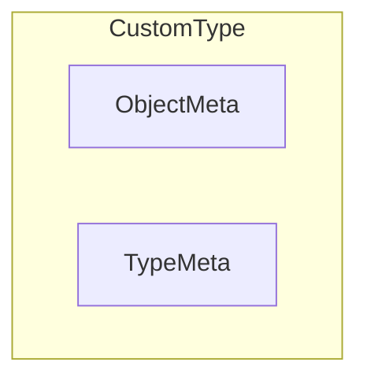
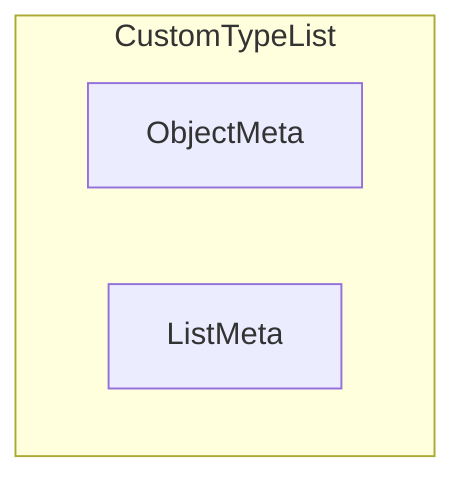

- [Kubernetes Client Facilities](#kubernetes-client-facilities)
  - [K8s apimachinery](#k8s-apimachinery)
    - [K8s objects](#k8s-objects)
      - [TypeMeta](#typemeta)
      - [ObjectMeta](#objectmeta)
        - [OwnerReferences](#ownerreferences)
        - [Finalizers and Deletion](#finalizers-and-deletion)
        - [Diff between Labels and Annotations](#diff-between-labels-and-annotations)
  - [K8s API Core](#k8s-api-core)
    - [Node](#node)
      - [NodeSpec](#nodespec)
  - [References](#references)

# Kubernetes Client Facilities

This chapter describes the types and functions provided by k8s core and client modules that are leveraged by the MCM - it only covers what is required to understand MCM code and is simply meant to be a helpful review. References are provided for further reading.
## K8s apimachinery


### K8s objects

A K8s object represents a persistent entity. When using the K8s client-go framework to define such an object, one should follow the rules:

1. A Go type representing a object must embed the [k8s.io/apimachinery/pkg/apis/meta/v1.ObjectMeta](https://pkg.go.dev/k8s.io/apimachinery/pkg/apis/meta/v1#ObjectMeta) struct. `ObjectMeta` is metadata that all persisted resources must have, which includes all objects users must create.
2. A Go type representing a _singluar_ object must embed [k8s.io/apimachinery/pkg/apis/meta/v1.TypeMeta](https://pkg.go.dev/k8s.io/apimachinery/pkg/apis/meta/v1#TypeMeta) which describes an _individual_ object in an API response or request with strings representing the _Kind_ of the object and its API schema version called _APIVersion_. 

3. A Go type representing a _list_ of a custom type must embed [k8s.io/apimachinery/pkg/apis/meta/v1.ListMeta](https://pkg.go.dev/k8s.io/apimachinery/pkg/apis/meta/v1#ListMeta)


#### TypeMeta

```go
type TypeMeta struct {
	// Kind is a string value representing the REST resource this object represents.
	Kind string 

	// APIVersion defines the versioned schema of this representation of an object.
	APIVersion string
}
```

#### ObjectMeta

A snippet of `ObjectMeta` struct fields shown below for convenience with the MCM relevant fields that are used by controller code.
```go
type ObjectMeta struct { //snippet 
    // Name must be unique within a namespace. Is required when creating resources,
    Name string 

    // Namespace defines the space within which each name must be unique. An empty namespace is  equivalent to the "default" namespace,
    Namespace string

    // An opaque value that represents the internal version of this object that can be used by clients to determine when objects have changed.
    ResourceVersion string
    // UID is the unique in time and space value for this object. It is typically generated by the API server on successful creation of a resource and is not allowed to change on PUT operations.
    UID types.UID 

    // CreationTimestamp is a timestamp representing the server time when this object was  created.
    CreationTimestamp Time 

    // DeletionTimestamp is RFC 3339 date and time at which this resource will be deleted. This field is set by the server when a graceful deletion is requested by the user.  The resource is expected to be deleted (no longer reachable via APIs) after the time in this field, once the finalizers list is empty.
    DeletionTimestamp *Time


    // Must be empty before the object is deleted from the registry by the API server. Each entry is an identifier for the responsible controller that will remove the entry from the list.
    Finalizers []string 

    // Map of string keys and values that can be used to organize and categorize (scope and select) objects. Valid label keys have two segments: an optional prefix and name, separated by a slash (/).  Meant to be meaningful and relevant to USERS.
    Labels map[string]string

    // Annotations is an unstructured key value map stored with a resource that may be  set by controllers/tools to store and retrieve arbitrary metadata. Meant for TOOLS.
    Annotations map[string]string 

    // References to owner objects. Ex: Pod belongs to its owning ReplicaSet. A Machine belongs to its owning MachineSet.
    OwnerReferences []OwnerReference

    // The name of the cluster which the object belongs to. This is used to distinguish resources with same name and namespace in different clusters.
    ClusterName string

    //... other fields omitted.
}
```

##### OwnerReferences
[k8s.io/apimachinery/pkg/apis/meta/v1.OwnerReference](https://pkg.go.dev/k8s.io/apimachinery/pkg/apis/meta/v1#OwnerReference) is a struct that contains `TypeMeta` fields and a small sub-set of the `ObjectMetadata` - enough to let you identify an owning object. An owning object must be in the same namespace as the dependent, or be cluster-scoped, so there is no namespace field.
```go
type OwnerReference struct {
   APIVersion string
   Kind string 
   Name string 
   UID types.UID 
   //... other fields omitted. TODO: check for usages.
}
```

##### Finalizers and Deletion

Every k8s object has a `Finalizers []string` field that can be explicitly assigned by a controller. Every k8s object has a `DeletionTimestamp *Time` that is set by API Server when graceful deletion is requested.

These are part of the [k8s.io./apimachinery/pkg/apis/meta/v1.ObjectMeta](https://pkg.go.dev/k8s.io/apimachinery/pkg/apis/meta/v1#ObjectMeta) struct type which is embedded in all k8s objects. 

When you tell Kubernetes to delete an object that has finalizers specified for it, the Kubernetes API marks the object for deletion by populating `.metadata.deletionTimestamp` aka `Deletiontimestamp`, and returns a `202` status code (HTTP `Accepted`). The target object remains in a terminating state while the control plane takes the actions defined by the finalizers. After these actions are complete, the controller should removes the relevant finalizers from the target object. When the `metadata.finalizers` field is empty, Kubernetes considers the deletion complete and deletes the object.

##### Diff between Labels and Annotations

_Labels_ are used in conjunction with selectors to identify groups of related resources and meant to be meaningful to users. Because selectors are used to query labels, this operation needs to be efficient. To ensure efficient queries, labels are constrained by RFC 1123. RFC 1123, among other constraints, restricts labels to a maximum 63 character length. Thus, labels should be used when you want Kubernetes to group a set of related resources. See https://kubernetes.io/docs/concepts/overview/working-with-objects/labels/ on label key and value restrictions

_Annotations_ are used for “non-identifying information” i.e., metadata that Kubernetes does not care about. As such, annotation keys and values have no constraints. Can include characters not 

## K8s API Core
The MCM leverages several types from https://pkg.go.dev/k8s.io/api/core/v1 

### Node
[k8s.io/api/core/v1.Node](https://pkg.go.dev/k8s.io/api/core/v1#Node) represents a worker node in Kubernetes. 

```go
type Node struct {
    metav1.TypeMeta
    metav1.ObjectMeta 
    Spec NodeSpec
    // Most recently observed status of the node.
    Status NodeStatus
}
```
#### NodeSpec

[k8s.io/api/core/v1.NodeSpec](https://pkg.go.dev/k8s.io/api/core/v1#NodeSpec)describes the attributes that a node is created with.  Both [Node](#node) and [MachineSpec](./mcm_facilities.md#machinespec) use this. A snippet of MCM-relevant `NodeSpec` struct fields shown below for convenience.

```go 
type NodeSpec struct {
    // ID of the node assigned by the cloud provider in the format: <ProviderName>://<ProviderSpecificNodeID>
    ProviderID string 
}
```


## References

- [K8s API Conventions](https://github.com/kubernetes/community/blob/master/contributors/devel/sig-architecture/api-conventions.md)
- [How To Call Kubernetes API using Go - Types and Common Machinery](https://iximiuz.com/en/posts/kubernetes-api-go-types-and-common-machinery/)
- [Node Taints and Tolerances](https://kubernetes.io/docs/concepts/scheduling-eviction/taint-and-toleration/)