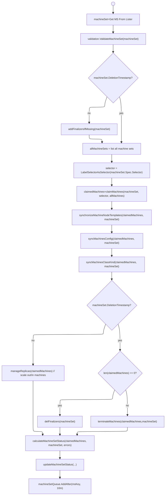
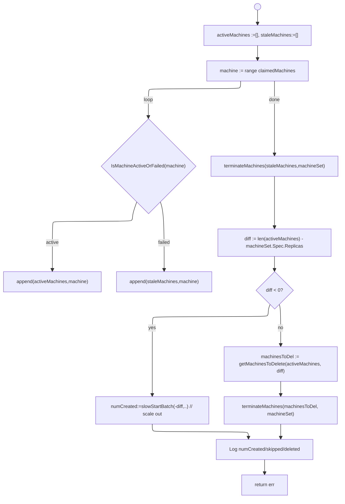

# Reconcile Cluster Machine Set

A `MachineSet` is to a `Machine` in an analogue of what a `ReplicaSet` is to a `Pod`. A `MachineSet` ensures that the specified number of Machines are running at any given time. 

A `MachineSet` is rarely rarely created directly. It is generally owned by its parent MachineDeployment and its ObjectMetadata.OwnerReferenes slice has a reference to the parent deployment.

The MCM controller `reconcileClusterMachineSet` is called from objects retrieved from the `machineSetQueue` as shown below.

```go
worker.Run(c.machineSetQueue, 
"ClusterMachineSet", 
worker.DefaultMaxRetries, true, c.reconcileClusterMachineSet, stopCh, &waitGroup)
``````

The following is the flow diagram for `func (c *controller) reconcileClusterMachineSet(key string) error` . As can be observed, it could be optimized better. For any error in the below,  the ms key is added back to the `machineSetQueue` according to the default rate limiting. 



## claimMachines

`claimMachines` tries to take ownership of a machine - it associates a `Machine` with a `MachineSet` by setting `machine.metadata.OwnerReferences` and releasets the `Machine` if the MS's deletion timestamp has been set.

1. Initialize an empty `claimedMachines []Machine` slice
1. Initialize an empty `errlist []erro`
1. Iterate through `allMachines` and Get the `ownerRef`(the first element in `OwnerReferences` slice)
1. If the `ownerRef` is not `nil`
    1. if the `ownerRef.UID` is diff from the `machineSet`s `UUID` skip the claim and continue. (Since the machine belongs to another machine set)
    1. If the machine `selector` matches the labels of the `machineSet`, add to `claimedMachines` and continue
    1. If the `machineSet.DeletionTimestamp` is set, skip and continue
    1. Release the `Machine` by removing its `ownerReference`
1. If the `ownerRef` is `nil`
   1. If the `machineSet.DeletionTimestamp` is set or if the machine `selector` does not mach the `machineSet`, skip and continue.
   1. If the `machine.DeletionTimestamp` is set, skip and continue.
   1. Adopt the machine, ie. set the `ownerReference` to the `machineSet` and add to `claimedMachines`
   ```
   ownerReferences:
    - apiVersion: machine.sapcloud.io/v1alpha1
      blockOwnerDeletion: true
      controller: true
      kind: MachineSet
      name: shoot--i034796--aw2-a-z1-8c99f
      uid: 20bc03c5-e95b-4df5-9faf-68be38cb8e1b
   ```
1. Returned `claimedMachines`.


## synchronizeMachineNodeTemplates

```go
func (c *controller) syncMachinesNodeTemplates(ctx context.Context, 
 claimedMachines []*Machine, machineSet *MachineSet) error 
```
1. This iterates through the `claimeMachines` and copies the `machineset.Spec.Template.Spec.NodeTemplateSpec` to the `machine.Spec.NodeTemplateSpec`
1. NOTE: Seems useless IO busy-work to me. When MC launches the `Machine`, it might as well access the owning `MachineSet` and get the `NodeSpec`.
2. The only reason to do this is to support independent `Machines` without owning `MachineSets`. We will need to see whether such a use-case is truly needed.

NOTE: `NodeTemplate` describes common resource capabilities like `cpu`, `gpu`, `memory`, etc in terms of [k8s.io/api/core/v1.ResourceList](https://pkg.go.dev/k8s.io/api/core/v1#ResourceList). This is used by the `cluster-autoscaler` for scaling decisions. 

## syncMachinesConfig

Copies  `machineset.Spec.Template.Spec.MachineConfiguration` to  `machine.Spec.MachineConfiguration` for all `claimedMachines`.

See `MachineConfiguration` inside [MachineSpec](http://localhost:3000/mcm_facilities.html#machinespec)


## syncMachinesClassKind

NOTE: This is useless and should be removed since we only have ONE kind of `MachineClass`. TODO: Discuss with Himanshu/Rishabh.

```go
func (c *controller) syncMachinesClassKind(ctx context.Context, 
    claimedMachines []*Machine, machineSet *MachineSet) error 
```

Iterates through `claimedMachines` and sets `machine.Spec.Class.Kind = machineset.Spec.Template.Spec.Class.Kind` if not already set.


## manageReplicas (scale-out / scale-in)

```go
func (c *controller) manageReplicas(ctx context.Context, 
    claimedMachines []Machine, machineSet *MachineSet) error
```



###  terminateMachines

```go
func (c *controller) terminateMachines(ctx context.Context, 
    inactiveMachines []*Machine, machineSet *MachineSet) error {
```
1. Invokes `controlMachineClient.Machines(namespace).Delete(ctx, machineID,..)` for each `Machine` in `inactiveMachines` and records an event.
1. The `machine.Status.Phase` is also set to `Terminating`.
3. This is done in parallel using `go-routines` a `WaitGroup` on length of `inactiveMachines` 


###  slowStartBatch

```go
func slowStartBatch(count int, initialBatchSize int, createFn func() error) (int, error)
```
1. Initializes `remaining` to `count` and `successes` as `0`.
1. Method executes `fn` (which creates a `Machine` object) in parallel with number of go-routines starting with `batchSize := initialBatchSize` and then doubling `batchSize` size after the call to `fn`. 
   1. For each batch iteration, a `wg sync.WaitGroup` is constructed with `batchSize`. Each batch execution waits for batch to be complete using `wg.Wait()`
   1. For each batch iteration, an `errCh` is constructed with size as  `batchSize` 
   1. `batchSize` go-routines execute `fn` concurrently, sending errors on `errCh` and invoking `wg.Done()` when complete.
   1. `numErrorsInBatch = len(errCh)`
   1. `successes` is `batchSize` minus `numErrorsInBatch`
   1. if `numErrorsInBatch > 0`, abort, returning `successes` and first error from `errCh`
   1. `remaining` is decremented by the `batchSize`
   1. Compute `batchSize` as `Min(remaining, 2*batchSize)`
   1. Continue iteration while `batchSize` is greater than `0`.
   1. Return `successes, nil` when done.
2. `fn` is a lambda that creates a new `Machine` in which we do the below:
    1. Create an `ownerRef` with the `machineSet.Name` and `machineSet.UID`
    2. Get the machine spec template using [machineSet.Spec.Template](http://localhost:3000/mcm_facilities.html#machineset)
    3. Then create a `Machine` obj setting the machine spec and `ownerRef`. Use the `machineSet` name as the prefix for `GenerateName` in the `ObjectMeta`.
    4. If any `err` return the same or `nil` if no error.
    5. New `Machine` objects are persisted using `controlMachineClient.Machines(namespace).Create(ctx, machine, createOpts)`