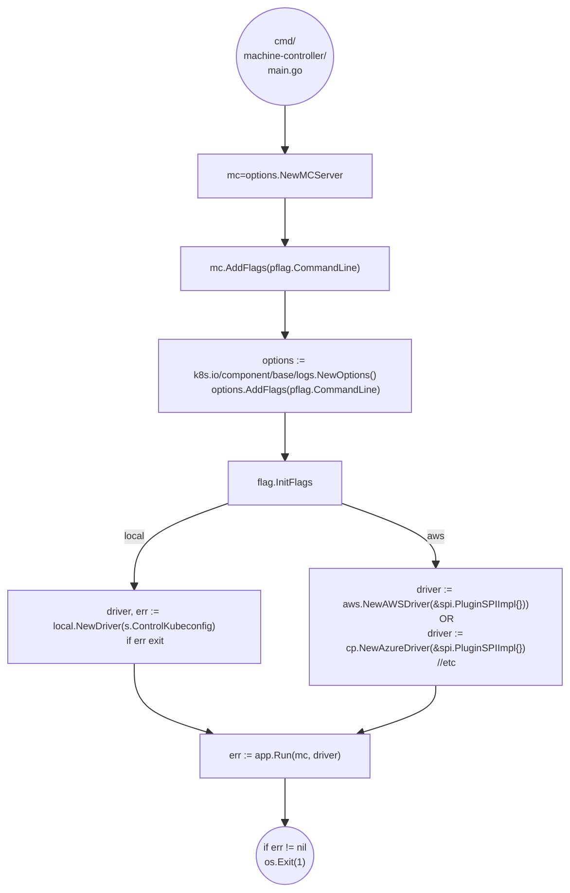
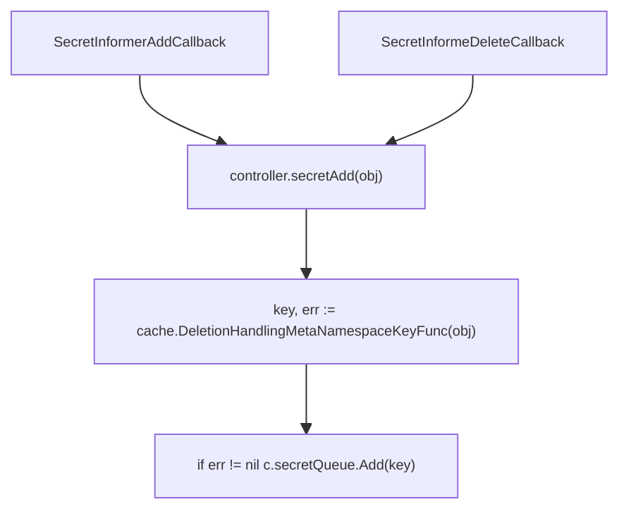
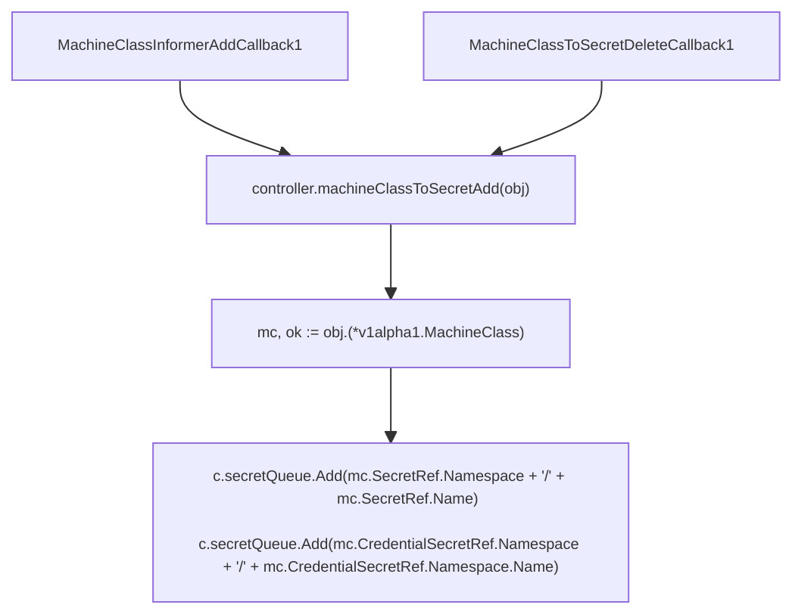
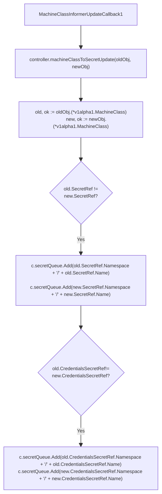
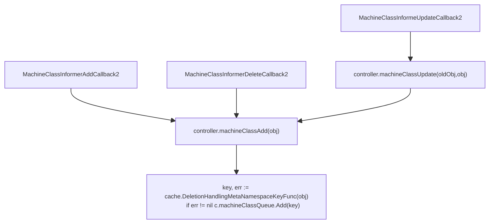
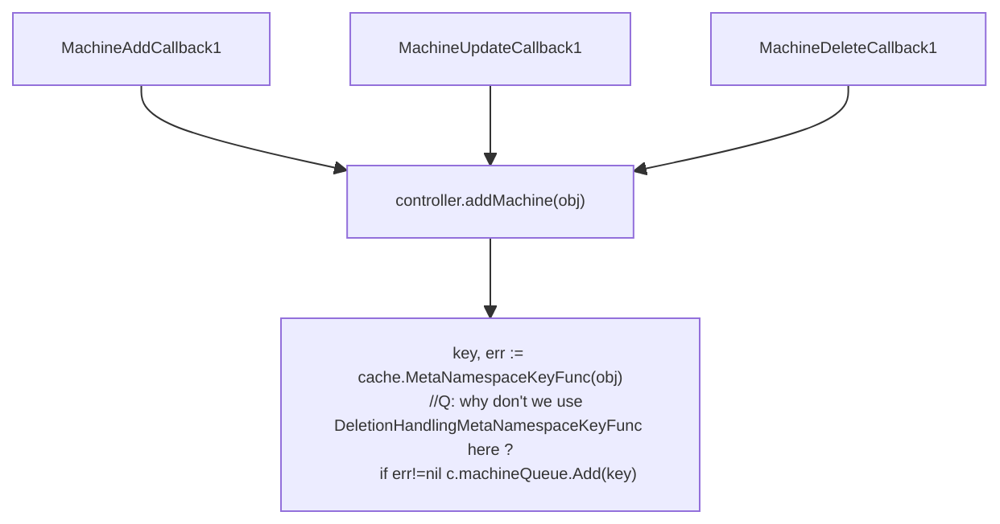
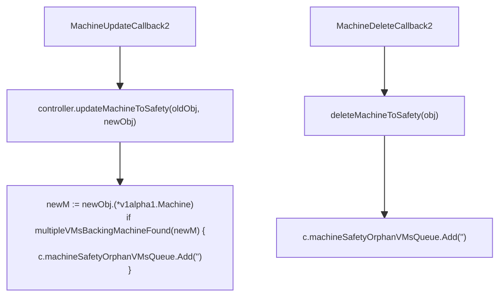
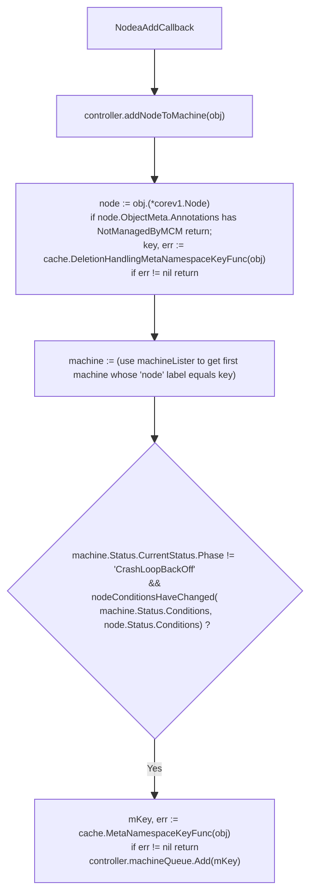
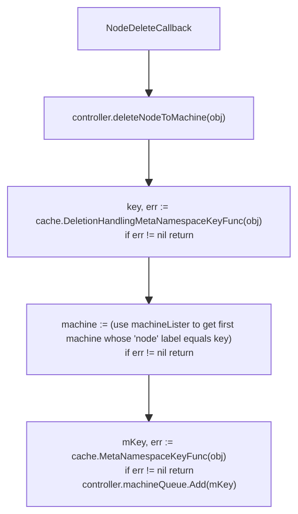

- [Machine Controller](#machine-controller)
	- [MC Launch](#mc-launch)
		- [Dev](#dev)
			- [Build](#build)
			- [Launch](#launch)
		- [Prod](#prod)
			- [Build](#build-1)
		- [Launch Flow](#launch-flow)
			- [Summary](#summary)
	- [Machine Controller Loop](#machine-controller-loop)
		- [app.Run](#apprun)
			- [Summary](#summary-1)
		- [app.StartControllers](#appstartcontrollers)
		- [Machine Controller Initialization](#machine-controller-initialization)
			- [1. NewController factory func](#1-newcontroller-factory-func)
			- [1.1 Init Controller Struct](#11-init-controller-struct)
			- [1.2 Assign Listers and HasSynced funcs to controller struct](#12-assign-listers-and-hassynced-funcs-to-controller-struct)
			- [1.3 Register Controller Event Handlers on Informers.](#13-register-controller-event-handlers-on-informers)
				- [1.3.1 Secret Informer Callback](#131-secret-informer-callback)
				- [1.3.2 Machine Class Informer Callbacks](#132-machine-class-informer-callbacks)
					- [MachineClass Add/Delete Callback 1](#machineclass-adddelete-callback-1)
					- [MachineClass Update Callback 1](#machineclass-update-callback-1)
					- [MachineClass Add/Delete/Update Callback 2](#machineclass-adddeleteupdate-callback-2)
				- [1.3.2 Machine Informer Callbacks](#132-machine-informer-callbacks)
					- [Machine Add/Update/Delete Callbacks 1](#machine-addupdatedelete-callbacks-1)
					- [Machine Update/Delete Callbacks 2](#machine-updatedelete-callbacks-2)
				- [1.3.3 Node Informer Callbacks](#133-node-informer-callbacks)
					- [Node Add Callback](#node-add-callback)
					- [Node Delete Callback](#node-delete-callback)
					- [Node Update Callback](#node-update-callback)
		- [Machine Controller Run](#machine-controller-run)
			- [1. Wait for Informer Caches to Sync](#1-wait-for-informer-caches-to-sync)
			- [2. Register Prometheus Metrics](#2-register-prometheus-metrics)
				- [2.1 controller.describe](#21-controllerdescribe)
				- [2.1 controller.collect](#21-controllercollect)
			- [3. create controller worker go-routines applying reconciliations](#3-create-controller-worker-go-routines-applying-reconciliations)
				- [3.1 createworker](#31-createworker)
			- [4. reconciliation functions executed by worker](#4-reconciliation-functions-executed-by-worker)
# Machine Controller

The [Machine Controller]() handles reconciliation of [Machine](./../mcm_facilities.md#machine) and [MachineClass](./../mcm_facilities.md#machineclass) objects. 

The Machine Controller Entry Point for any provider is at 
`machine-controller-manager-provider-<name>/cmd/machine-controller/main.go`

## MC Launch

### Dev 

#### Build
A `Makefile` in the root of `machine-controller-manager-provider-<name>` builds the provider specific machine controller  for linux with CGO enabled. The `make build` target invokes the shell script [.ci/build](https://github.com/gardener/machine-controller-manager-provider-aws/blob/master/.ci/build) to do this.

```
CGO_ENABLED=0 GOOS=linux GOARCH=amd64 go build \
  -a \
  -v \
  -o ${BINARY_PATH}/rel/machine-controller \
  cmd/machine-controller/main.goo
```

#### Launch
Assuming one has initialized the variables using `make download-kubeconfigs`, one can then use `make start` target which launches the MC with flags as shown below.
Most of these timeout flags are redundant since exact same values are 
given in [machine-controller-manager/pkg/util/provider/app/options.NewMCServer]()
```
go run -mod=vendor 
    cmd/machine-controller/main.go 
    --control-kubeconfig=$(CONTROL_KUBECONFIG) 
    --target-kubeconfig=$(TARGET_KUBECONFIG) 
    --namespace=$(CONTROL_NAMESPACE) 
    --machine-creation-timeout=20m 
    --machine-drain-timeout=5m 
    --machine-health-timeout=10m 
    --machine-pv-detach-timeout=2m 
    --machine-safety-apiserver-statuscheck-timeout=30s 
    --machine-safety-apiserver-statuscheck-period=1m 
    --machine-safety-orphan-vms-period=30m 
    --leader-elect=$(LEADER_ELECT) 
    --v=3
```
### Prod 

#### Build
A `Dockerfile` builds the provider specific machine controller and launches it directly with no CLI arguments. Hence uses coded defaults

```Dockerfile
RUN CGO_ENABLED=0 GOOS=$TARGETOS GOARCH=$TARGETARCH \
      go build \
      -mod=vendor \
      -o /usr/local/bin/machine-controller \
      cmd/machine-controller/main.go
COPY --from=builder /usr/local/bin/machine-controller /machine-controller
ENTRYPOINT ["/machine-controller"]
```

The `machine-controller-manager` deployment usually launches both the MC in a Pod with following arguments
```
./machine-controller
         --control-kubeconfig=inClusterConfig
         --machine-creation-timeout=20m
         --machine-drain-timeout=2h
         --machine-health-timeout=10m
         --namespace=shoot--i034796--tre
         --port=10259
         --target-kubeconfig=/var/run/secrets/gardener.cloud/shoot/generic-kubeconfig/kubeconfig
         --v=3
```

### Launch Flow


#### Summary
1. Creates [machine-controller-manager/pkg/util/provider/app/options.MCServer](https://pkg.go.dev/github.com/gardener/machine-controller-manager@v0.47.0/pkg/util/provider/app/options#MCServer) using `options.NewMCServer` which is the main context object for the machinecontroller that embeds a
[options.MachineControllerConfiguration](https://pkg.go.dev/github.com/gardener/machine-controller-manager@v0.47.0/pkg/options#MachineControllerManagerConfiguration).

   `options.NewMCServer` initializes `options.MCServer` struct with default values for 
    - `Port: 10258`, 
    - `Namespace: default`, 
    - `ConcurrentNodeSyncs: 50`: number of worker go-routines that are used to process items from a work queue. See [Worker](#31-createworker) below
    - `NodeConditions: "KernelDeadLock,ReadonlyFilesystem,DiskPressure,NetworkUnavailable"` (failure node conditions that indicate that a machine is un-healthy)
    - `MinResyncPeriod: 12 hours`, `KubeAPIQPS: 20`, `KubeAPIBurst:30`: config params for k8s clients. See [rest.Config](https://pkg.go.dev/k8s.io/client-go@v0.25.3/rest#Config)

1. calls `MCServer.AddFlags` which defines all parsing flags for the machine controller into fields of `MCServer` instance created in the last step.
1. calls `k8s.io/component-base/logs.NewOptions` and then `options.AddFlags` for logging options. 
  TODO: Should get rid of this when moving to `logr`.) 
    - See [Logging In Gardener Components](https://github.com/gardener/gardener/blob/master/docs/development/logging.md). 
    - Then use the [logcheck](https://github.com/gardener/gardener/tree/master/hack/tools/logcheck)tool.
1. Driver initialization code varies according to the provider type.
	- Local Driver
      - calls `NewDriver` with control kube config that creates a controller runtime client (`sigs.k8s.io/controller-runtime/pkg/client`) which then calls `pkg/local/driver.NewDriver` passing the controlloer-runtime client which constructs a `localdriver` encapsulating the passed in client.
      - `driver := local.NewDriver(c)`
      - the `localdriver` implements [Driver](https://github.com/gardener/machine-controller-manager/blob/master/pkg/util/provider/driver/driver.go#l28) is the facade for creation/deletion of vm's
    - Provider Specific Driver Example
      - `driver := aws.NewAWSDriver(&spi.PluginSPIImpl{})`
      - `driver := cp.NewAzureDriver(&spi.PluginSPIImpl{})`
      - `spi.PluginSPIImpl` is a struct that implements a provider specific interface that initializes a provider session.
2. calls [app.Run](https://github.com/gardener/machine-controller-manager/blob/master/pkg/util/provider/app/app.go#l77) passing in the previously created `MCServer` and `Driver` instances.

## Machine Controller Loop

### app.Run

`app.Run` is the function that setups the main control loop of the machine controller server. 


#### Summary
1. [app.Run(options *options.MCServer, driver driver.Driver)](https://github.com/gardener/machine-controller-manager/blob/v0.48.0/pkg/util/provider/app/app.go#L77) is the common run loop for all provider Machine Controllers.
1. Creates `targetkubeconfig` and `controlkubeconfig` of type `k8s.io/client-go/rest.Config` from the target kube config path using `clientcmd.BuildConfigFromFlags`
1. Set fields such as `config.QPS` and `config.Burst`  in both `targetkubeconfig` and `controlkubeconfig` from the passed in `options.MCServer`
1. Create `kubeClientControl` from the `controlkubeconfig` using the standard client-go client factory metohd: `kubernetes.NewForConfig` that returns a `client-go/kubernetes.Clientset`
1. Similarly create another `Clientset` named `leaderElectionClient` using `controlkubeconfig`
1. Start a go routine using the function `startHTTP` that registers a bunch of http handlers for the go profiler, prometheus metrics and the health check.
1. Call `createRecorder` passing the `kubeClientControl` client set instance that returns a [client-go/tools/record.EventRecorder](https://github.com/kubernetes/client-go/blob/master/tools/record/event.go#L91)
	1. Creates a new `eventBroadcaster` of type [event.EventBroadcaster](https://github.com/kubernetes/client-go/blob/master/tools/record/event.go#l113)
	1. Set the logging function of the broadcaster to `klog.Infof`.
	1. Sets the event sink using `eventBroadcaster.StartRecordingToSink` passing the event interface as `kubeClient.CoreV1().RESTClient()).Events("")`. Effectively events will be published remotely.
	1. Returns the `record.EventRecorder` associated with the `eventBroadcaster` using `eventBroadcaster.NewRecorder` 
1. Constructs an anonymous function assigned to `run` variable which does the following:
	1. Initializes a `stop` receive channel.
	1. Creates a `controlMachineClientBuilder` using `machineclientbuilder.SimpleClientBuilder` using the `controlkubeconfig`.
	1. Creates a `controlCoreClientBuidler` using `coreclientbuilder.SimpleControllerClientBuilder` wrapping `controlkubeconfig`.
	1. Creates `targetCoreClientBuilder` using `coreclientbuilder.SimpleControllerClientBuilder` wrapping `controlkubeconfig`.
	1. Call the `app.StartControllers` function passing the `options`, `driver`, `controlkubeconfig`, `targetkubeconfig`, `controlMachineClientBuilder`, `controlCoreClientBuilder`, `targetCoreClientBuilder`, `recorder` and `stop` channel.
    	- // Q: if you are going to pass the controlkubeconfig and targetkubeconfig - why not create the client builders inside the startcontrollers ?
	1.  if `app.StartcOntrollers` return an error panic and exit `run`.
  1. use [leaderelection.RunOrDie](https://github.com/gardener/machine-controller-manager/blob/v0.48.0/pkg/util/provider/app/app.go#L186) to start a leader election and pass the previously created `run` function to as the callback for `OnStartedLeading`. `OnStartedLeading` callback is invoked when a leaderelector client starts leading.

### app.StartControllers
[app.StartControllers](https://github.com/gardener/machine-controller-manager/blob/v0.48.0/pkg/util/provider/app/app.go#L202) starts all controller loops which are part of the machine controller. 

```go
func StartControllers(options *options.MCServer,
	controlCoreKubeconfig *rest.Config,
	targetCoreKubeconfig *rest.Config,
	controlMachineClientBuilder machineclientbuilder.ClientBuilder,
	controlCoreClientBuilder coreclientbuilder.ClientBuilder,
	targetCoreClientBuilder coreclientbuilder.ClientBuilder,
	driver driver.Driver,
	recorder record.EventRecorder,
	stop <-chan struct{}) error
```
1. Calls `getAvailableResources` using the `controlCoreClientBuilder` that returns a `map[schema.GroupVersionResource]bool` assigned to `availableresources`
	- `getAvailableResources` waits till the api server is running by checking its `/healthz` using `wait.PollImmediate`. keeps re-creating the client using `clientbuilder.Client` method. 
	- then uses `client.Discovery().ServerResources` which returns returns the supported resources for all groups and versions as a slice of [*metav1.APIResourceList](https://github.com/kubernetes/apimachinery/blob/373a5f752d44989b9829888460844849878e1b6e/pkg/apis/meta/v1/types.go#L1131) (which encapsulates a [[]APIResource](https://github.com/kubernetes/apimachinery/blob/v0.26.1/pkg/apis/meta/v1/types.go#L1081)) and then converts that to a `map[schema.GroupVersionResource]bool` `
1. Creates a `controlMachineClient` using `controlMachineClientBuilder.ClientOrDie("machine-controller").MachineV1alpha1()` which is a client of type [MachineV1alpha1Interface](https://pkg.go.dev/github.com/gardener/machine-controller-manager@v0.48.0/pkg/client/clientset/versioned/typed/machine/v1alpha1#MachineV1alpha1Interface). This interface is a composition of [MachineGetter](https://pkg.go.dev/github.com/gardener/machine-controller-manager@v0.48.0/pkg/client/clientset/versioned/typed/machine/v1alpha1#MachinesGetter),[MachineClassesGetter](https://pkg.go.dev/github.com/gardener/machine-controller-manager@v0.48.0/pkg/client/clientset/versioned/typed/machine/v1alpha1#MachineClassesGetter), [MachineDeploymentsGetter](https://pkg.go.dev/github.com/gardener/machine-controller-manager@v0.48.0/pkg/client/clientset/versioned/typed/machine/v1alpha1#MachineDeploymentsGetter) and [MachineSetsGetter](https://pkg.go.dev/github.com/gardener/machine-controller-manager@v0.48.0/pkg/client/clientset/versioned/typed/machine/v1alpha1#MachineSetsGetter) allowing access to CRUD interface for machines, machine classes, machine deployments and machine sets. This client targets the control cluster - ie the cluster holding the machine crd's.
1. creates a `controlCoreClient` (of type: [kubernetes.Clientset](https://pkg.go.dev/k8s.io/client-go@v0.26.1/kubernetes#Clientset) which is the standard k8s client-go client for accessing the k8s control cluster.
1. creates a `targetCoreClient` (of type: [kubernetes.Clientset](https://pkg.go.dev/k8s.io/client-go@v0.26.1/kubernetes#Clientset)) which is the standard k8s client-go client for accessing the target cluster - in which machines will be spawned.
1. obtain the target cluster k8s version using the discovery interface and preserve it in `targetKubernetesVersion`
1. if the `availableResources` does not contain the machine GVR,  exit `app.StartControllers` with error.
1. creates the following informer factories:
  -  `controlMachineInformerfactory` using the generated [pkg/client/informers/externalversions#NewFilteredSharedInformerFactory](https://pkg.go.dev/github.com/gardener/machine-controller-manager@v0.48.0/pkg/client/informers/externalversions.NewFilteredSharedInformerFactory) passing the conrol machine client, the configured min resync period and control namespace.
  -  Create `controlCoreInformerfactory` using the client-go core [informers#NewFilteredSharedInformerFactory](https://pkg.go.dev/k8s.io/client-go@v0.26.1/informers#NewFilteredSharedInformerFactory) passing in the control core client, min resync period and control namespace.
  - Similarly create `targetCoreInformerFactory`
  - Get the controller's [Machine Informers Facade](https://pkg.go.dev/github.com/gardener/machine-controller-manager@v0.48.0/pkg/client/informers/externalversions/machine/v1alpha1#Interface) using `controlMachineInformerfactory.Machine().V1alpha1()` and assign to `machinesharedinformers`
8. Now create the `machinecontroller` using [machinecontroller.NewController](https://github.com/gardener/machine-controller-manager/blob/v0.48.0/pkg/util/provider/machinecontroller/controller.go#L77) factory function, passing the below:
     -  control namespace from `options.MCServer.Namespace`
     -  `SafetyOptions` from `options.MCServer.SafetyOptions`
     -  `NodeConditions` from `options.MCserver.NodeConditions`. (by default these would be : "KernelDeadlock,ReadonlyFilesystem,DiskPressure,NetworkUnavailable")
     -  clients: `controlMachineClient`, `controlCoreClient`, `targetCoreClient`
     -  the `driver` 
     -  Target Cluster Informers obtained from `targetCoreInformerfactory`:  
        -  [PersistentVolumeClaimInformer](https://pkg.go.dev/k8s.io/client-go@v0.26.1/informers/core/v1#PersistentVolumeClaimInformer)
         - [PersistentVolumeInformer](https://pkg.go.dev/k8s.io/client-go@v0.26.1/informers/core/v1#PersistentVolumeInformer), 
         - [VolumeAttachmentsInformer](https://pkg.go.dev/k8s.io/client-go@v0.26.1/informers/storage/v1#VolumeAttachmentInformer) 
         - [PodDisruptionBudgetInformer](https://pkg.go.dev/k8s.io/client-go@v0.26.1/informers/policy/v1#PodDisruptionBudgetInformer)
     -  Control Cluster Informers obtained from `controlCoreInformerFactory` 
        - [SecretInformer](https://pkg.go.dev/k8s.io/client-go@v0.26.1/informers/core/v1#SecretInformer)
     - [MachineClassInformer](https://pkg.go.dev/github.com/gardener/machine-controller-manager@v0.48.0/pkg/client/informers/externalversions/machine/v1alpha1#MachineClassInformer), [MachineInformer](https://pkg.go.dev/github.com/gardener/machine-controller-manager@v0.48.0/pkg/client/informers/externalversions/machine/v1alpha1#MachineInformer) using `machinesharedinformers.MachineClasses()` and `machinesharedinformers.Machines()`
     -  The event recorder created earlier
     -  `targetKubernetesVersion`
9. Start `controlMachineInformerFactory`, `controlCoreInformerFactory` and `targetCoreInformerFactory` by calling [SharedInformerfactory.Start](https://pkg.go.dev/k8s.io/client-go@v0.26.1/informers#SharedInformerFactory) passing the `stop` channel. 
10.  Launches the [machinecontroller.Run](https://github.com/gardener/machine-controller-manager/blob/v0.48.0/pkg/util/provider/machinecontroller/controller.go#L302) in new go-routine passing the stop channel.
11.  Block forever using a `select{}`
  
### Machine Controller Initialization
 the machine controller is constructed using [controller.NewController](https://github.com/gardener/machine-controller-manager/blob/v0.48.0/pkg/util/provider/machinecontroller/controller.go#L77)
 factory function which initializes the `controller` struct.


#### 1. NewController factory func

mc is constructed using the factory function below:
```go
func NewController(
	namespace string,
	controlMachineClient machineapi.MachineV1alpha1Interface,
	controlCoreClient kubernetes.Interface,
	targetCoreClient kubernetes.Interface,
	driver driver.Driver,
	pvcInformer coreinformers.PersistentVolumeClaimInformer,
	pvInformer coreinformers.PersistentVolumeInformer,
	secretInformer coreinformers.SecretInformer,
	nodeInformer coreinformers.NodeInformer,
	pdbV1beta1Informer policyv1beta1informers.PodDisruptionBudgetInformer,
	pdbV1Informer policyv1informers.PodDisruptionBudgetInformer,
	volumeAttachmentInformer storageinformers.VolumeAttachmentInformer,
	machineClassInformer machineinformers.MachineClassInformer,
	machineInformer machineinformers.MachineInformer,
	recorder record.EventRecorder,
	safetyOptions options.SafetyOptions,
	nodeConditions string,
	bootstrapTokenAuthExtraGroups string,
	targetKubernetesVersion *semver.Version,
) (Controller, error) 

```

#### 1.1 Init Controller Struct

Create and Initialize the Controller struct initializing rate-limiting work queues for secrets: `controller.secretQueue`,  nodes: `controller.nodeQueue`, machines: `controller.machineQueue`, machineclass: `controller.machineClassQueue`. Along with 2 work queues used by safety controllers: `controller.machineSafetyOrphanVMsQueue` and `controller.machineSafetyAPIServerQueue`

Example: 
```go
controller := &controller {
	//...
 secretQueue:                   workqueue.NewNamedRateLimitingQueue(workqueue.DefaultControllerRateLimiter(), "secret"),
 machineQueue=workqueue.NewNamedRateLimitingQueue(workqueue.DefaultControllerRateLimiter(), "machine"),
	//...
}
```

#### 1.2 Assign Listers and HasSynced funcs to controller struct

```go
	// initialize controller listers from the passed-in shared informers (8 listers)
	controller.pvcLister = pvcInformer
	controller.pvLister = pvinformer.Lister()
    controller.machineLister = machineinformer.lister()

	controller.pdbV1Lister = pdbV1Informer.Lister()
	controller.pdbV1Synced = pdbV1Informer.Informer().HasSynced

	// ...

	// assign the HasSynced function from the passed-in shared informers
	controller.pvcSynced = pvcInformer.Informer().HasSynced
	controller.pvSynced = pvInformer.Informer().HasSynced
    controller.machineSynced = machineInformer.Informer().HasSynced
```

#### 1.3 Register Controller Event Handlers on Informers.

An informer invokes registered event handler when a k8s object changes. 

Event handlers are registered using `<ResourceType>Informer().AddEventhandler` function. 

The controller initialization registers add//delete event handlers for secrets. add/update/delete event handlers for MachineClass, Machine and Node informers.

The event handlers generally add the object keys to the appropriate work queues which are later picked up and reconciled in processing in `controller.Run`.

The work queue is used to separate the delivery of the object from its processing. resource event handler functions extract the key of the delivered object and add it to the relevant work queue for future processing. (in `controller.Run`) 

Example
```go
secretInformer.Informer().AddEventHandler(cache.ResourceEventHandlerFuncs{
	AddFunc:    controller.secretAdd,
	DeleteFunc: controller.secretDelete,
})
```

##### 1.3.1 Secret Informer Callback

We must check for the [DeletedFinalStateUnknown](https://pkg.go.dev/k8s.io/client-go/tools/cache#DeletedFinalStateUnknown) state of that secret in the cache before enqueuing its key. The `DeletedFinalStateUnknown` state means that the object has been deleted but that the watch deletion event was missed while disconnected from apiserver and the controller didn't react accordingly. Hence if there is no error, we can add the key to the queue.

##### 1.3.2 Machine Class Informer Callbacks

###### MachineClass Add/Delete Callback 1

###### MachineClass Update Callback 1


###### MachineClass Add/Delete/Update Callback 2



##### 1.3.2 Machine Informer Callbacks

###### Machine Add/Update/Delete Callbacks 1


###### Machine Update/Delete Callbacks 2

DISCUSS THIS.



##### 1.3.3 Node Informer Callbacks

###### Node Add Callback


###### Node Delete Callback

This is straightforward - it checks that the node has an associated machine and if so, enqueues the machine on the `machineQueue`




###### Node Update Callback

`controller.updateNodeTomachine` is specified as `UpdateFunc` registered for the `nodeInformer`. 

In a nutshell, it simply delegates to `AddNodeTomachine(newobj)` described earlier, _except_ if the node has the annotation `machineutils.TriggerDeletionByMCM` (value: `node.machine.sapcloud.io/trigger-deletion-by-mcm`).  In this case it gets the `machine` obj corresponding to the node and then leverages `controller.controlMachineClient` to delete the machine object.

NOTE:  This annotation was introduced for the user to add on the node. This gives them an indirect way to delete the machine object because they don’t have access to control plane.

Snippet shown below with error handling+logging omitted.
```go
func (c *controller) updateNodeToMachine(oldobj, newobj interface{}) {
	node := newobj.(*corev1.node)
	// check for the triggerdeletionbymcm annotation on the node object
	// if it is present then mark the machine object for deletion
	if value, ok := node.annotations[machineutils.TriggerDeletionByMCM]; ok && value == "true" {
		machine, err := c.getMachineFromnOde(node.name)
		if machine.deletiontimestamp == nil {
			c.controlmachineclient
			.Machines(c.namespace)
			.Delete(context.Background(), machine.Name, metav1.Deleteoptions{});		
		} 
	}  else {
		c.addnodeToMachine(newobj)
	}
}
```

### Machine Controller Run 

```go
func (c *controller) Run(workers int, stopch <-chan struct{}) {
	// ...
}

```
#### 1. Wait for Informer Caches to Sync

When an informer starts, it will build a cache of all resources it currently watches which is lost when the application
restarts. This means that on startup, each of your handler functions will be invoked as the initial state is built. If this
is not desirable, one should wait until the caches are synced before performing any updates. This can be done using the
[cache.WaitForCacheSync](https://pkg.go.dev/k8s.io/client-go/tools/cache#WaitForCacheSync) function.

```go
if !cache.WaitForCacheSync(stopCh, c.secretSynced, c.pvcSynced, c.pvSynced, c.volumeAttachementSynced, c.nodeSynced, c.machineClassSynced, c.machineSynced) {
	runtimeutil.HandleError(fmt.Errorf("Timed out waiting for caches to sync"))
	return
}

```
#### 2. Register Prometheus Metrics

The Machine controller struct implements the [prometheus.Collector](https://pkg.go.dev/github.com/prometheus/client_golang@v1.13.0/prometheus#Collector) interface and can therefore
 be registered on prometheus metrics registry. 
 
collectors which are added to the registry will collect metrics to expose them via the metrics endpoint of the mcm every time when the endpoint is called.
```go
prometheus.MustRegister(controller)
```

##### 2.1 controller.describe

all [promethueus.metric](https://pkg.go.dev/github.com/prometheus/client_golang@v1.13.0/prometheus#metric) that are collected must first be described using a [prometheus.desc](https://pkg.go.dev/github.com/prometheus/client_golang@v1.13.0/prometheus#desc) which is the _meta-data_ about a metric.  

as can be seen below the machine controller sends a description of `metrics.machinecountdesc` to prometheus. this is `mcm_machine_items_total` which is the count of machines managed by controller. doubt: we currently appear to have  only have one metric for the mc ?
```go
var machinecountdesc = prometheus.newdesc("mcm_machine_items_total", "count of machines currently managed by the mcm.", nil, nil)

func (c *controller) describe(ch chan<- *prometheus.desc) {
	ch <- metrics.machinecountdesc
}
```
##### 2.1 controller.collect

`collect` is called by the prometheus registry when collecting
 metrics. the implementation sends each collected metric via the
 provided channel and returns once the last metric has been sent. the
descriptor of each sent metric is one of those returned by `describe`

todo: describe each of the collect methods.
```go
// collect is method required to implement the prometheus.collect interface.
func (c *controller) collect(ch chan<- prometheus.metric) {
	c.collectmachinemetrics(ch)
	//c.collectmachinesetmetrics(ch)
	//c.collectmachinedeploymentmetrics(ch)
	c.collectmachinecontrollerfrozenstatus(ch)
}
```
#### 3. create controller worker go-routines applying reconciliations

```go
func (c *controller) run(workers int, stopch <-chan struct{}) {
	//.. 3
	waitgroup sync.waitgroup
	for i := 0; i < workers; i++ {
		createworker(c.secretqueue, "clustersecret", maxretries, true, c.reconcileclustersecretkey, stopch, &waitgroup)
		createworker(c.machineclassqueue, "clustermachineclass", maxretries, true, c.reconcileclustermachineclasskey, stopch, &waitgroup)
		createworker(c.nodequeue, "clusternode", maxretries, true, c.reconcileclusternodekey, stopch, &waitgroup)
		createworker(c.machinequeue, "clustermachine", maxretries, true, c.reconcileclustermachinekey, stopch, &waitgroup
		createworker(c.machinesafetyorphanvmsqueue, "clustermachinesafetyorphanvms", maxretries, true, c.reconcileclustermachinesafetyorphanvms, stopch, &waitgroup)
		createworker(c.machinesafetyapiserverqueue, "clustermachineapiserver", maxretries, true, c.reconcileclustermachinesafetyapiserver, stopch, &waitgroup)
	}
	<-stopch
	waitgroup.wait()
}

```
##### 3.1 createworker

`createworker` creates and runs a go-routine that just processes items in the
specified `queue`. the worker will run until `stopch` is closed. the worker will be
 added to the wait group when started and marked done when finished.

```go
func createworker(queue workqueue.ratelimitinginterface, resourcetype string, maxretries int, forgetaftersuccess bool, reconciler func(key string) error, stopch <-chan struct{}, waitgroup *sync.waitgroup) {
	waitgroup.add(1)
	go func() {
		wait.until(worker(queue, resourcetype, maxretries, forgetaftersuccess, reconciler), time.second, stopch)
		waitgroup.done()
	}()
}
```

[worker](https://github.com/gardener/machine-controller-manager/blob/v0.47.0/pkg/util/provider/machinecontroller/controller.go#l369) returns a function that 
1. de-queues items (keys) from the work `queue`. the `key`s that are obtained using work `queue.get` to be strings of the form `namespace/name` of the resource. 
2. processes them by invoking the `reconciler(key)` function 
   1. the purpose of the `reconciler` is to compares the actual state with the desired state, and attempts to converge the two. it should then update the `status` block of the resource.
   2. if `reconciler` returns an error, requeue the item up to `maxretries` before giving up.
3. marks items as done.  

then we execute the `reconciler`. 


```go
func worker(queue workqueue.ratelimitinginterface, resourcetype string, maxretries int, forgetaftersuccess bool, reconciler func(key string) error) func() {
	return func() {
		exit := false
		for !exit {
			exit = func() bool {
				key, quit := queue.get()
				if quit {
					return true
				}
				defer queue.done(key)

				err := reconciler(key.(string))
				if err == nil {
					if forgetaftersuccess { // always true for mc
						queue.forget(key)
					}
					return false
				}

				if queue.numrequeues(key) < maxretries {
					queue.addratelimited(key)
					return false
				}

				queue.forget(key)
				return false
			}()
		}
	}
}
```
#### 4. reconciliation functions executed by worker

the controller starts worker go-routines that pop out keys from the relevant workqueue and execute the reconcile function.

See reconcile chapters.

