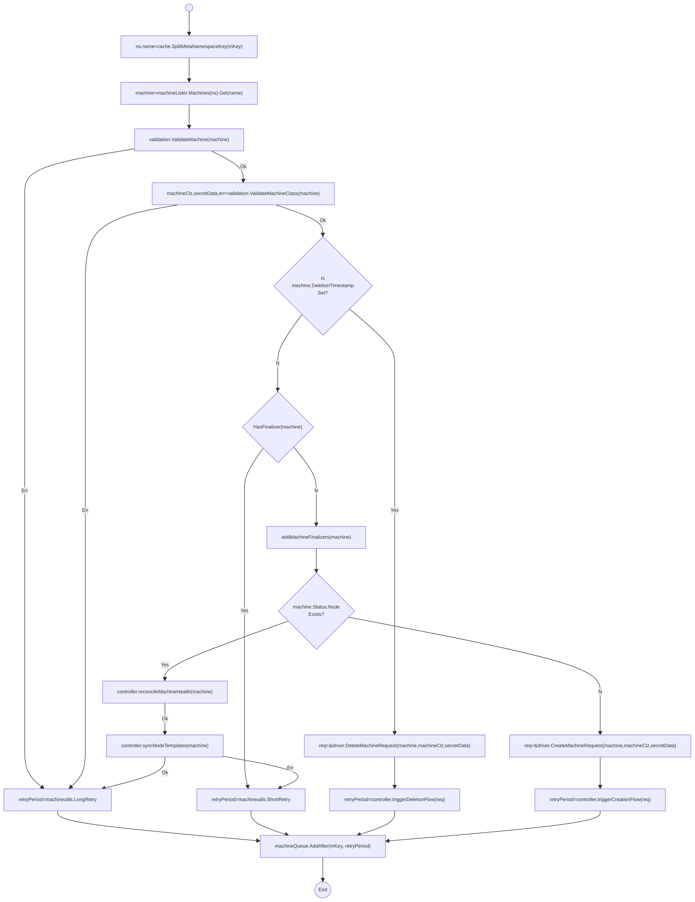
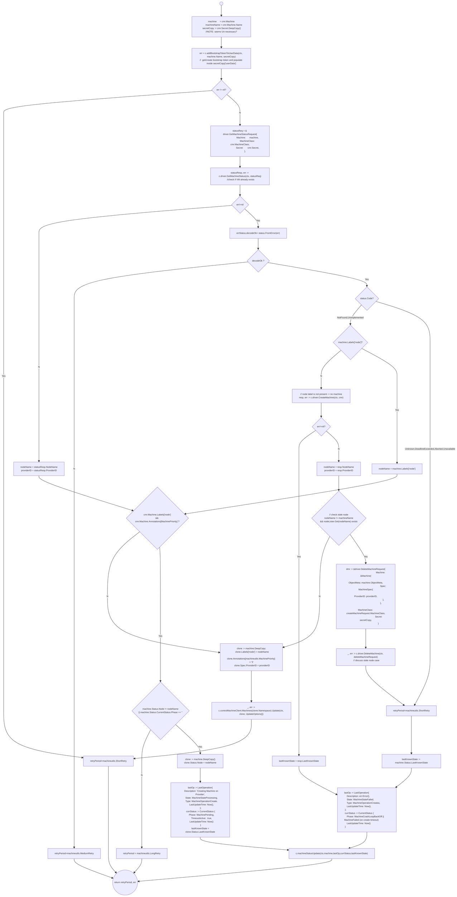
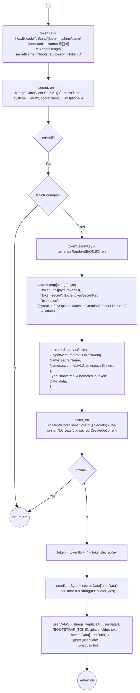
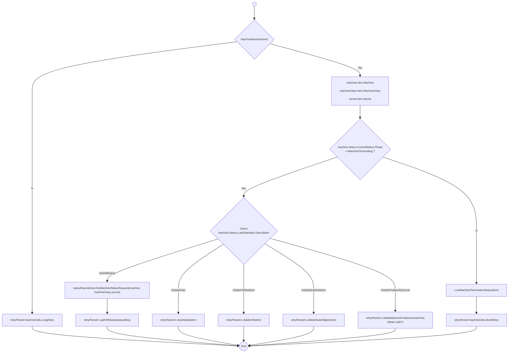
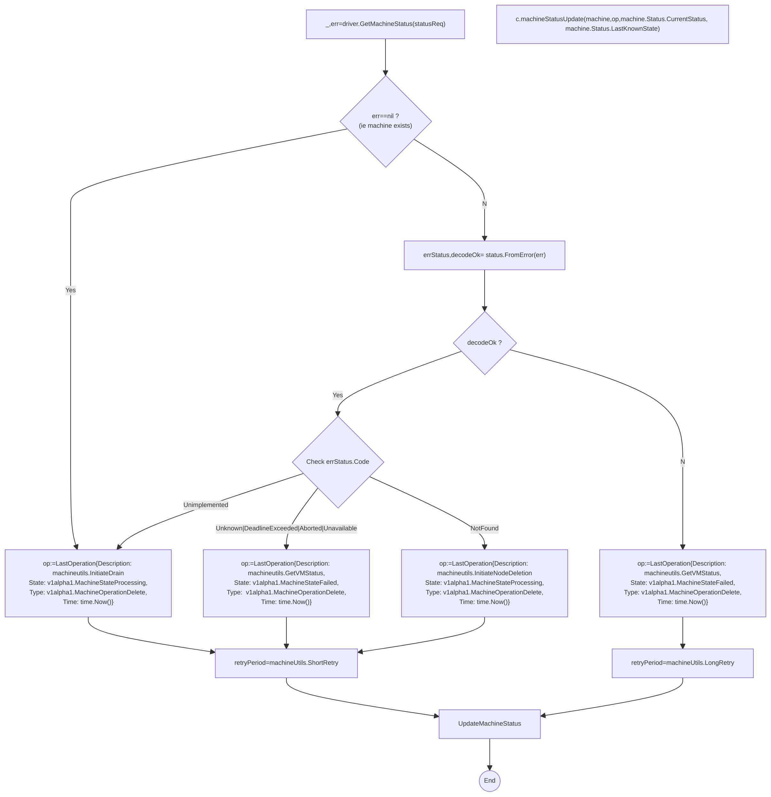
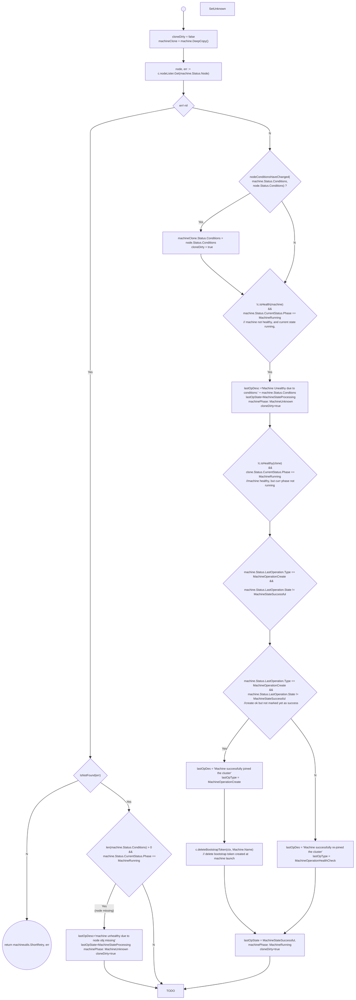

- [Cluster Machine Reconciliation](#cluster-machine-reconciliation)
  - [controller.triggerCreationFlow](#controllertriggercreationflow)
    - [controller.addBootstrapTokenToUserData](#controlleraddbootstraptokentouserdata)
  - [controller.triggerDeletionFlow](#controllertriggerdeletionflow)
    - [controller.getVMStatus](#controllergetvmstatus)
    - [controller.drainNode](#controllerdrainnode)
  - [controller.reconcileMachineHealth](#controllerreconcilemachinehealth)
    - [Health Check FLow Diagram](#health-check-flow-diagram)
    - [Health Check Summary](#health-check-summary)
    - [Health Check Doubts](#health-check-doubts)

While perusing the below, you might need to reference [Machine Controller Helper Functions](./mc_helper_funcs.md)  as several reconcile functions delegate to helper methods defined on the machine controller struct.

# Cluster Machine Reconciliation

```go
func (c *controller) reconcileClusterMachineKey(key string) error
```
The top-level reconcile function for the machine that analyzes machine status and delegates to the individual reconcile functions for machine-creation, machine-deletion and machine-health-check flows. 




## controller.triggerCreationFlow

[Controller Method](https://github.com/gardener/machine-controller-manager/blob/v0.47.0/pkg/util/provider/machinecontroller/machine.go#L326) that orchestraes the call to the [Driver.CreateMachine](../mcm_facilities.md#driver)

This method badly requires to be split into several functions. It is too long. 
```go
func (c *controller) triggerCreationFlow(ctx context.Context, 
cmr *driver.CreateMachineRequest) 
  (machineutils.RetryPeriod, error) 
```

Apologies for HUMONGOUS flow diagram - all this is in one method - will split into several sections later for clarity!


### controller.addBootstrapTokenToUserData

This method is responsible for adding the bootstrap token for the machine. Bootstrap tokens are used when joining new nodes to a cluster. Bootstrap Tokens are defined with a specific `SecretType`: `bootstrap.kubernetes.io/token` and live in the `kube-system` namespace. These Secrets are then read by the Bootstrap Authenticator in the API Server

Reference
- [Bootstrap Tokens](https://kubernetes.io/docs/reference/access-authn-authz/bootstrap-tokens/)
- [Bootstrap Token Secrets](https://github.com/kubernetes/design-proposals-archive/blob/main/cluster-lifecycle/bootstrap-discovery.md#new-bootstrap-token-secrets)
- [Bootstrap Token Structure](https://github.com/kubernetes/design-proposals-archive/blob/main/cluster-lifecycle/bootstrap-discovery.md#new-bootstrap-token-structure)


```go
func (c *controller) addBootstrapTokenToUserData(ctx context.Context, machineName string, secret *corev1.Secret) error 

```



## controller.triggerDeletionFlow

```go
func (c *controller) triggerDeletionFlow(ctx context.Context, dmr *driver.DeleteMachineRequest) (machineutils.RetryPeriod, error) 

```
Please note that there is sad use of `machine.Status.LastOperation`  as semantically the _next_ requested operation. This is confusing. TODO: DIscuss This.



### controller.getVMStatus
(BAD NAME FOR METHOD: should be called `checkMachineExistenceAndEnqueNextOperation`)

```go
func (c *controller) getVMStatus(ctx context.Context, 
    statusReq *driver.GetMachineStatusRequest) (machineutils.RetryPeriod, error)
```

This method is only called for the delete flow. 
1. It attempts to get the machine status
1. If the machine exists, it updates the machine status operation to `InitiateDrain` and returns a `ShortRetry` for the machine work queue. 
1. If attempt to get machine status failed, it will obtain the error code from the error.
   1. If decoding the error code failed, it will update the  machine status operation to `machineutils.GetVMStatus`returns a `LongRetry` for the machine work queue. 
      1. Unsure how we get out of this Loop. TODO: Discuss this. Is this dead code?
   2. For `Unknown|DeadlineExceeded|Aborted|Unavailable` it updates the machine status operation to `machineutils.GetVMStatus` status and returns a `ShortRetry` for the machine work queue.  (So that reconcile will run this method again in future)
   3. For `NotFound` code (ie machine is not found), it will enqueue node deletion by updating the machine stauts operation to `machineutils.InitiateNodeDeletion` and returning a `ShortRetry` for the machine work queue.




### controller.drainNode

Inside `pkg/util/provider/machinecontroller/machine_util.go`
```go
func (c *controller) drainNode(ctx context.Context, dmr *driver.DeleteMachineRequest) (machineutils.RetryPeriod, error)
```




```mermaid

%%{init: {'themeVariables': { 'fontSize': '10px'}, "flowchart": {"useMaxWidth": false }}}%%
flowchart TD


Initialize["err = nil
machine = dmr.Machine
nodeName= machine.Labels['node']
drainTimeout=machine.Spec.MachineConfiguration.MachineDrainTimeout || c.safetyOptions.MachineDrainTimeout
maxEvictRetries=machine.Spec.MachineConfiguration.MaxEvictRetries || c.safetyOptions.MaxEvictRetries
skipDrain = false"]
-->GetNodeReadyCond["nodeReadyCond = machine.Status.Conditions contains k8s.io/api/core/v1/NodeReady
readOnlyFSCond=machine.Status.Conditions contains 'ReadonlyFilesystem' 
"]
-->ChkNodeNotReady["skipDrain = (nodeReadyCond.Status == ConditionFalse) && nodeReadyCondition.LastTransitionTime.Time > 5m
or (readOnlyFSCond.Status == ConditionTrue) && readOnlyFSCond.LastTransitionTime.Time > 5m
// discuss this
"]
-->ChkSkipDrain{"skipDrain true?"}
ChkSkipDrain--Yes-->SetOpStateProcessing
ChkSkipDrain--No-->SetHasDrainTimedOut["hasDrainTimedOut = time.Now() > machine.DeletionTimestamp + drainTimeout"]
SetHasDrainTimedOut-->ChkForceDelOrTimedOut{"machine.Labels['force-deletion']
  || hasDrainTimedOut"}

ChkForceDelOrTimedOut--Yes-->SetForceDelParams["
  forceDeletePods=true
  drainTimeout=1m
  maxEvictRetries=1
  "]
SetForceDelParams--No-->UpdateNodeTermCond["err=c.UpdateNodeTerminationCondition(ctx, machine)"]
ChkForceDelOrTimedOut--No-->UpdateNodeTermCond

UpdateNodeTermCond-->ChkUpdateErr{"err != nil ?"}
ChkUpdateErr--No-->InitDrainOpts["
  // params reduced for brevity
  drainOptions := drain.NewDrainOptions(
    c.targetCoreClient,
    drainTimeout,
    maxEvictRetries,
    c.safetyOptions.PvDetachTimeout.Duration,
    c.safetyOptions.PvReattachTimeout.Duration,
    nodeName,
    forceDeletePods,
    c.driver,
		c.pvcLister,
		c.pvLister,
    c.pdbV1Lister,
		c.nodeLister,
		c.volumeAttachmentHandler)
"]
ChkUpdateErr--"Yes&&forceDelPods"-->InitDrainOpts
ChkUpdateErr--Yes-->SetOpStateFailed["opstate = v1alpha1.MachineStateFailed
  description=machineutils.InitiateDrain
  //drain failed. retry next sync
  "]

InitDrainOpts-->RunDrain["err = drainOptions.RunDrain(ctx)"]
RunDrain-->ChkDrainErr{"err!=nil?"}
ChkDrainErr--No-->SetOpStateProcessing["
  opstate= v1alpha1.MachineStateProcessing
  description=machineutils.InitiateVMDeletion
// proceed with vm deletion"]
ChkDrainErr--"Yes && forceDeletePods"-->SetOpStateProcessing
ChkDrainErr--Yes-->SetOpStateFailed
SetOpStateProcessing-->
InitLastOp["lastOp:=v1alpha1.LastOperation{
			Description:    description,
			State:          state,
			Type:           v1alpha1.MachineOperationDelete,
			LastUpdateTime: metav1.Now(),
		}
  //lastOp is actually the *next* op semantically"]
SetOpStateFailed-->InitLastOp
InitLastOp-->UpdateMachineStatus["c.machineStatusUpdate(ctx,machine,lastOp,machine.Status.CurrentStatus,machine.Status.LastKnownState)"]
-->Return(("machineutils.ShortRetry, err"))
```

Note on above
1. We skip the drain if node is set to ReadonlyFilesystem for over 5 minutes
   1. Check TODO:  `ReadonlyFilesystem` is a MCM condition and not a k8s core node condition. Not sure if we are mis-using this field. TODO: Check this.
2. Check TODO: Why do we check that node is not ready for 5m in order to skip the drain ? Shouldn't we skip the drain if node is simply not ready ? Why wait for 5m here ?/
3. See [Run Drain](./node_drain.md#run-drain)


## controller.reconcileMachineHealth

[controller.reconcileMachineHealth](https://github.com/gardener/machine-controller-manager/blob/v0.47.0/pkg/util/provider/machinecontroller/machine_util.go#L584) reconciles the machine object with any change in node conditions or VM health.

```go
func (c *controller) reconcileMachineHealth(ctx context.Context, machine *Machine) 
  (machineutils.RetryPeriod, error)
```

NOTES:
1. Reference [controller.isHealth](./mc_helper_methods.md#controllerishealthy) which checks the machine status conditions.

### Health Check FLow Diagram


### Health Check Summary

1. Gets the `Node` obj associated with the machine. If it IS NOT found, yet the current machine phase is `Running`, change the machine phase to `Unknown`, the last operation state to `Processing`, the last operation type to `HealthCheck`, update the machine status and return with a short retry.  
2. If the `Node` object IS found, then it checks whether the `Machine.Status.Conditions` are different from `Node.Status.Conditions`. If so it sets the machine conditions to the node conditions.
3.  If the machine IS NOT healthy (See [isHealthy](./mc_helper_methods.md#controllerishealthy)) but the current machine phase is `Running`, change the machine phase to `Unknown`, the last operation state to `Processing`, the last operation type to `HealthCheck`, update the machine status and return with a short retry.  
4. If the machine IS healthy but the current machine phase is NOT `Running`,  check whether the last operation type was a `Create`.
   1.  If the last operation type was a `Create` and last operation state is not marked as `Successful`, then delete the bootstrap token associated with the machine. Change the last operation state to `Successful`.
   1. If the last operation type was NOT a `Create`, change the last operation type to `HealthCheck`
   1. Change the machine phase to `Running` and update the machine status and return with a short retry.
5. If the current machine phase is `Pending` (ie machine being created) get the configured machine creation timeout and check.  
   1. If the timoeut HAS NOT expired, enqueue the machine key on the machine work queue after 1m. 
   1. If the timeout HAS expired, then change the last operation state to `Failed` and the machine phase to `Failed`. Update the machine status and return with a short retry.
6. If the current machine phase is `Unknown`, get the effective machine health timeout and check. 
   1. If the timoeut HAS NOT expired, enqueue the machine key on the machine work queue after 1m. 
   2. If the timoeut HAS expired 
      1. Get the machine deployment name `machine.Labels['name']`
      2. Register ONE permit with this name. See [Permit Giver](../mcm_facilities.md#permitspermitgiver)

```
    machineClone.Status.CurrentStatus = CurrentStatus {
      Phase: MachineUnknown,
      LastUpdateTime: Now(),
    };
    machineClone.Status.LastOperation = LastOperation{
        Description:    statusDesc,
        State:          MachineStateProcessing,
        Type:           MachineOperationHealthCheck,
        LastUpdateTime: Now(),
    }
    cloneDirty = true
```
### Health Check Doubts

1. TODO: Why don't we check the machine health using the `Driver.GetMachineStatus` in the reconcile Machine health ? (seems like something obvious to do and would have helped in those meltdown issues where machine was incorrectly marked as failed)
1. TODO: Why do we do `len(machine.Status.Condtions)==0` in the below when ?
1. TODO: why doesn't this code make use of the helper method: `c.machineStatusUpdate` ?
1. TODO: Unclear why `LastOperation.Description` does not use/concatenate one of the predefined constants in `machineutils`
2. TODO: code makes too much use of `cloneDirty` to check whether machine clone obj has changed, when it could easily return early in several branches.
3. TODO: Code directly makes calls to enqueue machine keys on the machine queue and still returns retry periods to caller leanding to un-necessary enqueue of machine keys. (spurious design)

