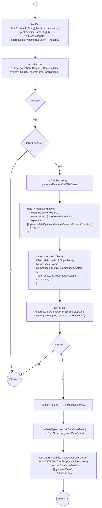
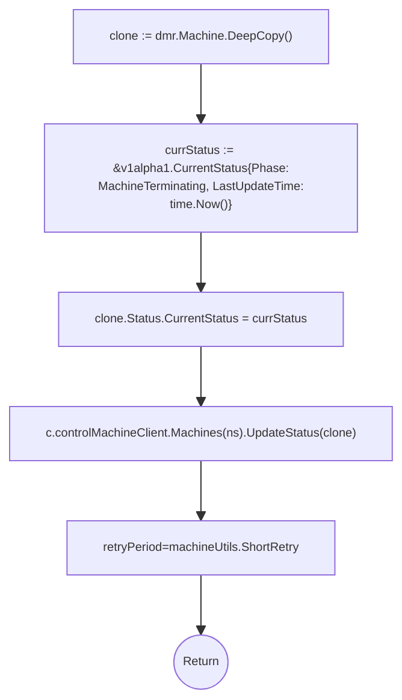
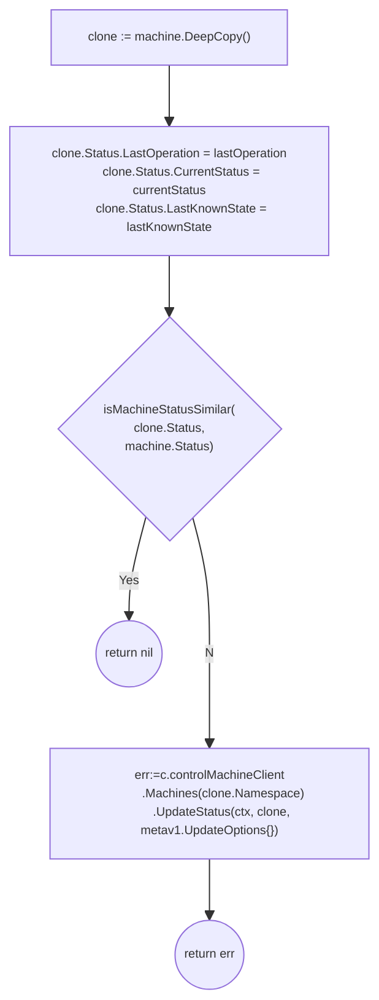
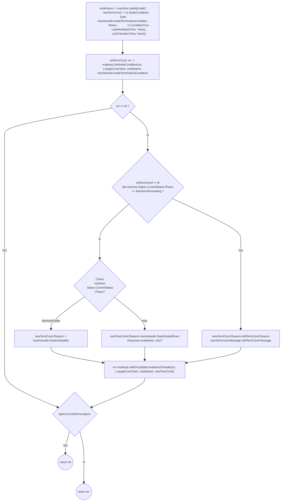
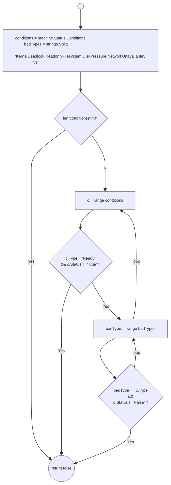
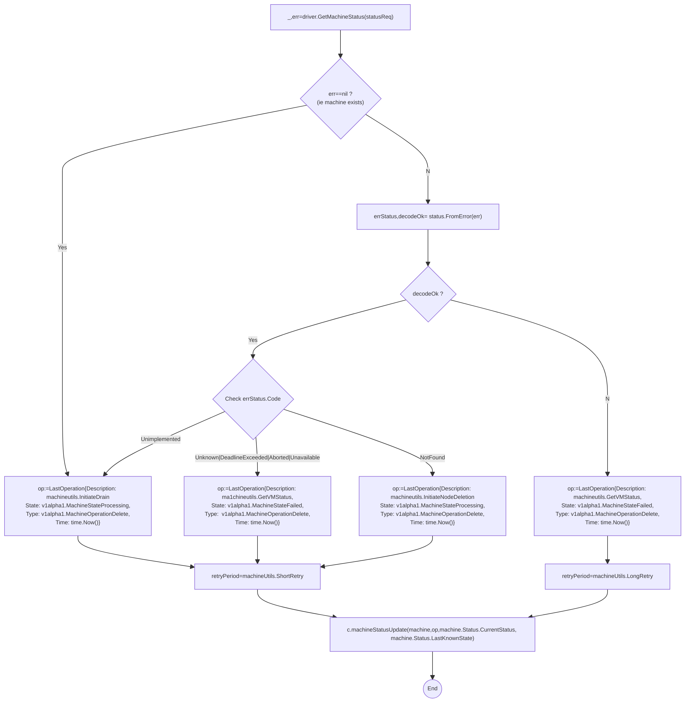
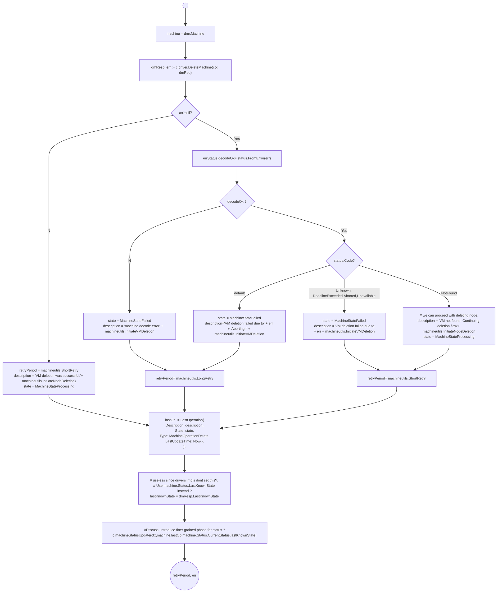
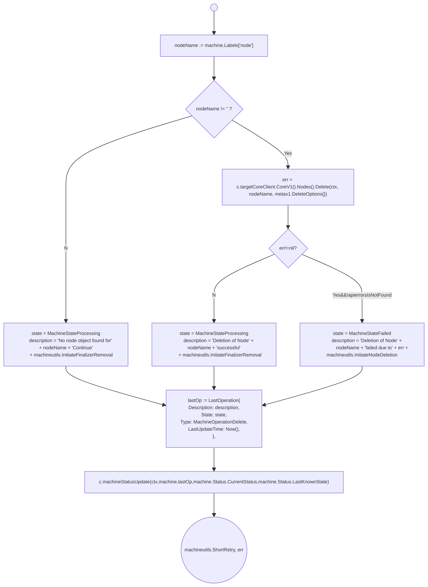

- [Machine Controller Helper Methods](#machine-controller-helper-methods)
	- [controller.addBootstrapTokenToUserData](#controlleraddbootstraptokentouserdata)
	- [controller.addMachineFinalizers](#controlleraddmachinefinalizers)
	- [controller.setMachineTerminationStatus](#controllersetmachineterminationstatus)
	- [controller.machineStatusUpdate](#controllermachinestatusupdate)
	- [controller.UpdateNodeTerminationCondition](#controllerupdatenodeterminationcondition)
	- [controller.isHealthy](#controllerishealthy)
	- [controller.getVMStatus](#controllergetvmstatus)
	- [controller.drainNode](#controllerdrainnode)
	- [controller.deleteVM](#controllerdeletevm)
	- [controller.deleteNodeObject](#controllerdeletenodeobject)
# Machine Controller Helper Methods

## controller.addBootstrapTokenToUserData


This method is responsible for adding the bootstrap token for the machine.

Bootstrap tokens are used when joining new nodes to a cluster. Bootstrap Tokens are defined with a specific `SecretType`: `bootstrap.kubernetes.io/token` and live in the `kube-system` namespace. These Secrets are then read by the Bootstrap Authenticator in the API Server


Reference
- [Bootstrap Tokens](https://kubernetes.io/docs/reference/access-authn-authz/bootstrap-tokens/)
- [Bootstrap Token Secrets](https://github.com/kubernetes/design-proposals-archive/blob/main/cluster-lifecycle/bootstrap-discovery.md#new-bootstrap-token-secrets)
- [Bootstrap Token Structure](https://github.com/kubernetes/design-proposals-archive/blob/main/cluster-lifecycle/bootstrap-discovery.md#new-bootstrap-token-structure)


```go
func (c *controller) addBootstrapTokenToUserData(ctx context.Context, machineName string, secret *corev1.Secret) error 

```



## controller.addMachineFinalizers

This method checks for the `MCMFinalizer` Value: `machine.sapcloud.io/machine-controller-manager` and adds it if it is not present. It leverages `k8s.io/apimachinery/pkg/util/sets` package for its work.

This method is regularly called during machine reconciliation, if a machine does not have a deletion timestamp so that all non-deleted machines possess this finalizer.

```go
func (c *controller) addMachineFinalizers(ctx context.Context, machine *v1alpha1.Machine) (machineutils.RetryPeriod, error)
	if finalizers := sets.NewString(machine.Finalizers...); !finalizers.Has(MCMFinalizerName) {
		finalizers.Insert(MCMFinalizerName)
		clone := machine.DeepCopy()
		clone.Finalizers = finalizers.List()
		_, err := c.controlMachineClient.Machines(clone.Namespace).Update(ctx, clone, metav1.UpdateOptions{})
		if err != nil {
			// Keep retrying until update goes through
			klog.Errorf("Failed to add finalizers for machine %q: %s", machine.Name, err)
		} else {
			// Return error even when machine object is updated
			klog.V(2).Infof("Added finalizer to machine %q with providerID %q and backing node %q", machine.Name, getProviderID(machine), getNodeName(machine))
			err = fmt.Errorf("Machine creation in process. Machine finalizers are UPDATED")
		}
	}
	return machineutils.ShortRetry, err

```

##  controller.setMachineTerminationStatus

`setMachineTerminationStatus` set's the machine status to terminating. This is illustrated below. Please note that `Machine.Status.LastOperation` is set an instance of the `LastOperation` struct. (which at times appears to be a command for the next action? Discuss this.) 

```go
func (c *controller) setMachineTerminationStatus(ctx context.Context, dmr *driver.DeleteMachineRequest) (machineutils.RetryPeriod, error)  
```




## controller.machineStatusUpdate

Updates `machine.Status.LastOperation`, `machine.Status.CurrentStatus` and `machine.Status.LastKnownState`

```go
func (c *controller) machineStatusUpdate(
	ctx context.Context,
	machine *v1alpha1.Machine,
	lastOperation v1alpha1.LastOperation,
	currentStatus v1alpha1.CurrentStatus,
	lastKnownState string) error 
```



NOTE: [isMachineStatusSimilar](https://github.com/gardener/machine-controller-manager/blob/v0.47.0/pkg/util/provider/machinecontroller/machine_util.go#L544) implementation is quite sad. TODO: we should improve stuff like this when we move to controller-runtime.

## controller.UpdateNodeTerminationCondition

[controller.UpdateNodeTerminationCondition](https://github.com/gardener/machine-controller-manager/blob/v0.47.0/pkg/util/provider/machinecontroller/machine_util.go#L1316) adds or updates the termination condition to the `Node.Status.Conditions` of the node object corresponding to the machine.

```go
func (c *controller) UpdateNodeTerminationCondition(ctx context.Context, machine *v1alpha1.Machine) error 
```




## controller.isHealthy

Checks if machine is healty by checking its conditions.
```go
func (c *controller) isHealthy(machine *.Machine) bool 
```


NOTE
1. controller.NodeConditions should be called controller.BadConditionTypes
2. Iterate over `machine.Status.Conditions`
   1. If `Ready` condition inis not `True`, node is determined as un-healty.
   2. If any of the bad condition types are detected, then node is determine as un-healthy


## controller.getVMStatus
(BAD NAME FOR METHOD: should be called `checkMachineExistenceAndEnqueNextOperation`)

```go
func (c *controller) getVMStatus(ctx context.Context, 
    statusReq *driver.GetMachineStatusRequest) (machineutils.RetryPeriod, error)
```

This method is only called for the delete flow. 
1. It attempts to get the machine status
1. If the machine exists, it updates the machine status operation to `InitiateDrain` and returns a `ShortRetry` for the machine work queue. 
1. If attempt to get machine status failed, it will obtain the error code from the error.
   1.  For `Unimplemented`(ie `GetMachineStatus` op was is not implemented), it does the same as `2`. ie: it updates the machine status operation to `InitiateDrain` and returns a `ShortRetry` for the machine work queue. 
   1. If decoding the error code failed, it will update the  machine status operation to `machineutils.GetVMStatus` and returns a `LongRetry` for the machine key into the machine work queue. 
      1. Unsure how we get out of this Loop. TODO: Discuss this.
   2. For `Unknown|DeadlineExceeded|Aborted|Unavailable` it updates the machine status operation to `machineutils.GetVMStatus` status and returns a `ShortRetry` for the machine work queue.  (So that reconcile will run this method again in future)
   3. For `NotFound` code (ie machine is not found), it will enqueue node deletion by updating the machine stauts operation to `machineutils.InitiateNodeDeletion` and returning a `ShortRetry` for the machine work queue.




## controller.drainNode

Inside `pkg/util/provider/machinecontroller/machine_util.go`
```go
func (c *controller) drainNode(ctx context.Context, dmr *driver.DeleteMachineRequest) (machineutils.RetryPeriod, error)
```




```mermaid

%%{init: {'themeVariables': { 'fontSize': '10px'}, "flowchart": {"useMaxWidth": false }}}%%
flowchart TD


Initialize["err = nil
machine = dmr.Machine
nodeName= machine.Labels['node']
drainTimeout=machine.Spec.MachineConfiguration.MachineDrainTimeout || c.safetyOptions.MachineDrainTimeout
maxEvictRetries=machine.Spec.MachineConfiguration.MaxEvictRetries || c.safetyOptions.MaxEvictRetries
skipDrain = false"]
-->GetNodeReadyCond["nodeReadyCond = machine.Status.Conditions contains k8s.io/api/core/v1/NodeReady
readOnlyFSCond=machine.Status.Conditions contains 'ReadonlyFilesystem' 
"]
-->ChkNodeNotReady["skipDrain = (nodeReadyCond.Status == ConditionFalse) && nodeReadyCondition.LastTransitionTime.Time > 5m
or (readOnlyFSCond.Status == ConditionTrue) && readOnlyFSCond.LastTransitionTime.Time > 5m
// discuss this
"]
-->ChkSkipDrain{"skipDrain true?"}
ChkSkipDrain--Yes-->SetOpStateProcessing
ChkSkipDrain--No-->SetHasDrainTimedOut["hasDrainTimedOut = time.Now() > machine.DeletionTimestamp + drainTimeout"]
SetHasDrainTimedOut-->ChkForceDelOrTimedOut{"machine.Labels['force-deletion']
  || hasDrainTimedOut"}

ChkForceDelOrTimedOut--Yes-->SetForceDelParams["
  forceDeletePods=true
  drainTimeout=1m
  maxEvictRetries=1
  "]
SetForceDelParams-->UpdateNodeTermCond["err=c.UpdateNodeTerminationCondition(ctx, machine)"]
ChkForceDelOrTimedOut--No-->UpdateNodeTermCond

UpdateNodeTermCond-->ChkUpdateErr{"err != nil ?"}
ChkUpdateErr--No-->InitDrainOpts["
  // params reduced for brevity
  drainOptions := drain.NewDrainOptions(
    c.targetCoreClient,
    drainTimeout,
    maxEvictRetries,
    c.safetyOptions.PvDetachTimeout.Duration,
    c.safetyOptions.PvReattachTimeout.Duration,
    nodeName,
    forceDeletePods,
    c.driver,
		c.pvcLister,
		c.pvLister,
    c.pdbV1Lister,
		c.nodeLister,
		c.volumeAttachmentHandler)
"]
ChkUpdateErr--"Yes&&forceDelPods"-->InitDrainOpts
ChkUpdateErr--Yes-->SetOpStateFailed["opstate = v1alpha1.MachineStateFailed
  description=machineutils.InitiateDrain
  //drain failed. retry next sync
  "]

InitDrainOpts-->RunDrain["err = drainOptions.RunDrain(ctx)"]
RunDrain-->ChkDrainErr{"err!=nil?"}
ChkDrainErr--No-->SetOpStateProcessing["
  opstate= v1alpha1.MachineStateProcessing
  description=machineutils.InitiateVMDeletion
// proceed with vm deletion"]
ChkDrainErr--"Yes && forceDeletePods"-->SetOpStateProcessing
ChkDrainErr--Yes-->SetOpStateFailed
SetOpStateProcessing-->
InitLastOp["lastOp:=v1alpha1.LastOperation{
			Description:    description,
			State:          state,
			Type:           v1alpha1.MachineOperationDelete,
			LastUpdateTime: metav1.Now(),
		}
  //lastOp is actually the *next* op semantically"]
SetOpStateFailed-->InitLastOp
InitLastOp-->UpdateMachineStatus["c.machineStatusUpdate(ctx,machine,lastOp,machine.Status.CurrentStatus,machine.Status.LastKnownState)"]
-->Return(("machineutils.ShortRetry, err"))
```

Note on above
1. We skip the drain if node is set to ReadonlyFilesystem for over 5 minutes
   1. Check TODO:  `ReadonlyFilesystem` is a MCM condition and not a k8s core node condition. Not sure if we are mis-using this field. TODO: Check this.
2. Check TODO: Why do we check that node is not ready for 5m in order to skip the drain ? Shouldn't we skip the drain if node is simply not ready ? Why wait for 5m here ?/
3. See [Run Drain](./node_drain.md#run-drain)

## controller.deleteVM

Called by `controller.triggerDeletionFlow`

```go
func (c *controller) deleteVM(ctx context.Context, dmReq *driver.DeleteMachineRequest) 
	(machineutils.RetryPeriod, error)

```



## controller.deleteNodeObject
NOTE: Should have just called this `controller.deleteNode` for naming consistency with other methods.

Called by `triggerDeletionFlow` after successfully deleting the VM.
```go
func (c *controller) deleteNodeObject(ctx context.Context, 
machine *v1alpha1.Machine) 
	(machineutils.RetryPeriod, error) 
```


