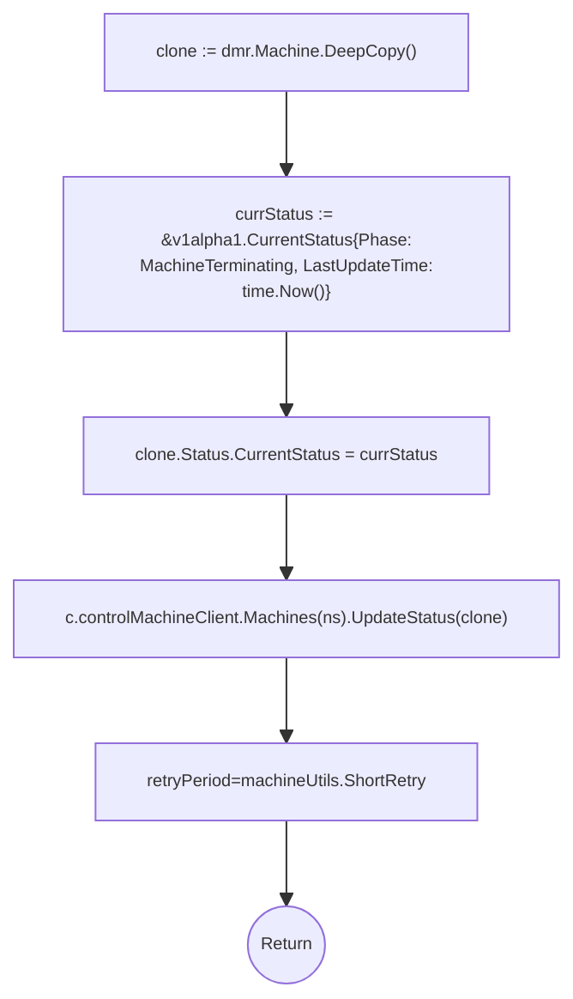
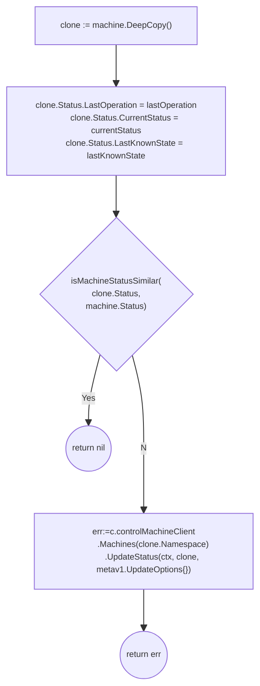
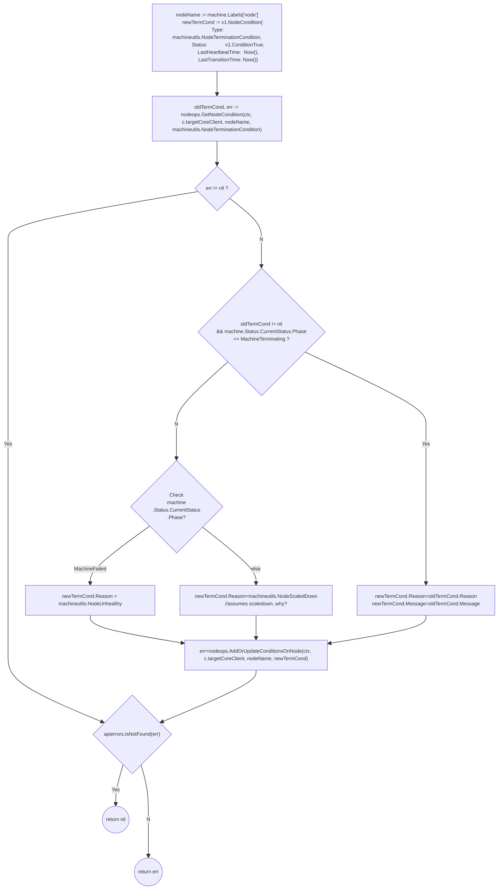
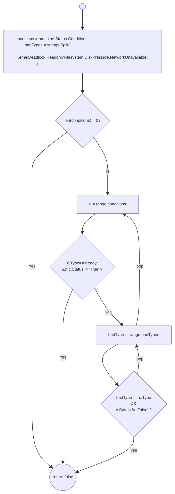

- [Machine Controller Helper Methods](#machine-controller-helper-methods)
	- [controller.ValidateMachineClass](#controllervalidatemachineclass)
	- [controller.addMachineFinalizers](#controlleraddmachinefinalizers)
	- [controller.setMachineTerminationStatus](#controllersetmachineterminationstatus)
	- [controller.machineStatusUpdate](#controllermachinestatusupdate)
	- [controller.UpdateNodeTerminationCondition](#controllerupdatenodeterminationcondition)
# Machine Controller Helper Methods

## controller.ValidateMachineClass

```go
func (c *controller) ValidateMachineClass(ctx context.Context, classSpec *v1alpha1.ClassSpec) (*v1alpha1.MachineClass, map[string][]byte, machineutils.RetryPeriod, error) 
```

TODO: Validation Flow Diagram and Retrieval of secrets.

## controller.addMachineFinalizers

This method checks for the `MCMFinalizer` Value: `machine.sapcloud.io/machine-controller-manager` and adds it if it is not present. It leverages `k8s.io/apimachinery/pkg/util/sets` package for its work.

This method is regularly called during machine reconciliation, if a machine does not have a deletion timestamp so that all non-deleted machines possess this finalizer.

```go
func (c *controller) addMachineFinalizers(ctx context.Context, machine *v1alpha1.Machine) (machineutils.RetryPeriod, error)
	if finalizers := sets.NewString(machine.Finalizers...); !finalizers.Has(MCMFinalizerName) {
		finalizers.Insert(MCMFinalizerName)
		clone := machine.DeepCopy()
		clone.Finalizers = finalizers.List()
		_, err := c.controlMachineClient.Machines(clone.Namespace).Update(ctx, clone, metav1.UpdateOptions{})
		if err != nil {
			// Keep retrying until update goes through
			klog.Errorf("Failed to add finalizers for machine %q: %s", machine.Name, err)
		} else {
			// Return error even when machine object is updated
			klog.V(2).Infof("Added finalizer to machine %q with providerID %q and backing node %q", machine.Name, getProviderID(machine), getNodeName(machine))
			err = fmt.Errorf("Machine creation in process. Machine finalizers are UPDATED")
		}
	}
	return machineutils.ShortRetry, err

```

##  controller.setMachineTerminationStatus

`setMachineTerminationStatus` set's the machine status to terminating. This is illustrated below. Please note that `Machine.Status.LastOperation` is set an instance of the `LastOperation` struct. This is VERY misleading as this generally the Next Operation carried in the next pickup by the reconciler func.

```go
func (c *controller) setMachineTerminationStatus(ctx context.Context, dmr *driver.DeleteMachineRequest) (machineutils.RetryPeriod, error)  
```




## controller.machineStatusUpdate

Updates `machine.Status.LastOperation`, `machine.Status.CurrentStatus` and `machine.Status.LastKnownState`

```go
func (c *controller) machineStatusUpdate(
	ctx context.Context,
	machine *v1alpha1.Machine,
	lastOperation v1alpha1.LastOperation,
	currentStatus v1alpha1.CurrentStatus,
	lastKnownState string) error 
```



NOTE: [isMachineStatusSimilar](https://github.com/gardener/machine-controller-manager/blob/v0.47.0/pkg/util/provider/machinecontroller/machine_util.go#L544) implementation is quite sad. TODO: we should improve stuff like this when we move to controller-runtime.

## controller.UpdateNodeTerminationCondition

[controller.UpdateNodeTerminationCondition](https://github.com/gardener/machine-controller-manager/blob/v0.47.0/pkg/util/provider/machinecontroller/machine_util.go#L1316) adds or updates the termination condition to the `Node.Status.Conditions` of the node object corresponding to the machine.

```go
func (c *controller) UpdateNodeTerminationCondition(ctx context.Context, machine *v1alpha1.Machine) error 
```




## controller.isHealthy

Checks if machine is healty by checking its conditions.
```go
func (c *controller) isHealthy(machine *.Machine) bool 
```


NOTE
1. controller.NodeConditions should be called controller.BadConditionTypes