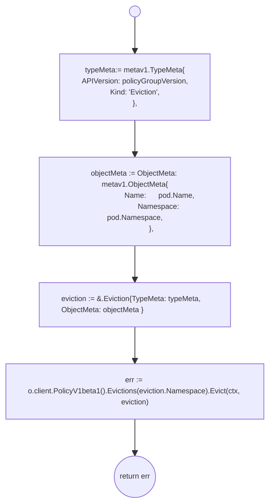
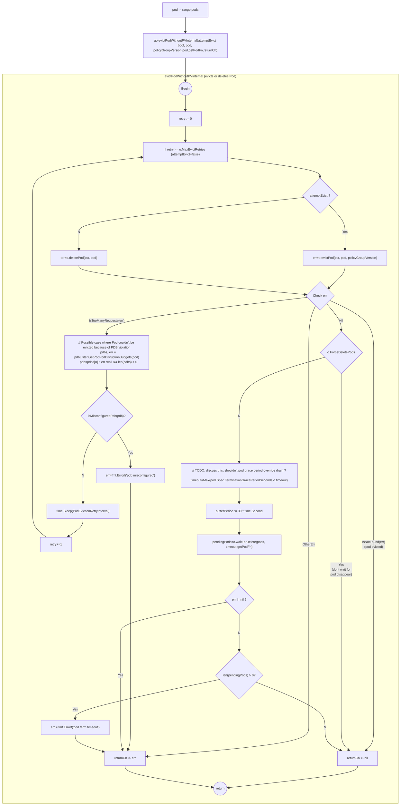
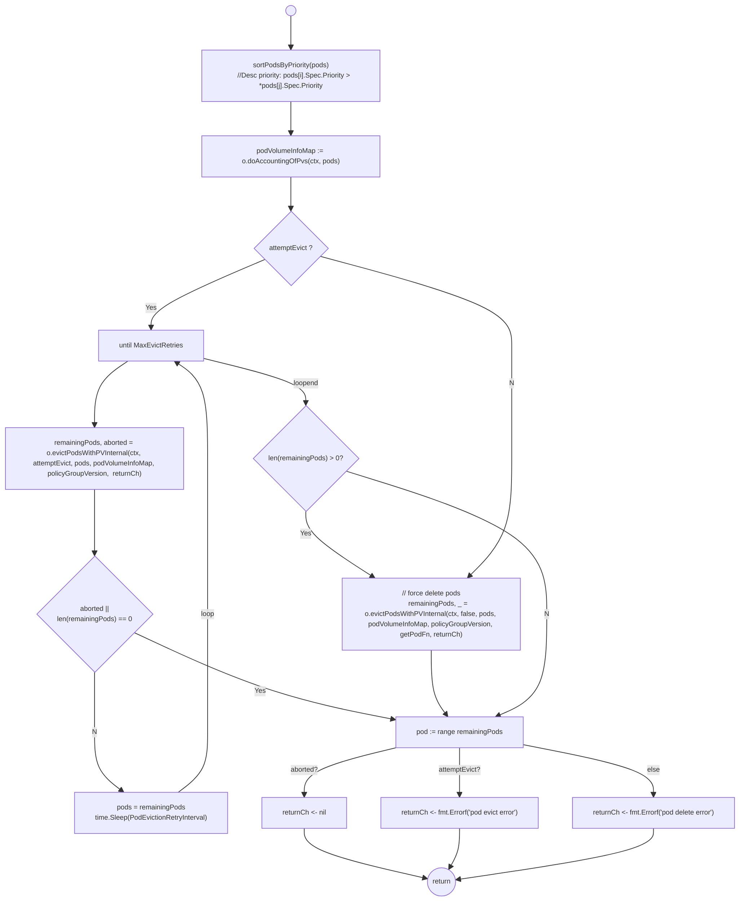
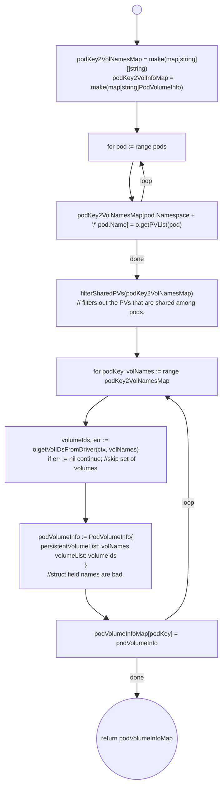

- [Node Drain](#node-drain)
	- [Drain Utilities](#drain-utilities)
		- [VolumeAttachmentHandler](#volumeattachmenthandler)
	- [Drain](#drain)
		- [Drain Types](#drain-types)
			- [Drain Constants](#drain-constants)
			- [drain.Options](#drainoptions)
		- [drain.PodVolumeInfo](#drainpodvolumeinfo)
		- [drain.Options.evictPod](#drainoptionsevictpod)
		- [drain.Options.deletePod](#drainoptionsdeletepod)
		- [drain.Options.RunDrain](#drainoptionsrundrain)
			- [drain.filterPodsWithPv](#drainfilterpodswithpv)
		- [drain.Options.evictPodsWithoutPv](#drainoptionsevictpodswithoutpv)
			- [drain.Options.evictPodWithoutPVInternal](#drainoptionsevictpodwithoutpvinternal)
			- [isMisconfiguredPdb](#ismisconfiguredpdb)
		- [drain.Options.evictPodsWithPv](#drainoptionsevictpodswithpv)
			- [drain.Options.doAccountingOfPvs](#drainoptionsdoaccountingofpvs)
			- [drain.Options.getPVList](#drainoptionsgetpvlist)
			- [drain.Options.getVolIDsFromDriver](#drainoptionsgetvolidsfromdriver)
			- [drain.Options.evictPodsWithPVInternal](#drainoptionsevictpodswithpvinternal)
		- [drain.Options.waitForDelete](#drainoptionswaitfordelete)
# Node Drain

Node Drain code is in [github.com/gardener/machine-controller-manager/pkg/util/provider/drain/drain.go](https://github.com/gardener/machine-controller-manager/blob/v0.47.0/pkg/util/provider/drain/drain.go)

## Drain Utilities 

### VolumeAttachmentHandler

[pkg/util/provider/drain.VolumeAttachmentHandler](https://pkg.go.dev/github.com/gardener/machine-controller-manager@v0.47.0/pkg/util/provider/drain#VolumeAttachmentHandler) is an handler used to distribute
incoming [k8s.io/api/storage/v1.VolumeAttachment](https://pkg.go.dev/k8s.io/api/storage/v1#VolumeAttachment) requests to a number of workers where each worker is a channel of type `*VolumeAttachment`. 

A [k8s.io/api/storage/v1.VolumeAttachment](https://pkg.go.dev/k8s.io/api/storage/v1#VolumeAttachment) is a non-namespaced k8s object that captures the intent to attach or detach the specified volume to/from the specified node. See [VolumeAttachment](../src/k8s_facilities.md#volumeattachment)

```go
type VolumeAttachmentHandler struct {
	sync.Mutex
	workers []chan *storagev1.VolumeAttachment
}

// NewVolumeAttachmentHandler returns a new VolumeAttachmentHandler
func NewVolumeAttachmentHandler() *VolumeAttachmentHandler {
	return &VolumeAttachmentHandler{
		Mutex:   sync.Mutex{},
		workers: []chan *storagev1.VolumeAttachment{},
	}
}
```

The `dispatch` method is responsible for distributing incomding `VolumeAttachent`s to available channels.

```go
func (v *VolumeAttachmentHandler) dispatch(obj interface{}) {
	if len(v.workers) == 0 {
		// As no workers are registered, nothing to do here.
		return
	}
	volumeAttachment := obj.(*storagev1.VolumeAttachment)
	v.Lock()
	defer v.Unlock()

	for i, worker := range v.workers {
		select {
		case worker <- volumeAttachment:
		default:
			klog.Warningf("Worker %d/%v is full. Discarding value.", i, worker)
			// TODO: Umm..isn't this problematic if we miss this ?
		}
	}
}
```

The `Add|Update` methods below delegate to dispatch. The usage of this utility involves specifying the add/update methods below as the event handler callbacks on an instance of [k8s.io/client-go/informers/storage/v1.VolumeAttachmentInformer](https://pkg.go.dev/k8s.io/client-go@v0.25.2/informers/storage/v1#VolumeAttachmentInformer). This way incoming volume attachments are distributed to several worker channels.
```go
func (v *VolumeAttachmentHandler) AddVolumeAttachment(obj interface{}) {
	v.dispatch(obj)
}

func (v *VolumeAttachmentHandler) UpdateVolumeAttachment(oldObj, newObj interface{}) {
	v.dispatch(newObj)
}
```
#### VolumeAttachmentHandler Usage
During construction of the MC:

```go
volumeAttachmentInformer.Informer().AddEventHandler(
	cache.ResourceEventHandlerFuncs{
			AddFunc:    controller.volumeAttachmentHandler.AddVolumeAttachment,
			UpdateFunc: controller.volumeAttachmentHandler.UpdateVolumeAttachment,
});
```


## Drain 

### Drain Types

#### Drain Constants

- `PodEvictionRetryInterval` is the interval in which to retry eviction for pods
- `GetPvDetailsMaxRetries` is the number of max retries to get PV details using the [PersistentVolumeLister](https://pkg.go.dev/k8s.io/client-go/listers/core/v1#PersistentVolumeLister) or [PersistentVolumeClaimLister](https://pkg.go.dev/k8s.io/client-go/listers/core/v1#PersistentVolumeClaimLister)
- `GetPvDetailsRetryInterval` is the interval in which to retry getting PV details
```go
const (
    PodEvictionRetryInterval = time.Second * 20
	GetPvDetailsMaxRetries = 3
	GetPvDetailsRetryInterval = time.Second * 5
)
```

#### drain.Options

`drain.Options` are configurable options while draining a node before deletion

NOTE: Unused fields/Fields with constant defaults omitted for brevity
```go
type Options struct {
	client                       kubernetes.Interface
	kubernetesVersion            *semver.Version
	Driver                       driver.Driver
	drainStartedOn               time.Time
	drainEndedOn                 time.Time
	ErrOut                       io.Writer
	ForceDeletePods              bool
	MaxEvictRetries              int32
	PvDetachTimeout              time.Duration
	PvReattachTimeout            time.Duration
	nodeName                     string
	Out                          io.Writer
	pvcLister                    corelisters.PersistentVolumeClaimLister
	pvLister                     corelisters.PersistentVolumeLister
	pdbV1Lister                  policyv1listers.PodDisruptionBudgetLister
	nodeLister                   corelisters.NodeLister
	volumeAttachmentHandler      *VolumeAttachmentHandler
	Timeout                      time.Duration
}

```

### drain.PodVolumeInfo

`drain.PodVolumeInfo` is the struct used to encapsulate the PV names and PV ID's for all the [PVs](https://kubernetes.io/docs/concepts/storage/persistent-volumes/) attached to the pod
```go
PodVolumeInfo struct {
	persistentVolumeList []string
	volumeList           []string
}
```
NOTE: The struct fields are badly named.
- `PodVolumeInfo.persistentVolumeList` is a slice of persistent volume names. This is from [PersistentVolumeSpec.VolumeName](https://pkg.go.dev/k8s.io/api/core/v1#PersistentVolumeSpec)
- `PodVolumeInfo.volumeList` is a slice of persistent volume IDs. This is obtained using [driver.GetVolumeIDs](../src/mcm_facilities.md#driver) given the PV Spec.


### drain.Options.evictPod

```go
func (o *Options) evictPod(ctx context.Context, pod *corev1.Pod, policyGroupVersion string) error 
```
[drain.Options.evictPod](https://github.com/gardener/machine-controller-manager/blob/v0.47.0/pkg/util/provider/drain/drain.go#L363) is a simple helper method to evict a Pod using [Eviction API](https://pkg.go.dev/k8s.io/client-go@v0.25.2/kubernetes/typed/policy/v1#EvictionExpansion)
- TODO: `GracePeriodSeconds` in the code is useless here and should be removed as it is always -1.
- TODO: Currently this method uses old `k8s.io/api/policy/v1beta1`. It must be changed to  `k8s.io/api/policy/v1`
TODO NOTE: 



### drain.Options.deletePod

Simple helper method to delete a Pod
```go
func (o *Options) deletePod(ctx context.Context, pod *corev1.Pod) error {
```
Just delegates to [PodInterface.Delete](https://pkg.go.dev/k8s.io/client-go@v0.25.2/kubernetes/typed/core/v1#PodInterface)

```go
o.client.CoreV1().Pods(pod.Namespace).Delete(ctx, pod.Name, metav1.DeleteOptions{} )
```


### drain.Options.RunDrain

```go
func (o *Options) RunDrain(ctx context.Context) error
```



```mermaid
%%{init: {'themeVariables': { 'fontSize': '10px'}, "flowchart": {"useMaxWidth": false }}}%%
flowchart TD


GetNode["node, err = .client.CoreV1().Nodes().Get(ctx, o.nodeName, metav1.GetOptions{})"]
-->ChkGetNodeErr{err != nil}

ChkGetNodeErr--Yes-->ReturnNilEarly(("return nil
(case where deletion 
triggered during machine creation, 
so node is nil. 
TODO: should use apierrors.NotFound)"))

ChkGetNodeErr--No-->ChkNodeUnschedulable{node.Spec.Unschedulable?}

ChkNodeUnschedulable--Yes-->GetPodsForDeletion["
    pods, err := o.getPodsForDeletion(ctx)
    if err!=nil return err"]
ChkNodeUnschedulable--No-->CloneNode["clone := node.DeepCopy()
		clone.Spec.Unschedulable = true"]
        -->UpdateNode["_, err = o.client.CoreV1().Nodes().Update(ctx, clone, metav1.UpdateOptions{})
        if err != nil return err
        "]

UpdateNode-->GetPodsForDeletion
GetPodsForDeletion-->GetEvictionPGV["
    policyGroupVersion, err := SupportEviction(o.client)
    if err != nil return err
    "]
-->
DefineAttemptEvict["
attemptEvict := !o.ForceDeletePods && len(policyGroupVersion) > 0
"]
-->
DefineGetPodFn["
getPodFn := func(namespace, name string) (*corev1.Pod, error) {
		return o.client.CoreV1().Pods(namespace).Get(ctx, name, metav1.GetOptions{})
}"]
-->
CreateReturnChannel["
    returnCh := make(chan error, len(pods))
	defer close(returnCh)
    "]
-->ChkForceDelPods{"o.ForceDeletePods?"}

ChkForceDelPods--Yes-->EvictPodsWithoutPV["go o.evictPodsWithoutPv(ctx, attemptEvict, pods, policyGroupVersion, getPodFn, returnCh)
// go-routine feels un-necessary here."]
ChkForceDelPods--No-->FilterPodsWithPv["
podsWithPv, podsWithoutPv := filterPodsWithPv(pods)
"]

FilterPodsWithPv-->EvictPodsWithPv["
go o.evictPodsWithPv(ctx, attemptEvict, podsWithPv, policyGroupVersion, getPodFn, returnCh)
"]
-->EvictPodsWithoutPV

EvictPodsWithoutPV-->CreateAggregateError["
	var errors []error
    errors =
	for i = 0; i <  len(pods); ++i {
		err := <-returnCh
		if err != nil {
			errors = append(errors, err)
		}
	}
	
"]
-->ReturnAggError(("return\nerrors.NewAggregate(errors)"))

```

Notes:
1. [machine-controller-manager/pkg/util/provider/drain.SupportEviction](https://github.com/gardener/machine-controller-manager/blob/v0.47.0/pkg/util/provider/drain/drain.go#L1106) uses Discovery API to find out if the server support eviction subresource and if so return its groupVersion or "" if it doesn't.
   1. [k8s.io/kubectl/pkg/drain.CheckEvictionSupport](https://pkg.go.dev/k8s.io/kubectl/pkg/drain#CheckEvictionSupport) already does this.
2. [attemptEvict boolean](https://github.com/gardener/machine-controller-manager/blob/v0.47.0/pkg/util/provider/drain/drain.go#L400) usage is confusing.

#### drain.filterPodsWithPv

NOTE: should have been named `partitionPodsWithPVC`

Utility function that iterates through given `pods` and for each `pod`, iterates through its `pod.Spec.Volumes`. For each such pod `volume` checks `volume.PersistentVolumeClaim`. If not nil, adds `pod` to slice `podsWithPV` else adds `pod` to slice `podsWithoutPV`

```go
func filterPodsWithPv(pods []corev1.Pod) 
    (podsWithPV []*corev1.Pod, podsWithoutPV []*corev1.Pod) 
```

### drain.Options.evictPodsWithoutPv

drain method that iterates through each given pod and for each pod launches a go-routine that simply delegates to `Options.evictPodsWithoutPv`.

```go
func (o *Options) evictPodsWithoutPv(ctx context.Context, 
    pods []*corev1.Pod,
	policyGroupVersion string, //eviction API's GV
	getPodFn func(namespace, name string) (*corev1.Pod, error),
	returnCh chan error) {
    for _, pod := range pods {
		go o.evictPodWithoutPVInternal(ctx, attemptEvict, pod, policyGroupVersion, getPodFn, returnCh)
	}
	return
}
```
NOTE:
- `attemptEvict` parameter is very badly named. It is more meant to be a `retryEvict`


#### drain.Options.evictPodWithoutPVInternal

drian method that  that either evicts or deletes a Pod with retry handling until `Options.MaxEvictRetries` is reached.

```go
func (o *Options) evictPodWithoutPVInternal(
    ctx context.Context, 
    attemptEvict bool, 
    pod *corev1.Pod, 
    policyGroupVersion string, 
    getPodFn func(namespace, name string) (*corev1.Pod, error), 
    returnCh chan error) 

```



#### isMisconfiguredPdb

TODO: Discuss/Elaborate on why this is considered misconfigured.
```go
func isMisconfiguredPdbV1(pdb *policyv1.PodDisruptionBudget) bool {
	if pdb.ObjectMeta.Generation != pdb.Status.ObservedGeneration {
		return false
	}

	return pdb.Status.ExpectedPods > 0 && 
        pdb.Status.CurrentHealthy >= pdb.Status.ExpectedPods
        && pdb.Status.DisruptionsAllowed == 0
}
```

### drain.Options.evictPodsWithPv

```go
func (o *Options) evictPodsWithPv(ctx context.Context, 
    attemptEvict bool, 
    pods []*corev1.Pod,
	policyGroupVersion string,
	getPodFn func(namespace, name string) (*corev1.Pod, error),
	returnCh chan error)
```
NOTE
- See [drain.Options.evictPodsWithPv](https://github.com/gardener/machine-controller-manager/blob/v0.47.0/pkg/util/provider/drain/drain.go#L580)
- This method basically delegates to `o.evictPodsWithPVInternal` with retry handling
- TODO: UNHAPPY with logic of this method. Needs refactoring!
- Flow diagram is a MESS because code is confusing. sorry.



#### drain.Options.doAccountingOfPvs

[drain.Options.doAccountingOfPvs](https://github.com/gardener/machine-controller-manager/blob/v0.47.0/pkg/util/provider/drain/drain.go#L509) returns a map of the pod key `pod.Namespace + '/' + pod.Name` to a [PodVolumeInfo](#drainpodvolumeinfo) struct which holds a slice of PV names and PV IDs.

NOTES:
- See [filterSharedPVs](https://github.com/gardener/machine-controller-manager/blob/v0.47.0/pkg/util/provider/drain/drain.go#L544)




#### drain.Options.getPVList

NOTE: Should be called `getPVNames`.  Gets a slice of the persistent volume names bound to the given `pod`. 
```go
func (o *Options) getPVList(pod *corev1.Pod) (pvNames []string, err error) 
```
1. Iterate over `pod.Spec.Volumes`.
2. If `volume.PersistentVolumeClaim` reference is not nil, gets the `PersistentVolumeClaim` using `o.pvcLister` using `vol.PersistentVolumeClaim.ClaimName`.
   1. Implements error handling and retry till `GetPvDetailsMaxRetries` is reached with interval `GetPvDetailsRetryInterval` for the above.
3. Adds `pvc.Spec.VolumeName` to `pvNames`
4. Return `pvNames`


#### drain.Options.getVolIDsFromDriver

Given a slice of PV Names, this method gets the corresponding volume ids from the driver. 
- It does this by first getting the [PersistentVolumeSpec](https://pkg.go.dev/k8s.io/api/core/v1#PersistentVolumeSpec) using `o.pvLister.Get(pvName)` for each PV name and adding to the `pvSpecs` slice of type `PersistentVolumeSpec`. See [k8s.io/client-go/listers/core/v1.PersistentVolumeLister](https://pkg.go.dev/k8s.io/client-go/listers/core/v1#PersistentVolumeLister)
-  Retry handling is implemented here while looking up pvName till `GetPvDetailsMaxRetries` is reached with sleep interval of `GetPvDetailsRetryInterval` between each retry attempt.
- Once `pvSpecs` slice is populated it constructs a [driver.GetVolumeIDsRequest](https://pkg.go.dev/github.com/gardener/machine-controller-manager@v0.47.0/pkg/util/provider/driver#GetVolumeIDsRequest) from the same and then invokes `driver.GetVolumeIDs(driver.GetVolumeIDsRequest))` to obtain the [driver.GetVolumeIDsResponse](https://pkg.go.dev/github.com/gardener/machine-controller-manager@v0.47.0/pkg/util/provider/driver#GetVolumeIDsResponse) and retruns `driver.GetVolumeIDsResponse.VolumeIDs`

TODO: BUG ? In case the PV is not found or retry limit is reached the slice of volume ids will not have a 1:1 correspondence with slice of PV names passed in.

```go
func (o *Options) getVolIDsFromDriver(ctx context.Context, pvNames []string) ([]string, error)
```

###	# drain.Options.evictPodsWithPVInternal

[drain.Options.evictPodsWithPVInternal](https://github.com/gardener/machine-controller-manager/blob/v0.47.0/pkg/util/provider/drain/drain.go#L646) is a drain helper method that actually evicts/deletes pods and waits for volume detachment. It returns a `remainingPods` slice and a `fastTrack` boolean is meant to abort the pod eviction and exit the calling go-routine. (TODO: should be called `abort` or even better should use custom error here)

```go
func (o *DrainOptions) evictPodsWithPVInternal(ctx context.Context,
    attemptEvict bool, 
    pods []*corev1.Pod, 
    volMap map[string][]string,
	policyGroupVersion string,
	returnCh chan error
    ) (remainingPods []*api.Pod, fastTrack bool) 
```


### drain.Options.waitForDelete

NOTE: Ideally should have been named `waitForPodDisappearance`

[pkg/util/provider/drain.Options.waitForDelete](https://github.com/gardener/machine-controller-manager/blob/v0.47.0/pkg/util/provider/drain/drain.go#L1068) is a helper method defined on `drain.Options` that leverages [wait.PollImmediate](./k8s_facilities.md#waitpollimmediate) and the `getPodFn` (get pod by name and namespace) and checks that all pods have disappeared within `timeout`. The set of pods that did not disappear within timeout is returned as `pendingPods`

```go
func (o *Options) waitForDelete(
        pods []*corev1.Pod, interval, 
        timeout time.Duration,  
        getPodFn func(string, string) (*corev1.Pod, error)
    ) (pendingPods []*corev1.Pod, err error) 
```
