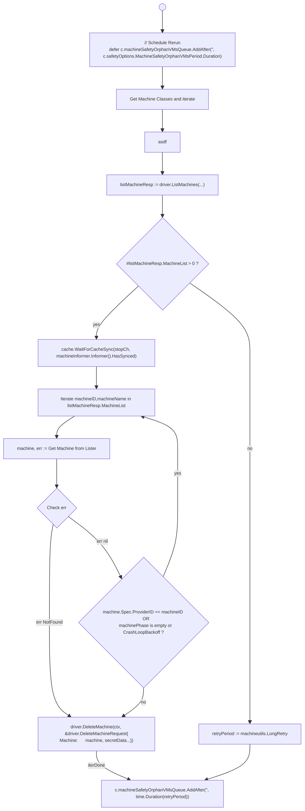

# Orphan / Safety Jobs

Read MCM FAQ: [What is Safety Controller in MCM](https://github.com/gardener/machine-controller-manager/blob/master/docs/FAQ.md#what-is-safety-controller-in-mcm)

These are jobs that periodically run by pushing dummy keys onto their respective work-queues. The worker then picks up and dispatches to the reconcile functions.

```go
    worker.Run(c.machineSafetyOrphanVMsQueue, "ClusterMachineSafetyOrphanVMs", 
    worker.DefaultMaxRetries, 
    true, c.reconcileClusterMachineSafetyOrphanVMs, stopCh, &waitGroup)

    worker.Run(c.machineSafetyAPIServerQueue, "ClusterMachineAPIServer", 
    worker.DefaultMaxRetries, true, c.reconcileClusterMachineSafetyAPIServer, 
    stopCh, &waitGroup)

```

## reconcileClusterMachineSafetyOrphanVMs

This techinically isn't a reconcilation loop. It is effectively just a job.



