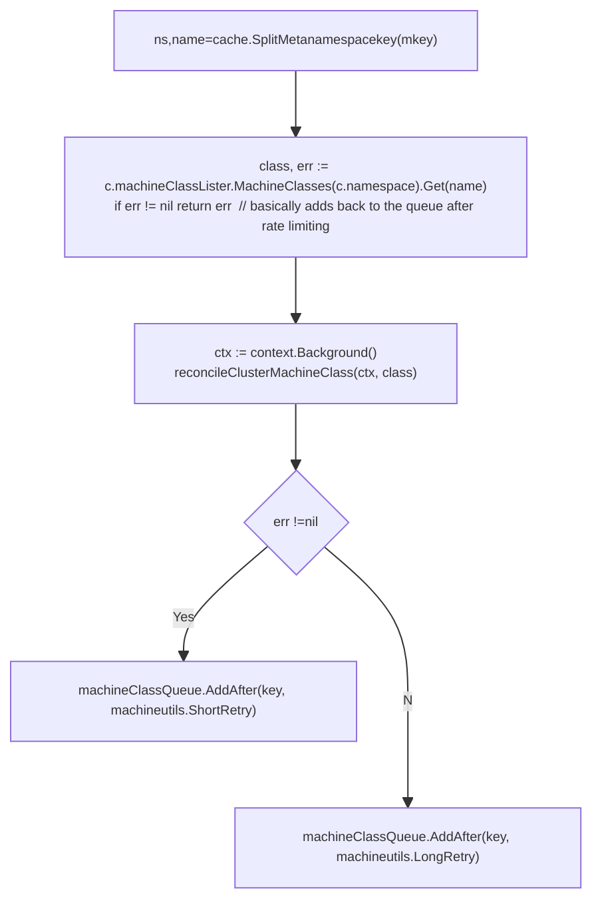
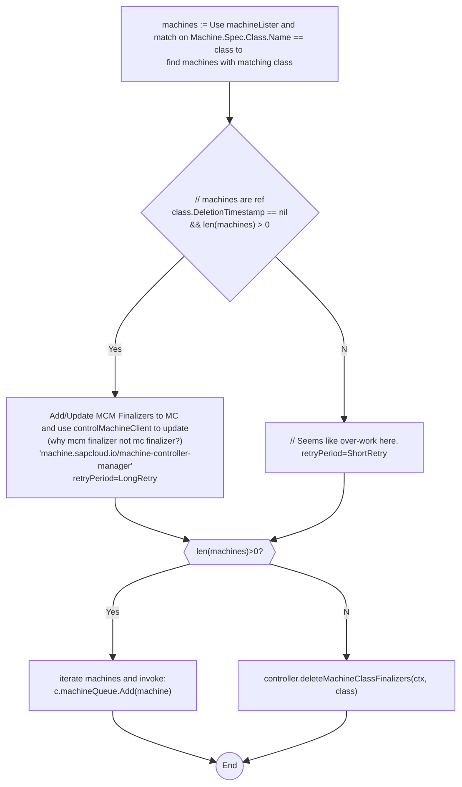
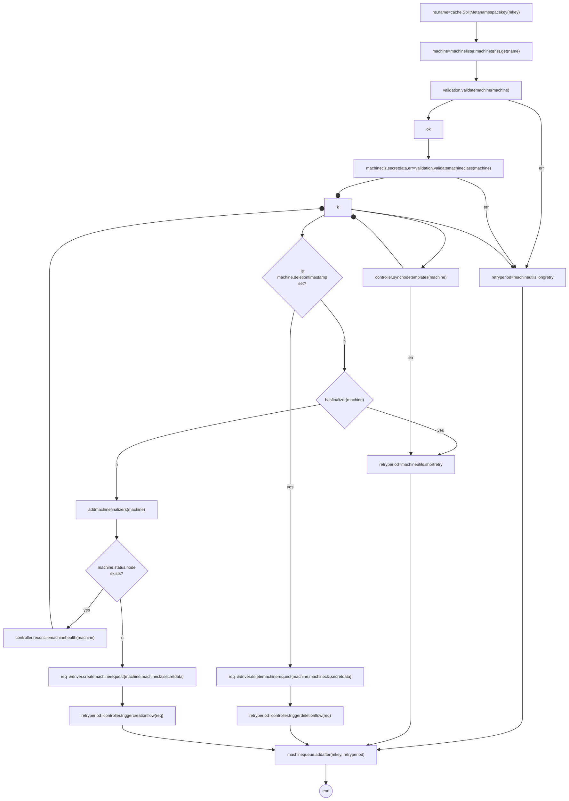

# Reconcile Cluster Machine Class 

## Reconcile Cluster Machine Class Key
`reconcileClusterMachineClassKey` just picks up the machine class key from the machine class queue  and then delegates further. 

```go
func (c *controller) reconcileClusterMachineClassKey(key string) error
```


## Reconcile Cluster Machine Class

```go
func (c *controller) reconcileClusterMachineClass(ctx context.Context,
 class *v1alpha1.MachineClass) error 
```
Bad design: should ideally return the retry period like other reconcile functions.




NOTE: Scratch work below. IGNORE.

