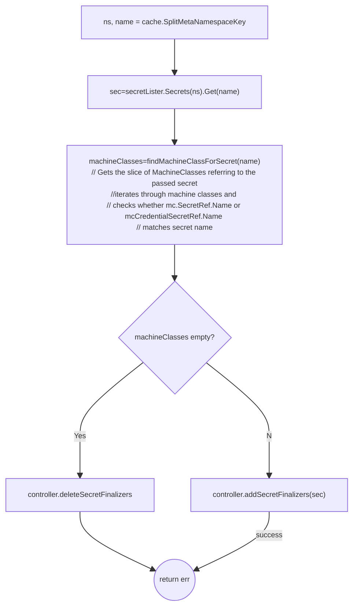

# Reconcile Cluster Secret

`reconcileClusterSecretKey` reconciles an secret due to controller resync
or an event on the secret
```go
func (c *controller) reconcileClusterSecretKey(key string) error 
// which looks up secret and delegates to
func (c *controller) reconcileClusterSecret(ctx context.Context, secret *corev1.Secret) error 
```
## Usage
Worker go-routines are created for this as below

```go
worker.Run(c.secretQueue, 
    "ClusterSecret", 
    worker.DefaultMaxRetries, 
    true, 
    c.reconcileClusterSecretKey,
    stopCh,
    &waitGroup)
```
## Flow

[controller.reconcileClusterSecretkey](https://github.com/gardener/machine-controller-manager/blob/v0.47.0/pkg/util/provider/machinecontroller/secret.go#L37)
 basically adds the [MCFinalizerName](../mcm_facilities.md#finalizers)  (value: `machine.sapcloud.io/machine-controller`) to the list of finalizers for all secrets that are referenced by machine classes within the same namespace.



### controller.addSecretFinalizers

```go
func (c *controller) addSecretFinalizers(ctx context.Context, secret *corev1.Secret) error {
```

Basicaly adds `machine.sapcloud.io/machine-controller` to the secret and uses `controlCoreClient` to update the secret.