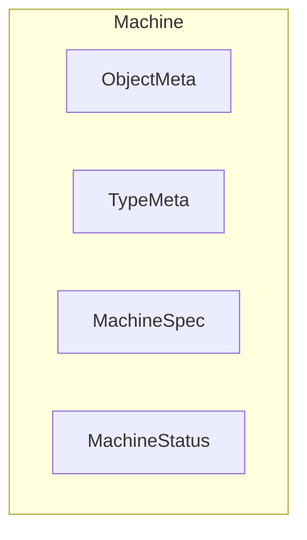
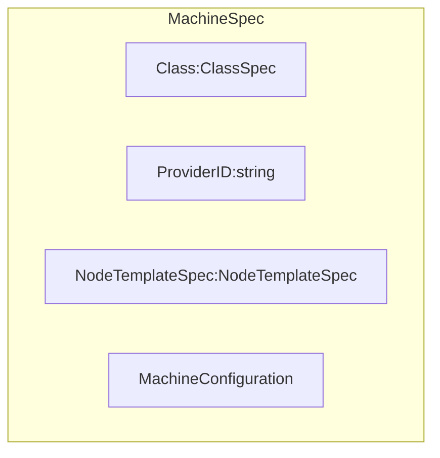
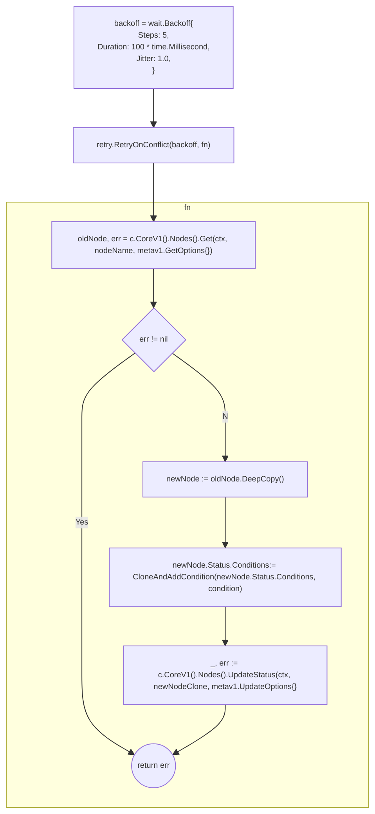

- [MCM Facilities](#mcm-facilities)
	- [Machine Controller Core Types](#machine-controller-core-types)
		- [Machine](#machine)
			- [MachineSpec](#machinespec)
			- [MachineStatus](#machinestatus)
			- [Extended NodeConditionTypes](#extended-nodeconditiontypes)
			- [LastOperation](#lastoperation)
				- [MachineState (should be called MachineOperationState)](#machinestate-should-be-called-machineoperationstate)
				- [MachineOperationType](#machineoperationtype)
			- [CurrentStatus](#currentstatus)
				- [MachinePhase](#machinephase)
	- [Utilities](#utilities)
		- [NodeOps](#nodeops)
			- [nodeops.GetNodeCondition](#nodeopsgetnodecondition)
			- [nodeops.CloneAndAddCondition](#nodeopscloneandaddcondition)
			- [nodeops.AddOrUpdateConditionsOnNode](#nodeopsaddorupdateconditionsonnode)
		- [MachineUtils](#machineutils)
			- [Operation Descriptions](#operation-descriptions)
			- [Retry Periods](#retry-periods)
		- [Drain Utilities](#drain-utilities)
			- [VolumeAttachmentHandler](#volumeattachmenthandler)
	- [Main Server Structs](#main-server-structs)
		- [MCServer](#mcserver)
			- [MCServer Usage](#mcserver-usage)
			- [MachineControllerConfiguration struct](#machinecontrollerconfiguration-struct)
				- [SafetyOptions](#safetyoptions)
	- [Controller Structs](#controller-structs)
		- [Machine Controller Core Struct](#machine-controller-core-struct)
	- [Codes and (error) Status](#codes-and-error-status)
		- [Code](#code)
		- [Status](#status)

# MCM Facilities

This chapter describes the core types and utilities present in the MCM module and used by the controllers and drivers.

## Machine Controller Core Types

The relevant machine types managed by the MCM controlled reside in [github.com/gardener/machine-controller-manager/pkg/apis/machine/v1alpha1](https://pkg.go.dev/github.com/gardener/machine-controller-manager@v0.47.0/pkg/apis/machine/v1alpha1). This follows the standard location for client gen types `<module>/pkg/apis/<group>/<version>`


### Machine

Machine is the representation of a physical or virtual machine that corresponds to a front-end k8s node object. An example YAML looks like the below
```yaml
apiVersion: machine.sapcloud.io/v1alpha1
kind: Machine
metadata:
  name: test-machine
  namespace: default
spec:
  class:
    kind: MachineClass
    name: test-class
```
[pkg/apis/machine/v1alpha1.Machine](https://github.com/gardener/machine-controller-manager/blob/v0.47.0/pkg/apis/machine/v1alpha1/machine_types.go#L39)

A `Machine` has a `Spec` field represented by [MachineSpec](#machinespec)
```go
type Machine struct {
	// ObjectMeta for machine object
	metav1.ObjectMeta 

	// TypeMeta for machine object
	metav1.TypeMeta 

	// Spec contains the specification of the machine
	Spec MachineSpec 

	// Status contains fields depicting the status
	Status MachineStatus 
}
```



#### MachineSpec

[MachineSpec](https://github.com/gardener/machine-controller-manager/blob/v0.47.0/pkg/apis/machine/v1alpha1/machine_types.go#L54) represents the specification of a Machine.

```go
type MachineSpec struct {

	// Class is the referrent to the MachineClass. 
	Class ClassSpec 

    // Unique identification of the VM at the cloud provider
	ProviderID string 

	// NodeTemplateSpec describes the data a node should have when created from a template
	NodeTemplateSpec NodeTemplateSpec 

	// Configuration for the machine-controller.  
	*MachineConfiguration 
}
type NodeTemplateSpec struct { // BADLY NAMED!
	metav1.ObjectMeta

	// NodeSpec describes the attributes that a node is created with.
	Spec corev1.NodeSpec
}
```

- `ProviderID` is the unique identification of the VM at the cloud provider. `ProviderID` typically matches with the `node.Spec.ProviderID` on the node object.
- `Class` field is of type `ClassSpec` which is just the (`Kind` and the `Name`) referring to the `MachineClass`. (Ideally the field, type should have been called `ClassReference`) like `OwnerReference`
- `NodeTemplateSpec` describes the data a node should have when created from a template, embeds `ObjectMeta` and holds a [corev1.NodeSpec](https://pkg.go.dev/k8s.io/api/core/v1#NodeSpec) in its `Spec` field.  
  - The `Machine.Spec.NodeTemplateSpec.Spec` mirrors k8s `Node.Spec`
- `MachineSpec` embeds a `MachineConfiguration` which is just a configuration object that is a connection of timeouts, maxEvictRetries and NodeConditions



```go
type MachineConfiguration struct {
	// MachineDraintimeout is the timeout after which machine is forcefully deleted.
	MachineDrainTimeout *Duration

	// MachineHealthTimeout is the timeout after which machine is declared unhealhty/failed.
	MachineHealthTimeout *Duration 

	// MachineCreationTimeout is the timeout after which machinie creation is declared failed.
	MachineCreationTimeout *Duration 

	// MaxEvictRetries is the number of retries that will be attempted while draining the node.
	MaxEvictRetries *int32 

	// NodeConditions are the set of conditions if set to true for MachineHealthTimeOut, machine will be declared failed.
	NodeConditions *string 
}
```


#### MachineStatus

[pkg/apis/machine/v1alpha1.MachineStatus](https://github.com/gardener/machine-controller-manager/blob/v0.47.0/pkg/apis/machine/v1alpha1/machine_types.go#L97) represents the most recently observed status of Machine.
```go
type MachineStatus struct {
	// Node string. 
	Node string // TODO: describe me more

	// Conditions of this machine, same as NodeStatus.Conditions
	Conditions []NodeCondition 

	// Last operation refers to the status of the last operation performed. NOTE: this is usually the NextOperation for reconcile!! Discuss!
	LastOperation LastOperation 

	// Current status of the machine object
	CurrentStatus CurrentStatus

	// LastKnownState can store details of the last known state of the VM by the plugins.
	// It can be used by future operation calls to determine current infrastucture state
	LastKnownState string 
}
```
#### Extended NodeConditionTypes

The MCM extends standard k8s [NodeConditionType](./k8s_facilities.md#nodeconditiontype) with several custom conditions. (TODO: isn't this hacky/error prone?)

-  [NodeTerminationCondition]() defined as `	NodeTerminationCondition v1.NodeConditionType = "Terminating"`


NodeTerminationCondition


#### LastOperation

[github.com/machine-controller-manager/pkg/apis/machine/v1alpha1.LastOperation](https://pkg.go.dev/github.com/gardener/machine-controller-manager/pkg/apis/machine/v1alpha1#LastOperation) represents the last operation performed on the object
```go
type LastOperation struct {
	// Description of the operation
	Description string 

	// Last update time of operation
	LastUpdateTime Time 

	// State of operation (bad naming)
	State MachineState 

	// Type of operation
	Type MachineOperationType 
}

```
##### MachineState (should be called MachineOperationState)

NOTE: BADLY NAMED: Should be called `MachineOperationState`

[machine-controller-manager/pkg/apis/machine/v1alpha1.MachineState](https://pkg.go.dev/github.com/gardener/machine-controller-manager/pkg/apis/machine/v1alpha1#MachineState) represents the  current state of a machine operation and is one of `Processing`, `Failed` or `Successful`.

```go
// MachineState is  current state of the machine.
// BAD Name: Should be MachineOperationState
type MachineState string

// These are the valid (operation) states of machines.
const (
	// MachineStatePending means there are operations pending on this machine state
	MachineStateProcessing MachineState = "Processing"

	// MachineStateFailed means operation failed leading to machine status failure
	MachineStateFailed MachineState = "Failed"

	// MachineStateSuccessful indicates that the node is not ready at the moment
	MachineStateSuccessful MachineState = "Successful"
)
```
##### MachineOperationType

[github.com/machine-controller-manager/pkg/apis/machine/v1alpha1.MachineOperationType](https://pkg.go.dev/github.com/gardener/machine-controller-manager/pkg/apis/machine/v1alpha1#MachineOperationType) is a label for the operation performed on a machine object: `Create`/`Update`/`HealthCheck`/`Delete`.

```go
type MachineOperationType string
const (
	// MachineOperationCreate indicates that the operation is a create
	MachineOperationCreate MachineOperationType = "Create"

	// MachineOperationUpdate indicates that the operation is an update
	MachineOperationUpdate MachineOperationType = "Update"

	// MachineOperationHealthCheck indicates that the operation is a create
	MachineOperationHealthCheck MachineOperationType = "HealthCheck"

	// MachineOperationDelete indicates that the operation is a delete
	MachineOperationDelete MachineOperationType = "Delete"
)

```

#### CurrentStatus
[github.com/machine-controller-manager/pkg/apis/machine/v1alpha1.CurrentStatus](https://pkg.go.dev/github.com/gardener/machine-controller-manager/pkg/apis/machine/v1alpha1#CurrentStatus) encapsulates information about the current status of Machine.

```go
type CurrentStatus struct {
	// Phase refers to the Machien (Lifecycle) Phase
	Phase MachinePhase 
	// TimeoutActive when set to true drives the machine controller
	// to check whether	machine failed the configured creation timeout or health check timeout and change machine phase to Failed.
	TimeoutActive bool 
	// Last update time of current status
	LastUpdateTime Time
}
```

##### MachinePhase

`MachinePhase` is a label for the life-cycle phase of a machine at a given time: `Unknown`, `Pending`, `Available`, `Running`, `Terminating`, `Failed`, `CrashLoopBackOff`,.
```go
type MachinePhase string
const (
	// MachinePending means that the machine is being created
	MachinePending MachinePhase = "Pending"

	// MachineAvailable means that machine is present on provider but hasn't joined cluster yet
	MachineAvailable MachinePhase = "Available"

	// MachineRunning means node is ready and running successfully
	MachineRunning MachinePhase = "Running"

	// MachineRunning means node is terminating
	MachineTerminating MachinePhase = "Terminating"

	// MachineUnknown indicates that the node is not ready at the movement
	MachineUnknown MachinePhase = "Unknown"

	// MachineFailed means operation failed leading to machine status failure
	MachineFailed MachinePhase = "Failed"

	// MachineCrashLoopBackOff means creation or deletion of the machine is failing.
	MachineCrashLoopBackOff MachinePhase = "CrashLoopBackOff"
)
```
## Utilities

### NodeOps

#### nodeops.GetNodeCondition
[machine-controller-manager/pkg/util/nodeops.GetNodeCondition](https://github.com/gardener/machine-controller-manager/blob/v0.47.0/pkg/util/nodeops/conditions.go#L72) get the nodes condition matching the specified type 

```go
func GetNodeCondition(ctx context.Context, c clientset.Interface, nodeName string, conditionType v1.NodeConditionType) (*v1.NodeCondition, error) {
	node, err := c.CoreV1().Nodes().Get(ctx, nodeName, metav1.GetOptions{})
	if err != nil {
		return nil, err
	}
	return getNodeCondition(node, conditionType), nil
}
func getNodeCondition(node *v1.Node, conditionType v1.NodeConditionType) *v1.NodeCondition {
	for _, cond := range node.Status.Conditions {
		if cond.Type == conditionType {
			return &cond
		}
	}
	return nil
}
```

#### nodeops.CloneAndAddCondition

[machine-controller-manager/pkg/util/nodeops.CloneAndAddCondition](https://github.com/gardener/machine-controller-manager/blob/v0.47.0/pkg/util/nodeops/conditions.go#L31) adds a condition to the node condition slice. If condition with this type already exists, it updates the `LastTransitionTime`

```go
func CloneAndAddCondition(conditions []v1.NodeCondition, condition v1.NodeCondition) []v1.NodeCondition {
	if condition.Type == "" || condition.Status == "" {
		return conditions
	}
	var newConditions []v1.NodeCondition

	for _, existingCondition := range conditions {
		if existingCondition.Type != condition.Type { 
			newConditions = append(newConditions, existingCondition)
		} else { 
			// condition with this type already exists
			if existingCondition.Status == condition.Status 
			&& existingCondition.Reason == condition.Reason {
				// condition status and reason are  the same, keep existing transition time
				condition.LastTransitionTime = existingCondition.LastTransitionTime
			}
		}
	}
	newConditions = append(newConditions, condition)
	return newConditions
}
```
TODO: Bug ? Logic above will end up adding duplicate node condition if status and reason phrase are different


#### nodeops.AddOrUpdateConditionsOnNode
[machine-controller-manager/pkg/util/nodeops.AddOrUpdateConditionsOnNode](https://github.com/gardener/machine-controller-manager/blob/v0.47.0/pkg/util/nodeops/conditions.go#L81) adds a condition to the node's status, retrying on conflict with backoff.

```go
func AddOrUpdateConditionsOnNode(ctx context.Context, c clientset.Interface, nodeName string, condition v1.NodeCondition) error 
```




### MachineUtils

#### Operation Descriptions
`machineutils` has a bunch of constants that are descriptions of machine operations that are set into `machine.Status.LastOperation.Description` by the machine controller while performing reconciliation. It also has some [reason phrase](k8s_facilities.md#conditions)

```go
const (
	// GetVMStatus sets machine status to terminating and specifies next step as getting VMs
	GetVMStatus = "Set machine status to termination. Now, getting VM Status"

	// InitiateDrain specifies next step as initiate node drain
	InitiateDrain = "Initiate node drain"

	// InitiateVMDeletion specifies next step as initiate VM deletion
	InitiateVMDeletion = "Initiate VM deletion"

	// InitiateNodeDeletion specifies next step as node object deletion
	InitiateNodeDeletion = "Initiate node object deletion"

	// InitiateFinalizerRemoval specifies next step as machine finalizer removal
	InitiateFinalizerRemoval = "Initiate machine object finalizer removal"

	// LastAppliedALTAnnotation contains the last configuration of annotations, 
	// labels & taints applied on the node object
	LastAppliedALTAnnotation = "node.machine.sapcloud.io/last-applied-anno-labels-taints"

	// MachinePriority is the annotation used to specify priority
	// associated with a machine while deleting it. The less its
	// priority the more likely it is to be deleted first
	// Default priority for a machine is set to 3
	MachinePriority = "machinepriority.machine.sapcloud.io"

	// MachineClassKind is used to identify the machineClassKind for generic machineClasses
	MachineClassKind = "MachineClass"

	// MigratedMachineClass annotation helps in identifying machineClasses who have been migrated by migration controller
	MigratedMachineClass = "machine.sapcloud.io/migrated"

	// NotManagedByMCM annotation helps in identifying the nodes which are not handled by MCM
	NotManagedByMCM = "node.machine.sapcloud.io/not-managed-by-mcm"

	// TriggerDeletionByMCM annotation on the node would trigger the deletion of the corresponding machine object in the control cluster
	TriggerDeletionByMCM = "node.machine.sapcloud.io/trigger-deletion-by-mcm"

	// NodeUnhealthy is a node termination reason for failed machines
	NodeUnhealthy = "Unhealthy"

	// NodeScaledDown is a node termination reason for healthy deleted machines
	NodeScaledDown = "ScaleDown"

	// NodeTerminationCondition describes nodes that are terminating
	NodeTerminationCondition v1.NodeConditionType = "Terminating"
)

```

#### Retry Periods

These are standard retry periods that are internally used by the machine controllers to enqueue keys into the work queue after the specified duration so that reconciliation can be retried afer elapsed duration.

```go
// RetryPeriod is an alias for specifying the retry period
type RetryPeriod time.Duration

// These are the valid values for RetryPeriod
const (
	// ShortRetry tells the controller to retry after a short duration - 15 seconds
	ShortRetry RetryPeriod = RetryPeriod(15 * time.Second)
	// MediumRetry tells the controller to retry after a medium duration - 2 minutes
	MediumRetry RetryPeriod = RetryPeriod(3 * time.Minute)
	// LongRetry tells the controller to retry after a long duration - 10 minutes
	LongRetry RetryPeriod = RetryPeriod(10 * time.Minute)
)

```

### Drain Utilities

#### VolumeAttachmentHandler
Inside `github.com/gardener/machine-controller-manager/pkg/util/provider/drain/volume_attachment.go`,
[pkg/util/provider/drain.VolumeAttachmentHandler](https://pkg.go.dev/github.com/gardener/machine-controller-manager@v0.47.0/pkg/util/provider/drain#VolumeAttachmentHandler) is an handler used to distribute
incoming [k8s.io/api/storage/v1.VolumeAttachment](https://pkg.go.dev/k8s.io/api/storage/v1#VolumeAttachment) requests to all listening workers via means of a slice of typed `VolumeAttachment` channels. A `VolumeAttachment` is a non-namespaced k8s object that captures the intent to attach or detach the specified volume to/from the specified node.

```go
type VolumeAttachmentHandler struct {
	sync.Mutex
	workers []chan *storagev1.VolumeAttachment
}

// NewVolumeAttachmentHandler returns a new VolumeAttachmentHandler
func NewVolumeAttachmentHandler() *VolumeAttachmentHandler {
	return &VolumeAttachmentHandler{
		Mutex:   sync.Mutex{},
		workers: []chan *storagev1.VolumeAttachment{},
	}
}
```

The `dispatch` method is responsible for distributing incomding `VolumeAttachent`s to available channels.

```go
func (v *VolumeAttachmentHandler) dispatch(obj interface{}) {
	if len(v.workers) == 0 {
		// As no workers are registered, nothing to do here.
		return
	}
	volumeAttachment := obj.(*storagev1.VolumeAttachment)
	v.Lock()
	defer v.Unlock()

	for i, worker := range v.workers {
		select {
		case worker <- volumeAttachment:
		default:
			klog.Warningf("Worker %d/%v is full. Discarding value.", i, worker)
			// TODO: Umm..isn't this problematic if we miss this ?
		}
	}
}
```

The `Add|Update` methods below delegate to dispatch. The usage of this utility involves specifying the add/update methods below as the event handler callbacks on an instance of [k8s.io/client-go/informers/storage/v1.VolumeAttachmentInformer](https://pkg.go.dev/k8s.io/client-go@v0.25.2/informers/storage/v1#VolumeAttachmentInformer). This way incoming volume attachments are distributed to several worker channels.
```go
func (v *VolumeAttachmentHandler) AddVolumeAttachment(obj interface{}) {
	v.dispatch(obj)
}

func (v *VolumeAttachmentHandler) UpdateVolumeAttachment(oldObj, newObj interface{}) {
	v.dispatch(newObj)
}
```


## Main Server Structs

### MCServer

[machine-controller-manager/pkg/util/provider/app/options.MCServer](https://github.com/gardener/machine-controller-manager/blob/v0.47.0/pkg/util/provider/app/options/options.go#L40)
is the main server context object for the machine controller. It embeds [options.MachineControllerConfiguration](https://github.com/gardener/machine-controller-manager/blob/v0.47.0/pkg/util/provider/options/types.go#L45) and has a `ControlKubeConfig` and `TargetKubeConfig` string fields.


```go
type MCServer struct {
	options.MachineControllerConfiguration

	ControlKubeconfig string
	TargetKubeconfig  string

```

The `MCServer` is constructed and initialized using the  [pkg/util/provider/app/options.NewMCServer](https://github.com/gardener/machine-controller-manager/blob/v0.47.0/pkg/util/provider/app/options/options.go#L48) function which sets most of the default values for fields for the embedded struct.

#### MCServer Usage

Individual providers leverage the MCServer as follows:
```go
  s := options.NewMCServer()
  driver := <providerSpecificDriverInitialization>
  if err := app.Run(s, driver); err != nil {
      fmt.Fprintf(os.Stderr, "%v\n", err)
      os.Exit(1)
  }
```
The MCServer is thus re-used across different providers.

#### MachineControllerConfiguration struct
An imnportant struct that represents machine configuration that supports deep-coopying and is embedded within the `MCServer`

`machine-controller-manager/pkg/util/provider/options.MachineControllerConfiguration`
```go
type MachineControllerConfiguration struct {
	metav1.TypeMeta

	// namespace in seed cluster in which controller would look for the resources.
	Namespace string

	// port is the port that the controller-manager's http service runs on.
	Port int32
	// address is the IP address to serve on (set to 0.0.0.0 for all interfaces).
	Address string
	// CloudProvider is the provider for cloud services.
	CloudProvider string
	// ConcurrentNodeSyncs is the number of node objects that are
	// allowed to sync concurrently. Larger number = more responsive nodes,
	// but more CPU (and network) load.
	ConcurrentNodeSyncs int32

	// enableProfiling enables profiling via web interface host:port/debug/pprof/
	EnableProfiling bool
	// enableContentionProfiling enables lock contention profiling, if enableProfiling is true.
	EnableContentionProfiling bool
	// contentType is contentType of requests sent to apiserver.
	ContentType string
	// kubeAPIQPS is the QPS to use while talking with kubernetes apiserver.
	KubeAPIQPS float32
	// kubeAPIBurst is the burst to use while talking with kubernetes apiserver.
	KubeAPIBurst int32
	// leaderElection defines the configuration of leader election client.
	LeaderElection mcmoptions.LeaderElectionConfiguration
	// How long to wait between starting controller managers
	ControllerStartInterval metav1.Duration
	// minResyncPeriod is the resync period in reflectors; will be random between
	// minResyncPeriod and 2*minResyncPeriod.
	MinResyncPeriod metav1.Duration

	// SafetyOptions is the set of options to set to ensure safety of controller
	SafetyOptions SafetyOptions

	//NodeCondition is the string of known NodeConditions. If any of these NodeCondition is set for a timeout period, the machine  will be declared failed and will replaced. Default is "KernelDeadlock,ReadonlyFilesystem,DiskPressure,NetworkUnavailable"
	NodeConditions string

	//BootstrapTokenAuthExtraGroups is a comma-separated string of groups to set bootstrap token's "auth-extra-groups" field to.
	BootstrapTokenAuthExtraGroups string
}

```
##### SafetyOptions

An important struct availablea as the `SafetyOptions` field in `MachineControllerConfiguration` containing several timeouts, retry-limits, etc. Most of these fields are set via [pkg/util/provider/app/options.NewMCServer](https://github.com/gardener/machine-controller-manager/blob/master/pkg/util/provider/app/options/options.go#L48) function

`pkg/util/provider/option.SafetyOptions`
```go
// SafetyOptions are used to configure the upper-limit and lower-limit
// while configuring freezing of machineSet objects
type SafetyOptions struct {
	// Timeout (in durartion) used while creation of
	// a machine before it is declared as failed
	MachineCreationTimeout metav1.Duration
	// Timeout (in durartion) used while health-check of
	// a machine before it is declared as failed
	MachineHealthTimeout metav1.Duration
	// Maximum number of times evicts would be attempted on a pod for it is forcibly deleted
	// during draining of a machine.
	MaxEvictRetries int32
	// Timeout (in duration) used while waiting for PV to detach
	PvDetachTimeout metav1.Duration
	// Timeout (in duration) used while waiting for PV to reattach on new node
	PvReattachTimeout metav1.Duration

	// Timeout (in duration) for which the APIServer can be down before
	// declare the machine controller frozen by safety controller
	MachineSafetyAPIServerStatusCheckTimeout metav1.Duration
	// Period (in durartion) used to poll for orphan VMs
	// by safety controller
	MachineSafetyOrphanVMsPeriod metav1.Duration
	// Period (in duration) used to poll for APIServer's health
	// by safety controller
	MachineSafetyAPIServerStatusCheckPeriod metav1.Duration

	// APIserverInactiveStartTime to keep track of the
	// start time of when the APIServers were not reachable
	APIserverInactiveStartTime time.Time
	// MachineControllerFrozen indicates if the machine controller
	// is frozen due to Unreachable APIServers
	MachineControllerFrozen bool
}
```

## Controller Structs

### Machine Controller Core Struct

`controller` struct in package `controller` inside go file: `machine-controller-manager/pkg/util/provider/machinecontroller.go` (Bad convention) is the concrete Machine Controller struct that holds state data for the MC and implements the classifical controller `Run(workers int, stopCh <-chan struct{})` method.

The top level `MCServer.Run` method initializes this controller struct and calls its `Run` method

```go
package controller
type controller struct {
	namespace                     string // control clustern namespace
	nodeConditions                string // Default: "KernelDeadlock,ReadonlyFilesystem,DiskPressure,NetworkUnavailable"

	controlMachineClient    machineapi.MachineV1alpha1Interface
	controlCoreClient       kubernetes.Interface
	targetCoreClient        kubernetes.Interface
	targetKubernetesVersion *semver.Version

	recorder                record.EventRecorder
	safetyOptions           options.SafetyOptions
	internalExternalScheme  *runtime.Scheme
	driver                  driver.Driver
	volumeAttachmentHandler *drain.VolumeAttachmentHandler
	// permitGiver store two things:
	// - mutex per machinedeployment
	// - lastAcquire time
	// it is used to limit removal of `health timed out` machines
	permitGiver permits.PermitGiver

	// listers
	pvcLister               corelisters.PersistentVolumeClaimLister
	pvLister                corelisters.PersistentVolumeLister
	secretLister            corelisters.SecretLister
	nodeLister              corelisters.NodeLister
	pdbV1beta1Lister        policyv1beta1listers.PodDisruptionBudgetLister
	pdbV1Lister             policyv1listers.PodDisruptionBudgetLister
	volumeAttachementLister storagelisters.VolumeAttachmentLister
	machineClassLister      machinelisters.MachineClassLister
	machineLister           machinelisters.MachineLister
	// queues
    // secretQueue = workqueue.NewNamedRateLimitingQueue(workqueue.DefaultControllerRateLimiter(), "secret"),
	secretQueue                 workqueue.RateLimitingInterface
	nodeQueue                   workqueue.RateLimitingInterface
	machineClassQueue           workqueue.RateLimitingInterface
	machineQueue                workqueue.RateLimitingInterface
	machineSafetyOrphanVMsQueue workqueue.RateLimitingInterface
	machineSafetyAPIServerQueue workqueue.RateLimitingInterface
	// syncs
	pvcSynced               cache.InformerSynced
	pvSynced                cache.InformerSynced
	secretSynced            cache.InformerSynced
	pdbV1Synced             cache.InformerSynced
	volumeAttachementSynced cache.InformerSynced
	nodeSynced              cache.InformerSynced
	machineClassSynced      cache.InformerSynced
	machineSynced           cache.InformerSynced
}

```


## Codes and (error) Status

### Code
[github.com/gardener/machine-controller-manager/pkg/util/provider/machinecodes/codes.Code](https://pkg.go.dev/github.com/gardener/machine-controller-manager@v0.47.0/pkg/util/provider/machinecodes/codes#Code) is a `uint32` with following error codes. These error codes are contained in errors returned from Driver methods.

Note: Un-happy with current design. It is clear that some error codes overlap each other in the sense that they are supersets of other codes. The right thing to do would have been to make an ErrorCategory.

| Value | Code                | Description              |
| ------| --------------------| ------------------------- 
| 0     | Ok                  | Success     
| 1     | Canceled            | the operation was canceled (by caller)
| 2     | Unknown             | Unknown error (unrecognized code)
| 3     | InvalidArgument     | InvalidArgument indicates client specified an invalid argument.
| 4     | DeadlineExceeded    | DeadlineExceeded means operation expired before completion.  For operations that change the state of the system, this error may be  returned even if the operation has completed successfully. For example, a successful response from a server could have been delayed long enough for the deadline to expire.
| 5     | NotFound            | requested entity not found.
| 6     | AlreadyExists       | an attempt to create an entity failed because one already exists.
| 7     | PermissionDenied    | caller does not have permission to execute the specified operation.
| 8     | ResourceExhausted   | indicates some resource has been exhausted, perhaps a per-user quota, or perhaps the entire file system is out of space.
| 9     | FailedPrecondition  | operation was rejected because the	 system is not in a state required for the operation's execution.
| 10    | Aborted             | operation was aborted and client should retry the full process
| 11    | OutOfRange          | operation was attempted past the valid range. Unlike InvalidArgument, this error indicates a problem that may be fixed if the system state changes.
| 12    | UnImplemented       | operation is not implemented or not supported
| 13    | Internal            | BAD. Some internal invariant broken. 
| 14    | Unavailable         | Service is currently unavailable (transient and op may be tried with backoff)
| 15    | DataLoss            | unrecoverable data loss or corruption.
| 16    | Unauthenticated     | request does not have valid creds for operation. Note: It would have been nice if 7 was called Unauthorized.

### Status

NOTE: This type is madly named. It should be called `MachineError` instead of `Status`

[status](https://pkg.go.dev/github.com/gardener/machine-controller-manager@v0.47.0/pkg/util/provider/machinecodes/status) implements errors returned by MachineAPIs. MachineAPIs service handlers should return an error created by this package, and machineAPIs clients should expect a corresponding error to be returned from the RPC call.

[status.Status](https://pkg.go.dev/github.com/gardener/machine-controller-manager@v0.47.0/pkg/util/provider/machinecodes/status#Status) implements `error` and encapsulates a `code` which should be onf the codes in [codes.Code](https://pkg.go.dev/github.com/gardener/machine-controller-manager@v0.47.0/pkg/util/provider/machinecodes/codes#Code) and a develoer-facing error message in English
```go
type Status struct {
	code int32
	message string
}
// New returns a Status encapsulating code and msg.
func New(code codes.Code, msg string) *Status {
	return &Status{code: int32(code), message: msg}
}
```

NOTE: No ideally why we are doing such hard work as shown in [status.FromError](https://github.com/gardener/machine-controller-manager/blob/v0.47.0/pkg/util/provider/machinecodes/status/status.go#L84) which involves time-consuming regex parsing of an error string into a status. This is actually being used to parse error strings of errors returned by Driver methods. Not good - should be better designed.


