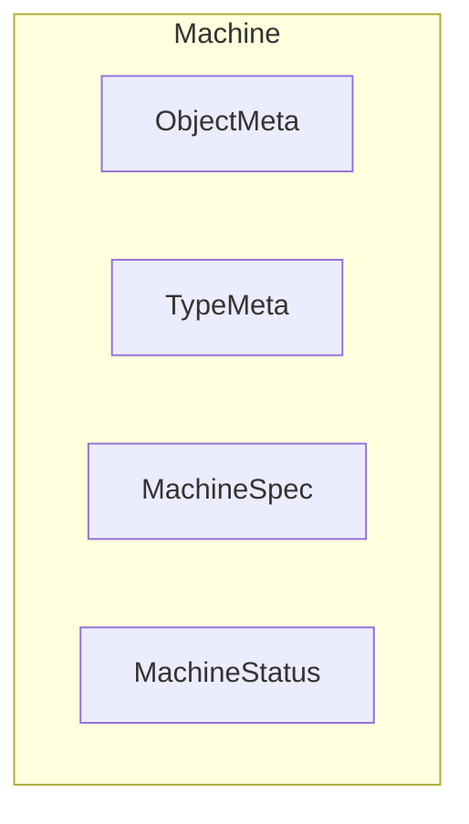
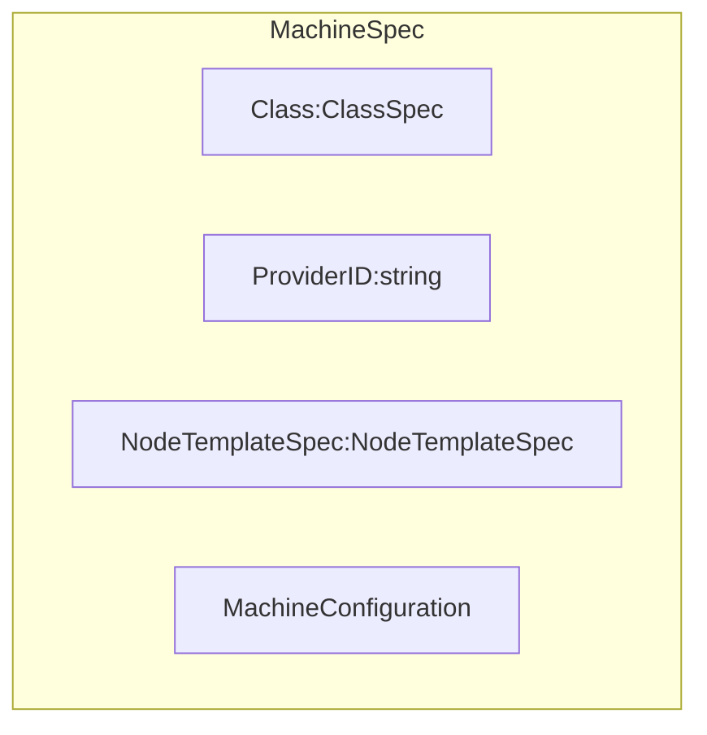

- [MCM Facilities](#mcm-facilities)
	- [Machine Controller Core Types](#machine-controller-core-types)
		- [Machine](#machine)
			- [MachineSpec](#machinespec)
			- [MachineStatus](#machinestatus)
			- [LastOperation](#lastoperation)
				- [MachineState (should be called MachineOperationState)](#machinestate-should-be-called-machineoperationstate)
				- [MachineOperationType](#machineoperationtype)
			- [CurrentStatus](#currentstatus)
				- [MachinePhase](#machinephase)
	- [MachineUtils](#machineutils)
		- [Operation Descriptions](#operation-descriptions)
		- [Retry Periods](#retry-periods)
	- [Codes and Status](#codes-and-status)
		- [Code](#code)
		- [Status](#status)

# MCM Facilities

This chapter describes the core types and utilities offerd by the MCM module.

## Machine Controller Core Types

The relevant machine types managed by the MCM controlled reside in [github.com/gardener/machine-controller-manager/pkg/apis/machine/v1alpha1](https://pkg.go.dev/github.com/gardener/machine-controller-manager@v0.47.0/pkg/apis/machine/v1alpha1). This follows the standard location for client gen types `<module>/pkg/apis/<group>/<version>`


### Machine

Machine is the representation of a physical or virtual machine that corresponds to a front-end k8s node object. An example YAML looks like the below
```yaml
apiVersion: machine.sapcloud.io/v1alpha1
kind: Machine
metadata:
  name: test-machine
  namespace: default
spec:
  class:
    kind: MachineClass
    name: test-class
```
[pkg/apis/machine/v1alpha1.Machine](https://github.com/gardener/machine-controller-manager/blob/v0.47.0/pkg/apis/machine/v1alpha1/machine_types.go#L39)

A `Machine` has a `Spec` field represented by [MachineSpec](#machinespec)
```go
type Machine struct {
	// ObjectMeta for machine object
	metav1.ObjectMeta 

	// TypeMeta for machine object
	metav1.TypeMeta 

	// Spec contains the specification of the machine
	Spec MachineSpec 

	// Status contains fields depicting the status
	Status MachineStatus 
}
```



#### MachineSpec

[MachineSpec](https://github.com/gardener/machine-controller-manager/blob/v0.47.0/pkg/apis/machine/v1alpha1/machine_types.go#L54) represents the specification of a Machine.

```go
type MachineSpec struct {

	// Class is the referrent to the MachineClass. 
	Class ClassSpec 

    // Unique identification of the VM at the cloud provider
	ProviderID string 

	// NodeTemplateSpec describes the data a node should have when created from a template
	NodeTemplateSpec NodeTemplateSpec 

	// Configuration for the machine-controller.  
	*MachineConfiguration 
}
type NodeTemplateSpec struct { // BADLY NAMED!
	metav1.ObjectMeta

	// NodeSpec describes the attributes that a node is created with.
	Spec corev1.NodeSpec
}
```

- `ProviderID` is the unique identification of the VM at the cloud provider. `ProviderID` typically matches with the `node.Spec.ProviderID` on the node object.
- `Class` field is of type `ClassSpec` which is just the (`Kind` and the `Name`) referring to the `MachineClass`. (Ideally the field, type should have been called `ClassReference`) like `OwnerReference`
- `NodeTemplateSpec` describes the data a node should have when created from a template, embeds `ObjectMeta` and holds a [corev1.NodeSpec](https://pkg.go.dev/k8s.io/api/core/v1#NodeSpec) in its `Spec` field.  
  - The `Machine.Spec.NodeTemplateSpec.Spec` mirrors k8s `Node.Spec`
- `MachineSpec` embeds a `MachineConfiguration` which is just a configuration object that is a connection of timeouts, maxEvictRetries and NodeConditions



```go
type MachineConfiguration struct {
	// MachineDraintimeout is the timeout after which machine is forcefully deleted.
	MachineDrainTimeout *Duration

	// MachineHealthTimeout is the timeout after which machine is declared unhealhty/failed.
	MachineHealthTimeout *Duration 

	// MachineCreationTimeout is the timeout after which machinie creation is declared failed.
	MachineCreationTimeout *Duration 

	// MaxEvictRetries is the number of retries that will be attempted while draining the node.
	MaxEvictRetries *int32 

	// NodeConditions are the set of conditions if set to true for MachineHealthTimeOut, machine will be declared failed.
	NodeConditions *string 
}
```


#### MachineStatus

[pkg/apis/machine/v1alpha1.MachineStatus](https://github.com/gardener/machine-controller-manager/blob/v0.47.0/pkg/apis/machine/v1alpha1/machine_types.go#L97) represents the most recently observed status of Machine.
```go
type MachineStatus struct {
	// Node string. 
	Node string // TODO: describe me more

	// Conditions of this machine, same as NodeStatus.Conditions
	Conditions []NodeCondition 

	// Last operation refers to the status of the last operation performed. NOTE: this is usually the NextOperation for reconcile!! Discuss!
	LastOperation LastOperation 

	// Current status of the machine object
	CurrentStatus CurrentStatus

	// LastKnownState can store details of the last known state of the VM by the plugins.
	// It can be used by future operation calls to determine current infrastucture state
	LastKnownState string 
}
```

#### LastOperation

[github.com/machine-controller-manager/pkg/apis/machine/v1alpha1.LastOperation](https://pkg.go.dev/github.com/gardener/machine-controller-manager/pkg/apis/machine/v1alpha1#LastOperation) represents the last operation performed on the object
```go
type LastOperation struct {
	// Description of the operation
	Description string 

	// Last update time of operation
	LastUpdateTime Time 

	// State of operation (bad naming)
	State MachineState 

	// Type of operation
	Type MachineOperationType 
}

```
##### MachineState (should be called MachineOperationState)

NOTE: BADLY NAMED: Should be called `MachineOperationState`

[machine-controller-manager/pkg/apis/machine/v1alpha1.MachineState](https://pkg.go.dev/github.com/gardener/machine-controller-manager/pkg/apis/machine/v1alpha1#MachineState) represents the  current state of a machine operation and is one of `Processing`, `Failed` or `Successful`.

```go
// MachineState is  current state of the machine.
// BAD Name: Should be MachineOperationState
type MachineState string

// These are the valid (operation) states of machines.
const (
	// MachineStatePending means there are operations pending on this machine state
	MachineStateProcessing MachineState = "Processing"

	// MachineStateFailed means operation failed leading to machine status failure
	MachineStateFailed MachineState = "Failed"

	// MachineStateSuccessful indicates that the node is not ready at the moment
	MachineStateSuccessful MachineState = "Successful"
)
```
##### MachineOperationType

[github.com/machine-controller-manager/pkg/apis/machine/v1alpha1.MachineOperationType](https://pkg.go.dev/github.com/gardener/machine-controller-manager/pkg/apis/machine/v1alpha1#MachineOperationType) is a label for the operation performed on a machine object: `Create`/`Update`/`HealthCheck`/`Delete`.

```go
type MachineOperationType string
const (
	// MachineOperationCreate indicates that the operation is a create
	MachineOperationCreate MachineOperationType = "Create"

	// MachineOperationUpdate indicates that the operation is an update
	MachineOperationUpdate MachineOperationType = "Update"

	// MachineOperationHealthCheck indicates that the operation is a create
	MachineOperationHealthCheck MachineOperationType = "HealthCheck"

	// MachineOperationDelete indicates that the operation is a delete
	MachineOperationDelete MachineOperationType = "Delete"
)

```

#### CurrentStatus
[github.com/machine-controller-manager/pkg/apis/machine/v1alpha1.CurrentStatus](https://pkg.go.dev/github.com/gardener/machine-controller-manager/pkg/apis/machine/v1alpha1#CurrentStatus) encapsulates information about the current status of Machine.

```go
type CurrentStatus struct {
	// Phase refers to the Machien (Lifecycle) Phase
	Phase MachinePhase 
	// TimeoutActive when set to true drives the machine controller
	// to check whether	machine failed the configured creation timeout or health check timeout and change machine phase to Failed.
	TimeoutActive bool 
	// Last update time of current status
	LastUpdateTime Time
}
```

##### MachinePhase

`MachinePhase` is a label for the life-cycle phase of a machine at a given time: `Unknown`, `Pending`, `Available`, `Running`, `Terminating`, `Failed`, `CrashLoopBackOff`,.
```go
type MachinePhase string
const (
	// MachinePending means that the machine is being created
	MachinePending MachinePhase = "Pending"

	// MachineAvailable means that machine is present on provider but hasn't joined cluster yet
	MachineAvailable MachinePhase = "Available"

	// MachineRunning means node is ready and running successfully
	MachineRunning MachinePhase = "Running"

	// MachineRunning means node is terminating
	MachineTerminating MachinePhase = "Terminating"

	// MachineUnknown indicates that the node is not ready at the movement
	MachineUnknown MachinePhase = "Unknown"

	// MachineFailed means operation failed leading to machine status failure
	MachineFailed MachinePhase = "Failed"

	// MachineCrashLoopBackOff means creation or deletion of the machine is failing.
	MachineCrashLoopBackOff MachinePhase = "CrashLoopBackOff"
)
```
## MachineUtils


### Operation Descriptions
`machineutils` has a bunch of constants that are descriptions of machine operations that are set into `machine.Status.LastOperation.Description` by the machine controller while performing reconciliation.

```go
const (
	// GetVMStatus sets machine status to terminating and specifies next step as getting VMs
	GetVMStatus = "Set machine status to termination. Now, getting VM Status"

	// InitiateDrain specifies next step as initiate node drain
	InitiateDrain = "Initiate node drain"

	// InitiateVMDeletion specifies next step as initiate VM deletion
	InitiateVMDeletion = "Initiate VM deletion"

	// InitiateNodeDeletion specifies next step as node object deletion
	InitiateNodeDeletion = "Initiate node object deletion"

	// InitiateFinalizerRemoval specifies next step as machine finalizer removal
	InitiateFinalizerRemoval = "Initiate machine object finalizer removal"

	// LastAppliedALTAnnotation contains the last configuration of annotations, 
	// labels & taints applied on the node object
	LastAppliedALTAnnotation = "node.machine.sapcloud.io/last-applied-anno-labels-taints"

	// MachinePriority is the annotation used to specify priority
	// associated with a machine while deleting it. The less its
	// priority the more likely it is to be deleted first
	// Default priority for a machine is set to 3
	MachinePriority = "machinepriority.machine.sapcloud.io"

	// MachineClassKind is used to identify the machineClassKind for generic machineClasses
	MachineClassKind = "MachineClass"

	// MigratedMachineClass annotation helps in identifying machineClasses who have been migrated by migration controller
	MigratedMachineClass = "machine.sapcloud.io/migrated"

	// NotManagedByMCM annotation helps in identifying the nodes which are not handled by MCM
	NotManagedByMCM = "node.machine.sapcloud.io/not-managed-by-mcm"

	// TriggerDeletionByMCM annotation on the node would trigger the deletion of the corresponding machine object in the control cluster
	TriggerDeletionByMCM = "node.machine.sapcloud.io/trigger-deletion-by-mcm"

	// NodeUnhealthy is a node termination reason for failed machines
	NodeUnhealthy = "Unhealthy"

	// NodeScaledDown is a node termination reason for healthy deleted machines
	NodeScaledDown = "ScaleDown"

	// NodeTerminationCondition describes nodes that are terminating
	NodeTerminationCondition v1.NodeConditionType = "Terminating"
)

```

### Retry Periods

These are standard retry periods that are internally used by the machine controllers to enqueue keys into the work queue after the specified duration so that reconciliation can be retried afer elapsed duration.

```go
// RetryPeriod is an alias for specifying the retry period
type RetryPeriod time.Duration

// These are the valid values for RetryPeriod
const (
	// ShortRetry tells the controller to retry after a short duration - 15 seconds
	ShortRetry RetryPeriod = RetryPeriod(15 * time.Second)
	// MediumRetry tells the controller to retry after a medium duration - 2 minutes
	MediumRetry RetryPeriod = RetryPeriod(3 * time.Minute)
	// LongRetry tells the controller to retry after a long duration - 10 minutes
	LongRetry RetryPeriod = RetryPeriod(10 * time.Minute)
)

```

## Codes and Status

### Code
[github.com/gardener/machine-controller-manager/pkg/util/provider/machinecodes/codes.Code](https://pkg.go.dev/github.com/gardener/machine-controller-manager@v0.47.0/pkg/util/provider/machinecodes/codes#Code) is a `uint32` with following error codes. These error codes are contained in errors returned from Driver methods.

Note: Un-happy with current design. It is clear that some error codes overlap each other in the sense that they are supersets of other codes. The right thing to do would have been to make an ErrorCategory.

| Value | Code                | Description              |
| ------| --------------------| ------------------------- 
| 0     | Ok                  | Success     
| 1     | Canceled            | the operation was canceled (by caller)
| 2     | Unknown             | Unknown error (unrecognized code)
| 3     | InvalidArgument     | InvalidArgument indicates client specified an invalid argument.
| 4     | DeadlineExceeded    | DeadlineExceeded means operation expired before completion.  For operations that change the state of the system, this error may be  returned even if the operation has completed successfully. For example, a successful response from a server could have been delayed long enough for the deadline to expire.
| 5     | NotFound            | requested entity not found.
| 6     | AlreadyExists       | an attempt to create an entity failed because one already exists.
| 7     | PermissionDenied    | caller does not have permission to execute the specified operation.
| 8     | ResourceExhausted   | indicates some resource has been exhausted, perhaps a per-user quota, or perhaps the entire file system is out of space.
| 9     | FailedPrecondition  | operation was rejected because the	 system is not in a state required for the operation's execution.
| 10    | Aborted             | operation was aborted and client should retry the full process
| 11    | OutOfRange          | operation was attempted past the valid range. Unlike InvalidArgument, this error indicates a problem that may be fixed if the system state changes.
| 12    | UnImplemented       | operation is not implemented or not supported
| 13    | Internal            | BAD. Some internal invariant broken. 
| 14    | Unavailable         | Service is currently unavailable (transient and op may be tried with backoff)
| 15    | DataLoss            | unrecoverable data loss or corruption.
| 16    | Unauthenticated     | request does not have valid creds for operation. Note: It would have been nice if 7 was called Unauthorized.

### Status

[status](https://pkg.go.dev/github.com/gardener/machine-controller-manager@v0.47.0/pkg/util/provider/machinecodes/status) implements errors returned by MachineAPIs. MachineAPIs service handlers should return an error created by this package, and machineAPIs clients should expect a corresponding error to be returned from the RPC call.

[status.Status](https://pkg.go.dev/github.com/gardener/machine-controller-manager@v0.47.0/pkg/util/provider/machinecodes/status#Status) implements `error` and encapsulates a `code` which should be onf the codes in [codes.Code](https://pkg.go.dev/github.com/gardener/machine-controller-manager@v0.47.0/pkg/util/provider/machinecodes/codes#Code) and a develoer-facing error message in English
```go
type Status struct {
	code int32
	message string
}
// New returns a Status encapsulating code and msg.
func New(code codes.Code, msg string) *Status {
	return &Status{code: int32(code), message: msg}
}
```

NOTE: No ideally why we are doing such hard work as shown in [status.FromError](https://github.com/gardener/machine-controller-manager/blob/v0.47.0/pkg/util/provider/machinecodes/status/status.go#L84) which involves time-consuming regex parsing of an error string into a status. This is actually being used to parse error strings of errors returned by Driver methods. Not good - should be better designed.


