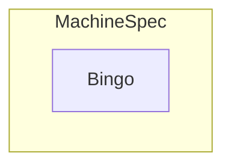

- [MCM Facilities](#mcm-facilities)
  - [Machine Controller Core Types](#machine-controller-core-types)
    - [Machine](#machine)
      - [MachineSpec](#machinespec)
      - [MachineStatus](#machinestatus)

# MCM Facilities

This chapter describes the core types and utilities offerd by the MCM module.

## Machine Controller Core Types

The relevant machine types managed by the MCM controlled reside in [github.com/gardener/machine-controller-manager/pkg/apis/machine/v1alpha1](https://pkg.go.dev/github.com/gardener/machine-controller-manager@v0.47.0/pkg/apis/machine/v1alpha1). This follows the standard location for client gen types `<module>/pkg/apis/<group>/<version>`

### Machine

Machine is the representation of a physical or virtual machine that corresponds to a front-end k8s node object. An example YAML looks like the below
```yaml
apiVersion: machine.sapcloud.io/v1alpha1
kind: Machine
metadata:
  name: test-machine
  namespace: default
spec:
  class:
    kind: MachineClass
    name: test-class
```
[pkg/apis/machine/v1alpha1.Machine](https://github.com/gardener/machine-controller-manager/blob/v0.47.0/pkg/apis/machine/v1alpha1/machine_types.go#L39)

A `Machine` has a `Spec` field represented by [MachineSpec](#machinespec)
```go
type Machine struct {
	// ObjectMeta for machine object
	metav1.ObjectMeta 

	// TypeMeta for machine object
	metav1.TypeMeta 

	// Spec contains the specification of the machine
	Spec MachineSpec 

	// Status contains fields depicting the status
	Status MachineStatus 
}
```


#### MachineSpec

[MachineSpec](https://github.com/gardener/machine-controller-manager/blob/v0.47.0/pkg/apis/machine/v1alpha1/machine_types.go#L54) represents the specification of a Machine.

```go
type MachineSpec struct {

	// Class holds the referrent to the MachineClass represented by the small type ClassSpec
	Class ClassSpec 

    // Unique identification of the VM at the cloud provider
	ProviderID string 

	// NodeTemplateSpec describes the data a node should have when created from a template
	NodeTemplateSpec NodeTemplateSpec 

	// Configuration for the machine-controller.  
	*MachineConfiguration 
}
type NodeTemplateSpec struct {
	metav1.ObjectMeta

	// NodeSpec describes the attributes that a node is created with.
	Spec corev1.NodeSpec
}
```
- `ProviderID` is the unique identification of the VM at the cloud provider. `ProviderID` typically matches with the node.Spec.ProviderID on the node object.
- `Class` field is of type `ClassSpec` which is just the (`Kind` and the `Name`) referring to the `MachineClass`. (Ideally the field, type should have been called `ClassReference`)
- `NodeTemplateSpec` describes the data a node should have when created from a template, embeds `ObjectMeta` and holds a [corev1.NodeSpec](https://pkg.go.dev/k8s.io/api/core/v1#NodeSpec) in its `Spec` field.  
  - Doubt: The only thing being used is the     




#### MachineStatus

[pkg/apis/machine/v1alpha1.MachineStatus](https://github.com/gardener/machine-controller-manager/blob/v0.47.0/pkg/apis/machine/v1alpha1/machine_types.go#L97) represents the most recently observed status of Machine.
```go
type MachineStatus struct {
	// Node string
	Node string

	// Conditions of this machine, same as node
	Conditions []corev1.NodeCondition 

	// Last operation refers to the status of the last operation performed
	LastOperation LastOperation 

	// Current status of the machine object
	CurrentStatus CurrentStatus

	// LastKnownState can store details of the last known state of the VM by the plugins.
	// It can be used by future operation calls to determine current infrastucture state
	LastKnownState string 
}
```
