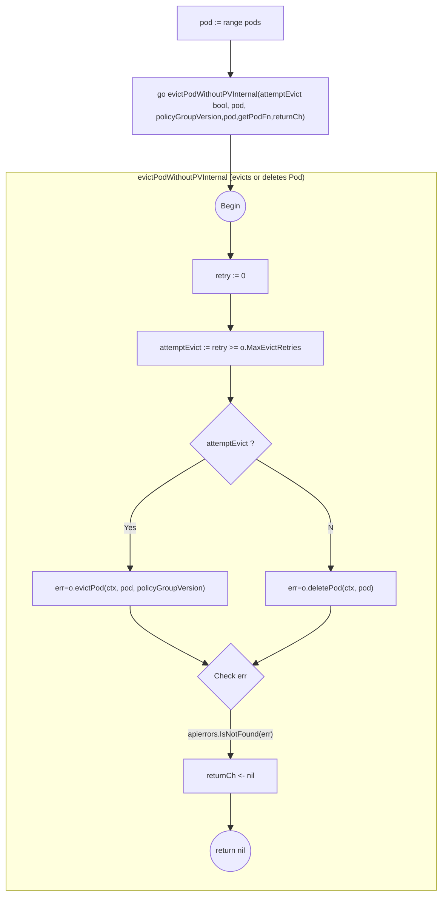

- [Node Drain](#node-drain)
  - [Drain Utilities](#drain-utilities)
    - [VolumeAttachmentHandler](#volumeattachmenthandler)
  - [Drain](#drain)
    - [drain.Options](#drainoptions)
    - [drain.Options.RunDrain](#drainoptionsrundrain)
    - [drain.Options.evictPodsWithoutPv](#drainoptionsevictpodswithoutpv)
# Node Drain

Node Drain code is in [github.com/gardener/machine-controller-manager/pkg/util/provider/drain/drain.go](https://github.com/gardener/machine-controller-manager/blob/v0.47.0/pkg/util/provider/drain/drain.go)

## Drain Utilities 

### VolumeAttachmentHandler

Inside `github.com/gardener/machine-controller-manager/pkg/util/provider/drain/volume_attachment.go`,
[pkg/util/provider/drain.VolumeAttachmentHandler](https://pkg.go.dev/github.com/gardener/machine-controller-manager@v0.47.0/pkg/util/provider/drain#VolumeAttachmentHandler) is an handler used to distribute
incoming [k8s.io/api/storage/v1.VolumeAttachment](https://pkg.go.dev/k8s.io/api/storage/v1#VolumeAttachment) requests to all listening workers via means of a slice of typed `VolumeAttachment` channels. A `VolumeAttachment` is a non-namespaced k8s object that captures the intent to attach or detach the specified volume to/from the specified node.

```go
type VolumeAttachmentHandler struct {
	sync.Mutex
	workers []chan *storagev1.VolumeAttachment
}

// NewVolumeAttachmentHandler returns a new VolumeAttachmentHandler
func NewVolumeAttachmentHandler() *VolumeAttachmentHandler {
	return &VolumeAttachmentHandler{
		Mutex:   sync.Mutex{},
		workers: []chan *storagev1.VolumeAttachment{},
	}
}
```

The `dispatch` method is responsible for distributing incomding `VolumeAttachent`s to available channels.

```go
func (v *VolumeAttachmentHandler) dispatch(obj interface{}) {
	if len(v.workers) == 0 {
		// As no workers are registered, nothing to do here.
		return
	}
	volumeAttachment := obj.(*storagev1.VolumeAttachment)
	v.Lock()
	defer v.Unlock()

	for i, worker := range v.workers {
		select {
		case worker <- volumeAttachment:
		default:
			klog.Warningf("Worker %d/%v is full. Discarding value.", i, worker)
			// TODO: Umm..isn't this problematic if we miss this ?
		}
	}
}
```

The `Add|Update` methods below delegate to dispatch. The usage of this utility involves specifying the add/update methods below as the event handler callbacks on an instance of [k8s.io/client-go/informers/storage/v1.VolumeAttachmentInformer](https://pkg.go.dev/k8s.io/client-go@v0.25.2/informers/storage/v1#VolumeAttachmentInformer). This way incoming volume attachments are distributed to several worker channels.
```go
func (v *VolumeAttachmentHandler) AddVolumeAttachment(obj interface{}) {
	v.dispatch(obj)
}

func (v *VolumeAttachmentHandler) UpdateVolumeAttachment(oldObj, newObj interface{}) {
	v.dispatch(newObj)
}
```

## Drain 

### drain.Options

`drain.Options` are configurable options while draining a node before deletion

NOTE: Unused fields/Fields with constant defaults omitted for brevity
```go
type Options struct {
	client                       kubernetes.Interface
	kubernetesVersion            *semver.Version
	Driver                       driver.Driver
	drainStartedOn               time.Time
	drainEndedOn                 time.Time
	ErrOut                       io.Writer
	ForceDeletePods              bool
	MaxEvictRetries              int32
	PvDetachTimeout              time.Duration
	PvReattachTimeout            time.Duration
	nodeName                     string
	Out                          io.Writer
	pvcLister                    corelisters.PersistentVolumeClaimLister
	pvLister                     corelisters.PersistentVolumeLister
	pdbV1Lister                  policyv1listers.PodDisruptionBudgetLister
	nodeLister                   corelisters.NodeLister
	volumeAttachmentHandler      *VolumeAttachmentHandler
	Timeout                      time.Duration
}

```

### drain.Options.RunDrain

```go
func (o *Options) RunDrain(ctx context.Context) error
```



```mermaid
%%{init: {'themeVariables': { 'fontSize': '10px'}, "flowchart": {"useMaxWidth": false }}}%%
flowchart TD


GetNode["node, err = .client.CoreV1().Nodes().Get(ctx, o.nodeName, metav1.GetOptions{})"]
-->ChkGetNodeErr{err != nil}

ChkGetNodeErr--Yes-->ReturnNilEarly(("return nil
(case where deletion 
triggered during machine creation, 
so node is nil. 
TODO: should use apierrors.NotFound)"))

ChkGetNodeErr--No-->ChkNodeUnschedulable{node.Spec.Unschedulable?}

ChkNodeUnschedulable--Yes-->GetPodsForDeletion["
    pods, err := o.getPodsForDeletion(ctx)
    if err!=nil return err"]
ChkNodeUnschedulable--No-->CloneNode["clone := node.DeepCopy()
		clone.Spec.Unschedulable = true"]
        -->UpdateNode["_, err = o.client.CoreV1().Nodes().Update(ctx, clone, metav1.UpdateOptions{})
        if err != nil return err
        "]

UpdateNode-->GetPodsForDeletion
GetPodsForDeletion-->GetEvictionPGV["
    policyGroupVersion, err := SupportEviction(o.client)
    if err != nil return err
    "]
-->
DefineAttemptEvict["
attemptEvict := !o.ForceDeletePods && len(policyGroupVersion) > 0
"]
-->
DefineGetPodFn["
getPodFn := func(namespace, name string) (*corev1.Pod, error) {
		return o.client.CoreV1().Pods(namespace).Get(ctx, name, metav1.GetOptions{})
}"]
-->
CreateReturnChannel["
    returnCh := make(chan error, len(pods))
	defer close(returnCh)
    "]
-->ChkForceDelPods{"o.ForceDeletePods?"}

ChkForceDelPods--Yes-->EvictPodsWithoutPV["go o.evictPodsWithoutPv(ctx, attemptEvict, pods, policyGroupVersion, getPodFn, returnCh)
// go-routine feels un-necessary here."]
ChkForceDelPods--No-->FilterPodsWithPv["
podsWithPv, podsWithoutPv := filterPodsWithPv(pods)
"]

FilterPodsWithPv-->EvictPodsWithPv["
go o.evictPodsWithPv(ctx, attemptEvict, podsWithPv, policyGroupVersion, getPodFn, returnCh)
"]
-->EvictPodsWithoutPV

EvictPodsWithoutPV-->CreateAggregateError["
	var errors []error
    errors =
	for i = 0; i <  len(pods); ++i {
		err := <-returnCh
		if err != nil {
			errors = append(errors, err)
		}
	}
	
"]
-->ReturnAggError(("return\nerrors.NewAggregate(errors)"))

```

Notes:
1. [machine-controller-manager/pkg/util/provider/drain.SupportEviction](https://github.com/gardener/machine-controller-manager/blob/v0.47.0/pkg/util/provider/drain/drain.go#L1106) uses Discovery API to find out if the server support eviction subresource and if so return its groupVersion or "" if it doesn't.
   1. [k8s.io/kubectl/pkg/drain.CheckEvictionSupport](https://pkg.go.dev/k8s.io/kubectl/pkg/drain#CheckEvictionSupport) already does this.
2. [attemptEvict boolean](https://github.com/gardener/machine-controller-manager/blob/v0.47.0/pkg/util/provider/drain/drain.go#L400) usage is confusing.

### drain.Options.evictPodsWithoutPv

method that iterates through each given pod and launchews a go-routine that performs either pod eviction or pod deletion followed by a wait accompanied with error and retry handling for each pod in an independent go-routine for every pod. 

```go
func (o *Options) evictPodsWithoutPv(ctx context.Context, 
    pods []*corev1.Pod,
	policyGroupVersion string, //eviction API's GV
	getPodFn func(namespace, name string) (*corev1.Pod, error),
	returnCh chan error)
```

